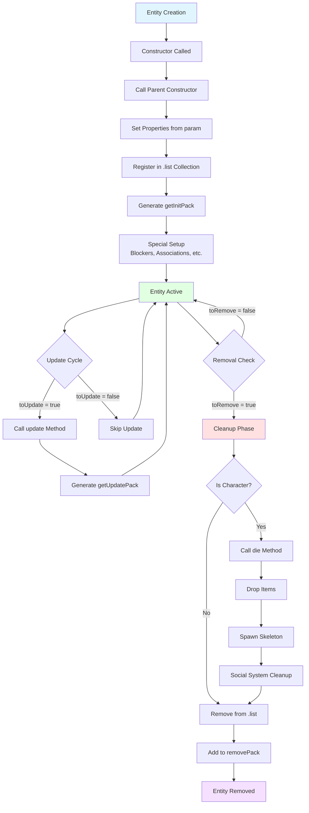
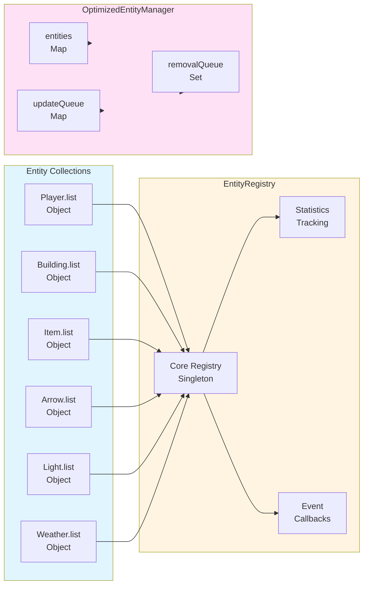

# Entity System Documentation

## Table of Contents

1. [Introduction](#introduction)
2. [Base Entity Class](#base-entity-class)
3. [Inheritance Patterns](#inheritance-patterns)
4. [Entity Properties](#entity-properties)
5. [Lifecycle Management](#lifecycle-management)
6. [Entity Collections](#entity-collections)
7. [Special Systems](#special-systems)
8. [Diagrams](#diagrams)
9. [Examples](#examples)

---

## Introduction

The Entity system is the core foundation of all game objects in Lambic. Every interactive object in the game - from players and NPCs to buildings, items, projectiles, and environmental effects - inherits from the base `Entity` class.

**Key Characteristics:**
- Function-based constructor pattern (not ES6 classes)
- Prototype-based inheritance
- Centralized collection management via `.list` objects
- Lifecycle flags (`toUpdate`, `toRemove`) for update and cleanup cycles
- Serialization via `getInitPack()` and `getUpdatePack()` methods

**Main File:** [`server/js/Entity.js`](server/js/Entity.js) (13,502 lines)

---

## Base Entity Class

### Location
[`server/js/Entity.js`](server/js/Entity.js) lines 34-113

### Constructor Pattern

The base `Entity` uses a function-based constructor that returns a self-contained object:

```javascript
Entity = function(param){
  var self = {
    x:0,
    y:0,
    z:0,
    spdX:0,
    spdY:0,
    id:Math.random()
  }

  if(param){
    if(param.x) self.x = param.x;
    if(param.y) self.y = param.y;
    if(param.z) self.z = param.z;
    if(param.id) self.id = param.id;
  }

  // Methods...
  return self;
};
```

### Core Properties

| Property | Type | Description | Default |
|----------|------|-------------|---------|
| `x` | Number | X coordinate in pixels | 0 |
| `y` | Number | Y coordinate in pixels | 0 |
| `z` | Number | Z layer (0=overworld, 1=indoor, 2=upper floor, -1/-2/-3=underground) | 0 |
| `spdX` | Number | X velocity (pixels per update) | 0 |
| `spdY` | Number | Y velocity (pixels per update) | 0 |
| `id` | Number | Unique entity identifier | `Math.random()` |

### Core Methods

#### `update()`
Called every game tick to update entity state. Base implementation only updates position:

```javascript
self.update = function(){
  self.updatePosition();
}
```

#### `updatePosition()`
Applies velocity to position:

```javascript
self.updatePosition = function(){
  self.x += self.spdX;
  self.y += self.spdY;
}
```

#### `getDistance(pt)`
Calculates Euclidean distance to a point:

```javascript
self.getDistance = function(pt){ // {x,y}
  return Math.sqrt(Math.pow(self.x-pt.x,2) + Math.pow(self.y-pt.y,2));
}
```

#### `findNearestWalkableTile(targetX, targetY, targetZ, maxRadius)`
Searches for the nearest walkable tile using a spiral search pattern:

```javascript
self.findNearestWalkableTile = function(targetX, targetY, targetZ, maxRadius = 5){
  // Tries target first, then spirals outward
  // Checks cardinals first, then diagonals
  // Returns [x, y] or null if none found
}
```

---

## Inheritance Patterns

The Entity system uses prototype-based inheritance where child constructors call the parent constructor and extend the returned object.

### Primary Inheritance Chain

```
Entity (base)
├── Building
│   ├── Farm
│   ├── Mill
│   ├── Lumbermill
│   ├── Mine
│   ├── Outpost
│   ├── Guardtower
│   ├── Tavern
│   ├── Monastery
│   ├── Market
│   ├── Stable
│   ├── Dock
│   ├── Garrison
│   ├── Forge
│   ├── Gate
│   └── Stronghold
├── Character
│   ├── Player (defined in lambic.js)
│   ├── Serf
│   ├── SerfM
│   ├── SerfF
│   ├── Innkeeper
│   ├── Blacksmith
│   ├── Monk
│   ├── Bishop
│   ├── Friar
│   ├── Shipwright
│   ├── Footsoldier
│   ├── Skirmisher
│   ├── Cavalier
│   ├── General
│   ├── Warden
│   ├── SwissGuard
│   ├── Hospitaller
│   ├── ImperialKnight
│   ├── Trebuchet
│   ├── BombardCannon
│   ├── TradeCart
│   ├── Merchant
│   ├── FishingBoat
│   ├── Galley
│   ├── Caravel
│   ├── Galleon
│   ├── Brother
│   ├── Oathkeeper
│   ├── Apparition
│   ├── Apollyon
│   ├── Goth
│   ├── Cataphract
│   ├── Acolyte
│   ├── HighPriestess
│   ├── Alaric
│   ├── Drakkar
│   ├── NorseSword
│   ├── NorseSpear
│   ├── Seidr
│   ├── Huskarl
│   ├── FrankSword
│   ├── FrankSpear
│   ├── FrankBow
│   ├── Mangonel
│   ├── Carolingian
│   ├── Malvoisin
│   ├── Charlemagne
│   ├── CeltAxe
│   ├── CeltSpear
│   ├── Headhunter
│   ├── Druid
│   ├── ScoutShip
│   ├── Longship
│   ├── Morrigan
│   ├── Gwenllian
│   ├── TeutonPike
│   ├── TeutonBow
│   ├── TeutonicKnight
│   ├── Prior
│   ├── Archbishop
│   ├── Hochmeister
│   ├── Trapper
│   ├── Outlaw
│   ├── Poacher
│   ├── Cutthroat
│   ├── Strongman
│   ├── Marauder
│   ├── Condottiere
│   ├── Deer (modular, in server/js/entities/)
│   ├── Boar (modular, in server/js/entities/)
│   ├── Wolf (modular, in server/js/entities/)
│   ├── Falcon (modular, in server/js/entities/)
│   └── Sheep (modular, in server/js/entities/)
├── Item
│   ├── Wood
│   ├── Stone
│   ├── Grain
│   ├── IronOre
│   ├── Iron
│   ├── Steel
│   ├── BoarHide
│   ├── Leather
│   ├── SilverOre
│   ├── Silver
│   ├── GoldOre
│   ├── Gold
│   ├── Diamond
│   ├── HuntingKnife
│   ├── Dague
│   ├── Rondel
│   ├── Misericorde
│   ├── BastardSword
│   ├── Longsword
│   ├── Zweihander
│   ├── Morallta
│   ├── Bow
│   ├── WelshLongbow
│   ├── KnightLance
│   ├── RusticLance
│   ├── PaladinLance
│   ├── Brigandine
│   ├── Lamellar
│   ├── Maille
│   ├── Hauberk
│   ├── Brynja
│   ├── Cuirass
│   ├── SteelPlate
│   ├── GreenwichPlate
│   ├── GothicPlate
│   ├── ClericRobe
│   ├── MonkCowl
│   ├── BlackCloak
│   ├── Tome
│   ├── RunicScroll
│   ├── SacredText
│   ├── StoneAxe
│   ├── IronAxe
│   ├── Pickaxe
│   ├── Key
│   ├── Torch
│   ├── LitTorch
│   ├── WallTorch
│   ├── Campfire
│   ├── InfiniteFire
│   ├── Firepit
│   ├── Fireplace
│   ├── Furnace
│   ├── Barrel
│   ├── Crates
│   ├── Bookshelf
│   ├── SuitArmor
│   ├── Anvil
│   ├── Runestone
│   ├── Dummy
│   ├── Cross
│   ├── Skeleton1
│   ├── Skeleton2
│   ├── Goods1
│   ├── Goods2
│   ├── Goods3
│   ├── Goods4
│   ├── Stash1
│   ├── Stash2
│   ├── Desk
│   ├── Swordrack
│   ├── Bed
│   ├── Jail
│   ├── JailDoor
│   ├── Chains
│   ├── Throne
│   ├── Banner
│   ├── StagHead
│   ├── Blood
│   ├── Chest
│   ├── LockedChest
│   ├── Bread
│   ├── Fish
│   ├── Lamb
│   ├── BoarMeat
│   ├── Venison
│   ├── PoachedFish
│   ├── LambChop
│   ├── BoarShank
│   ├── VenisonLoin
│   ├── Mead
│   ├── Saison
│   ├── Flanders
│   ├── BiereDeGarde
│   ├── Bordeaux
│   ├── Bourgogne
│   ├── Chianti
│   ├── Crown
│   ├── Arrows
│   ├── WorldMap
│   ├── CaveMap
│   ├── Relic
│   ├── Skeleton
│   ├── ShipWreckage
│   └── DroppedItem
├── Arrow
├── Light
└── Weather
```

### Inheritance Pattern Example

```javascript
// Parent constructor
Building = function(param){
  var self = Entity(param);  // Call parent constructor
  // Extend with building-specific properties
  self.owner = param.owner;
  self.house = param.house;
  self.type = param.type;
  // ... more properties
  return self;
}

// Child constructor
Farm = function(param){
  var self = Building(param);  // Call parent constructor
  // Extend with farm-specific properties
  self.mill = null;
  self.findMill = function(){ /* ... */ };
  return self;
}
```

### Modular Entity System

Some entities (Deer, Boar, Wolf, Falcon, Sheep) are defined in modular files under `server/js/entities/` and loaded via `initModularEntities()`. These use ES6 class syntax (`BaseItem`) as an alternative pattern, but still integrate with the main Entity system.

---

## Entity Properties

### Common Properties Across All Entities

| Property | Type | Description |
|----------|------|-------------|
| `toUpdate` | Boolean | Flag indicating entity needs update this tick |
| `toRemove` | Boolean | Flag indicating entity should be removed |
| `id` | Number | Unique identifier |
| `x`, `y`, `z` | Number | Spatial coordinates |

### Building Properties

**Location:** [`server/js/Entity.js`](server/js/Entity.js) lines 116-356

| Property | Type | Description |
|----------|------|-------------|
| `owner` | Number | Player ID who owns the building |
| `house` | Number | House ID the building belongs to |
| `kingdom` | Number | Kingdom ID |
| `type` | String | Building type ('farm', 'mill', 'lumbermill', etc.) |
| `built` | Boolean | Whether building is completed |
| `loc` | Array | Location [col, row] |
| `plot` | Array | Array of [col, row] tiles the building occupies |
| `walls` | Array | Wall positions |
| `topPlot` | Array | Upper floor plot positions |
| `mats` | Object | Required materials for construction |
| `req` | Object | Requirements object |
| `hp` | Number | Hit points |
| `occ` | Number | Occupancy count |
| `assignedSpots` | Object | Map of serfId -> [col,row] for work assignments |
| `availableResources` | Array | Copy of resources for tracking |
| `resources` | Array | Array of [x,y] resource locations (for mills, lumbermills, mines) |
| `farms` | Object | Map of farmId -> plot (for mills) |
| `serfs` | Object | Map of serfId -> serf (for mills, lumbermills, mines) |
| `network` | Array | Array of connected dock building IDs (for docks) |
| `cargoShip` | Number | Reference to cargo ship ID (for docks) |

**Special Building Types:**
- **Dock**: Has `createDockAssociation()` and `spawnCargoShip()` methods
- **Mill**: Has `tally()`, `findFarms()`, `updateResources()`, `updateFarmResources()` methods
- **Lumbermill**: Has `tally()`, `findTrees()`, `updateResources()` methods
- **Mine**: Has `tally()`, `findOre()`, `updateResources()` methods

### Character Properties

**Location:** [`server/js/Entity.js`](server/js/Entity.js) lines 1920-7897

| Property | Type | Description |
|----------|------|-------------|
| `type` | String | 'npc' or 'player' |
| `name` | String | Character name |
| `sex` | String | 'm' or 'f' |
| `house` | Number | House ID |
| `kingdom` | Number | Kingdom ID |
| `home` | Object | `{z, loc}` home location |
| `class` | String | Character class (e.g., 'Serf', 'Knight', 'Deer') |
| `rank` | Number | Character rank |
| `gear` | Object | `{head, armor, weapon, weapon2, accessory}` |
| `inventory` | Object | Inventory object (from `Inventory()` function) |
| `stores` | Object | Resource stores `{grain, wood, stone, ironore, iron, silverore, silver, goldore, gold, diamond}` |
| `mounted` | Boolean | Whether character is mounted |
| `ranged` | Boolean | Whether character uses ranged weapons |
| `military` | Boolean | Whether character is military |
| `cleric` | Boolean | Whether character is a cleric |
| `stealthed` | Boolean | Whether character is stealthed |
| `revealed` | Boolean | Whether character is revealed from stealth |
| `spriteSize` | Number | Sprite size in pixels |
| `facing` | String | 'up', 'down', 'left', 'right' |
| `pressingRight` | Boolean | Input state |
| `pressingLeft` | Boolean | Input state |
| `pressingUp` | Boolean | Input state |
| `pressingDown` | Boolean | Input state |
| `pressingAttack` | Boolean | Input state |
| `innaWoods` | Boolean | Whether in heavy forest |
| `onMtn` | Boolean | Whether on mountain terrain |
| `hasTorch` | Boolean | Whether holding torch |
| `working` | Boolean | Whether performing work action |
| `chopping` | Boolean | Whether chopping trees |
| `mining` | Boolean | Whether mining |
| `farming` | Boolean | Whether farming |
| `building` | Boolean | Whether building |
| `fishing` | Boolean | Whether fishing |
| `baseSpd` | Number | Base movement speed (default: 2) |
| `runSpd` | Number | Running speed (default: 6) |
| `currentSpeed` | Number | Current movement speed (updated by `updateSpeed()`) |
| `drag` | Number | Drag coefficient (default: 1) |
| `idleRange` | Number | Range for idle behavior (default: 1000) |
| `idleTime` | Number | Idle timer |
| `wanderRange` | Number | Wander range (default: 2048) |
| `aggroRange` | Number | Aggro range (default: 256) |
| `actionCooldown` | Number | Action cooldown timer |
| `attackCooldown` | Number | Attack cooldown timer |
| `hp` | Number | Hit points (default: 100) |
| `hpMax` | Number | Maximum hit points (default: 100) |
| `spirit` | Number | Spirit points |
| `spiritMax` | Number | Maximum spirit points |
| `strength` | Number | Strength stat (default: 1) |
| `damage` | Number | Damage stat |
| `fortitude` | Number | Fortitude stat |
| `attackrate` | Number | Attack rate (default: 50) |
| `dexterity` | Number | Dexterity stat (default: 1) |
| `running` | Boolean | Whether running |
| `kills` | Number | Kill count |
| `skulls` | String | Skull display string |
| `spriteScale` | Number | Sprite scaling factor (default: 1.0) |
| `socialProfile` | Object | Social system profile (for humanoid NPCs) |
| `zone` | Object | Zone reference |
| `zGrid` | Array | Zone grid coordinates |

**Player-Specific Properties** (from `lambic.js`):

| Property | Type | Description |
|----------|------|-------------|
| `hasHorse` | Boolean | Whether player has a horse |
| `knighted` | Boolean | Whether player is knighted |
| `crowned` | Boolean | Whether player is crowned |
| `title` | String | Player title |
| `friendlyfire` | Boolean | Friendly fire setting |
| `ghost` | Boolean | Ghost mode |
| `godMode` | Boolean | God mode (spectator camera) |
| `wallet` | Object | Blockchain wallet |

### Item Properties

**Location:** [`server/js/Entity.js`](server/js/Entity.js) lines 10551-12325

| Property | Type | Description |
|----------|------|-------------|
| `type` | String | Item type (e.g., 'Wood', 'Longsword') |
| `class` | String | Item class ('resource', 'weapon', 'armor', 'consumable', 'tool', 'environment') |
| `rank` | Number | Rarity rank (0=common, 1=rare, 2=lore, 3=mythic, 4=relic) |
| `qty` | Number | Quantity |
| `parent` | Number | Parent entity ID (for items in containers) |
| `canPickup` | Boolean | Whether item can be picked up (default: true) |
| `innaWoods` | Boolean | Whether item is in heavy forest |
| `spawnTime` | Number | Timestamp when item was spawned |
| `spawnDay` | Number | Day when item was spawned |
| `spawnTick` | Number | Tick when item was spawned |
| `despawnAfter` | Number | Despawn time in milliseconds (for consumables) |
| `sinkTime` | Number | Timestamp when sinking started (for water items) |
| `sunk` | Boolean | Whether item has sunk into terrain |
| `maxStack` | Number | Maximum stack size (for some item types) |

**Item Lifecycle:**
- Consumables (Bread, Fish, etc.) despawn after 10 minutes (`despawnAfter: 600000`)
- Water items sink to z=-3 after 10 seconds
- Land items sink to z=-3 after 7 days (2520 ticks) or 100 days for skeletons (36000 ticks)
- Items indoors (z=1, z=2, z=-2) never sink
- Unique items (relic, crown) never sink

### Arrow Properties

**Location:** [`server/js/Entity.js`](server/js/Entity.js) lines 10327-10549

| Property | Type | Description |
|----------|------|-------------|
| `angle` | Number | Firing angle in degrees |
| `spdX` | Number | X velocity (calculated from angle) |
| `spdY` | Number | Y velocity (calculated from angle) |
| `parent` | Number | Entity ID that fired the arrow |
| `damage` | Number | Arrow damage |
| `parentX` | Number | X position of parent when arrow was fired |
| `parentY` | Number | Y position of parent when arrow was fired |
| `timer` | Number | Lifetime timer (removed after 100 ticks) |
| `zGrid` | Array | Zone grid for collision detection |

### Light Properties

**Location:** [`server/js/Entity.js`](server/js/Entity.js) lines 13095-13176

| Property | Type | Description |
|----------|------|-------------|
| `parent` | Number | Item ID that emits the light |
| `radius` | Number | Light radius |

### Weather Properties

**Location:** [`server/js/Entity.js`](server/js/Entity.js) lines 13303-13416

| Property | Type | Description |
|----------|------|-------------|
| `weatherType` | String | 'fog' or 'storm' |
| `intensity` | Number | Intensity 0-1 (default: 1.0) |
| `lifetime` | Number | Remaining time in ticks |
| `moveSpeed` | Number | Movement speed (default: 0.1) |
| `moveDirection` | Number | Movement direction in radians |
| `moveTimer` | Number | Timer for direction changes |

### Camera Properties

**Location:** [`server/js/Entity.js`](server/js/Entity.js) lines 14094-14233

**Purpose**: Represents viewer/camera positions for spatial filtering, replacing direct player position usage

| Property | Type | Description |
|----------|------|-------------|
| `id` | String | Camera identifier (player ID, 'godmode', 'spectate', 'login') |
| `x` | Number | Camera X position |
| `y` | Number | Camera Y position |
| `z` | Number | Camera Z-level |
| `mode` | String | Camera mode ('player', 'godmode', 'spectate', 'login') |
| `locked` | Boolean | Whether camera is locked to a target |
| `lockedToEntityId` | String | Entity ID camera is locked to |
| `ownerPlayerId` | String | Associated player ID (null for spectators) |
| `context` | Object | Additional context (battleground info, etc.) |

**Methods**:
- `getViewerAnchors()`: Returns array of viewer anchor objects for spatial filtering
- `getAllInitPack()`: Returns initialization data for all cameras
- `update()`: Updates all camera entities (typically no-op as cameras are updated externally)

---

## Lifecycle Management

### Creation Phase

1. **Constructor Call**: Entity constructor is called with `param` object
2. **Parent Initialization**: Child constructors call parent constructor (`Entity(param)`)
3. **Property Assignment**: Properties are set from `param` or defaults
4. **Registration**: Entity is added to appropriate `.list` collection:
   ```javascript
   Building.list[self.id] = self;
   Player.list[self.id] = self;
   Item.list[self.id] = self;
   // etc.
   ```
5. **Init Pack**: `getInitPack()` is called and added to `initPack` for client sync
6. **Special Setup**: Entity-specific initialization (e.g., buildings register with houses, items set blockers)

**Example:**
```javascript
var building = Building({
  id: 12345,
  x: 1000,
  y: 2000,
  z: 0,
  owner: playerId,
  house: houseId,
  type: 'mill',
  plot: [[10, 20], [11, 20], [10, 21], [11, 21]]
});
// Building.list[12345] = building
// initPack.building.push(building.getInitPack())
```

### Update Cycle

Entities are updated via static `update()` methods on each entity type:

**Building.update()** (lines 1785-1795):
```javascript
Building.update = function(){
  var pack = [];
  for(var i in Building.list){
    var building = Building.list[i];
    if(building.update){
      building.update();
    }
    pack.push(building.getUpdatePack());
  }
  return pack;
}
```

**Item.update()** (lines 10623-10695):
- Processes consumable despawning
- Handles terrain sinking (water and land items)
- Updates items with `toUpdate` flag
- Removes items with `toRemove` flag
- Returns update pack for client sync

**Arrow.update()** (lines 10527-10541):
- Updates arrow position
- Checks collision with entities
- Removes arrows that hit targets or boundaries
- Handles terrain-based removal (mountains, forests, buildings)

**Character.update()**:
- Handled per-character via individual `update()` methods
- Characters update themselves based on their `action` state
- Combat, movement, work actions are processed

**Light.update()** (lines 13154-13169):
- Updates light position to follow parent item
- Removes lights when parent item is removed

**Weather.update()** (lines 13404-13416):
- Updates fog intensity based on time of day
- Decrements storm lifetime
- Handles random movement

**OptimizedEntityManager** (optional):
- Provides batched updates with priority system
- Tracks update frequency and skips entities that don't need updates
- Processes removal queue before updates

### Removal Phase

1. **Flag Setting**: Entity sets `toRemove = true`
2. **Update Detection**: Static `update()` methods check `toRemove` flag
3. **Cleanup**: 
   - Entity-specific cleanup (e.g., `die()` for characters, `cleanup()` if defined)
   - Remove from `.list` collection: `delete EntityType.list[id]`
   - Add to `removePack` for client sync: `removePack.entityType.push(id)`
4. **Special Cleanup**:
   - Characters: `die()` method handles death logic, kill tracking, social system integration
   - Items: Cleanup interactability markers, blocker tiles
   - Buildings: Release assigned spots, update resource lists

**Example Removal:**
```javascript
// In Item.update()
if(item.toRemove){
  // Clean up interactability
  if(typeof global.clearTileInteractable === 'function'){
    var loc = getLoc(item.x, item.y);
    global.clearTileInteractable(item.z, loc[0], loc[1]);
  }
  delete Item.list[i];
  removePack.item.push(item.id);
}
```

### Character Death Lifecycle

**Location:** [`server/js/Entity.js`](server/js/Entity.js) lines 2059-2225

The `die()` method handles character death:

1. **Death Location**: Records death location and Z layer
2. **Social System**: Notifies social system of death for witness recording
3. **Kill Tracking**: Updates killer's kill count and skulls display
4. **Item Dropping**: Drops inventory and stores as items
5. **Skeleton Spawning**: Spawns skeleton at death location
6. **Cleanup**: Sets `toRemove = true`, removes from social system
7. **Event Emission**: Emits death event for other systems

---

## Entity Collections

### Collection Objects

Each entity type maintains a `.list` object that maps entity IDs to entity instances:

| Collection | Type | Location |
|------------|------|----------|
| `Player.list` | Object | Defined in `lambic.js` |
| `Building.list` | Object | [`server/js/Entity.js`](server/js/Entity.js) line 1783 |
| `Item.list` | Object | [`server/js/Entity.js`](server/js/Entity.js) line 10620 |
| `Arrow.list` | Object | [`server/js/Entity.js`](server/js/Entity.js) line 10525 |
| `Light.list` | Object | [`server/js/Entity.js`](server/js/Entity.js) line 13152 |
| `Weather.list` | Object | [`server/js/Entity.js`](server/js/Entity.js) line 13394 |

**Usage Pattern:**
```javascript
// Access entity
var building = Building.list[buildingId];

// Iterate all entities
for(var id in Building.list){
  var building = Building.list[id];
  // Process building
}

// Check existence
if(Building.list[buildingId]){
  // Building exists
}
```

### EntityRegistry

**Location:** [`server/js/core/EntityRegistry.js`](server/js/core/EntityRegistry.js)

The `EntityRegistry` provides centralized access to all entity collections:

**Features:**
- Single source of truth for entity collections
- Consistent interface across entity types
- Statistics tracking (total entities, add/remove counts)
- Event callbacks (`onAdd`, `onRemove`)
- Type mappings (entity type -> collection name)

**Methods:**
- `registerCollection(name, listObject, options)` - Register a collection
- `getEntities(type, filter)` - Get entities with optional filter
- `getEntity(type, id)` - Get single entity by ID
- `addEntity(type, id, entity)` - Add entity to collection
- `removeEntity(type, id)` - Remove entity from collection
- `hasEntity(type, id)` - Check if entity exists
- `getCount(type)` - Get count of entities
- `getStats()` - Get statistics

**Example:**
```javascript
const entityRegistry = require('./core/EntityRegistry');

// Register collections
entityRegistry.registerCollection('players', Player.list);
entityRegistry.registerCollection('buildings', Building.list);

// Get all buildings
const buildings = entityRegistry.getEntities('buildings');

// Get building by ID
const building = entityRegistry.getEntity('buildings', buildingId);

// Add callback
entityRegistry.onAdd('buildings', (type, id, entity) => {
  console.log(`Building ${id} added`);
});
```

---

## Special Systems

### OptimizedEntityManager

**Location:** [`server/js/core/OptimizedEntityManager.js`](server/js/core/OptimizedEntityManager.js)

Provides optimized entity updates with:
- **Batched Updates**: Groups updates by priority
- **Update Skipping**: Skips entities that don't need updates based on delta time
- **Removal Queue**: Queues removals for batch processing
- **Performance Tracking**: Tracks update statistics

**Usage:**
```javascript
const manager = new OptimizedEntityManager();

// Add entity with priority
manager.addEntity(entity, 'high'); // 'high', 'medium', 'low'

// Update all entities
const result = manager.updateEntities(deltaTime);
// Returns: { updated, skipped, updateTime }

// Mark for removal
manager.markForRemoval(entityId);
```

### Item Lifecycle System

Items have sophisticated lifecycle management:

**Despawning:**
- Consumables (Bread, Fish, Lamb, etc.) despawn after 10 minutes
- Checked in `Item.update()`: `if(age > item.despawnAfter) item.toRemove = true`

**Terrain Sinking:**
- **Water Items**: Sink to z=-3 after 10 seconds
- **Land Items**: Sink to z=-3 after 7 days (2520 ticks) or 100 days for skeletons (36000 ticks)
- **Indoor Items** (z=1, z=2, z=-2): Never sink
- **Unique Items** (relic, crown): Never sink

**Sinking Process:**
```javascript
// Water items
if(terrain === 0 && elapsed > 10000){
  item.z = -3; // Underwater layer
}

// Land items
const elapsedTicks = (global.day - item.spawnDay) * 360 + (global.tick - item.spawnTick);
if(elapsedTicks >= sinkThreshold){
  item.sunk = true;
  item.z = -3;
}
```

### Character Death System

**Location:** [`server/js/Entity.js`](server/js/Entity.js) lines 2059-2225

The `die()` method handles:
1. **Death Recording**: Records death location and cause
2. **Social System Integration**: Notifies social system for witness recording
3. **Kill Tracking**: Updates killer's stats (kills, skulls)
4. **Item Dropping**: Drops inventory and stores as ground items
5. **Skeleton Spawning**: Creates skeleton at death location
6. **Cleanup**: Removes from social system, sets `toRemove = true`

**Kill Tracking:**
- Killers gain `kills++`
- Skulls display: `☠️` at 10+ kills, `💀` at 3+ kills
- Death events are logged

### Building Management Systems

**Resource Tracking:**
- Mills track farm plots and resources
- Lumbermills track tree locations
- Mines track ore/stone locations
- Resources are updated when depleted

**Serf Assignment:**
- Buildings track `assignedSpots` (serfId -> [col,row])
- `assignSpot(serfId, spot)` - Assign spot to serf
- `releaseSpot(serfId)` - Release spot
- `isSpotAvailable(spot)` - Check if spot is free

**Dock Network:**
- Docks maintain `network` array of connected dock IDs
- `createDockAssociation(otherDockId)` - Creates bidirectional connection
- Cargo ships link docks when traveling between them

### Serialization System

Entities provide serialization methods for client synchronization:

**getInitPack()**: Returns initial state for new entities
```javascript
self.getInitPack = function(){
  return {
    id: self.id,
    type: self.type,
    x: self.x,
    y: self.y,
    z: self.z,
    // ... type-specific properties
  };
}
```

**getUpdatePack()**: Returns changed state for existing entities
```javascript
self.getUpdatePack = function(){
  return {
    id: self.id,
    // ... only changed properties
  };
}
```

**Static Methods:**
- `EntityType.getAllInitPack()` - Returns all init packs
- `EntityType.update()` - Returns update pack array

**Pack Objects:**
- `initPack.entityType` - Array of init packs to send to clients
- `removePack.entityType` - Array of entity IDs to remove

---

## Diagrams

### Inheritance Hierarchy

```mermaid
graph TD
    Entity[Entity<br/>Base Class]
    
    Entity --> Building[Building]
    Entity --> Character[Character]
    Entity --> Item[Item]
    Entity --> Arrow[Arrow]
    Entity --> Light[Light]
    Entity --> Weather[Weather]
    
    Building --> Farm[Farm]
    Building --> Mill[Mill]
    Building --> Lumbermill[Lumbermill]
    Building --> Mine[Mine]
    Building --> Dock[Dock]
    Building --> Tavern[Tavern]
    Building --> OtherBuildings[Other Buildings...]
    
    Character --> Player[Player]
    Character --> Serf[Serf]
    Character --> SerfM[SerfM]
    Character --> SerfF[SerfF]
    Character --> NPCs[Various NPCs...]
    Character --> Fauna[Fauna<br/>Deer, Boar, Wolf, etc.]
    
    Item --> Resources[Resources<br/>Wood, Stone, etc.]
    Item --> Weapons[Weapons<br/>Swords, Bows, etc.]
    Item --> Armor[Armor<br/>Brigandine, Maille, etc.]
    Item --> Consumables[Consumables<br/>Bread, Fish, etc.]
    Item --> Environment[Environment<br/>Barrel, Chest, etc.]
    
    style Entity fill:#e1f5ff
    style Building fill:#fff4e1
    style Character fill:#ffe1f5
    style Item fill:#e1ffe1
    style Arrow fill:#f5e1ff
    style Light fill:#ffffe1
    style Weather fill:#e1ffff
```



### Entity Lifecycle Flow



### Entity Collection Structure



---

## Examples

### Creating a Building

```javascript
// Create a mill building
var mill = Mill({
  id: Math.random(),
  x: 3200,
  y: 2400,
  z: 0,
  owner: playerId,
  house: houseId,
  kingdom: kingdomId,
  type: 'mill',
  built: true,
  loc: [50, 37],
  plot: [[50, 37], [51, 37], [50, 38], [51, 38]],
  walls: [],
  topPlot: [],
  mats: {wood: 20, stone: 10},
  req: {},
  hp: 100
});

// Mill is automatically:
// - Added to Building.list[mill.id]
// - Added to initPack.building
// - Linked to nearby farms via findFarms()
```

### Creating a Character

```javascript
// Create a serf
var serf = SerfM({
  id: Math.random(),
  x: 1000,
  y: 1500,
  z: 0,
  house: houseId,
  kingdom: kingdomId,
  home: {z: 0, loc: [15, 23]},
  sex: 'm'
});

// Serf is automatically:
// - Added to Player.list[serf.id] (all characters use Player.list)
// - Initialized with default stats
// - Given social profile if social system is active
```

### Creating an Item

```javascript
// Create a wood resource
var wood = Wood({
  id: Math.random(),
  x: 2000,
  y: 3000,
  z: 0,
  qty: 5
});

// Wood is automatically:
// - Added to Item.list[wood.id]
// - Added to initPack.item
// - Checked for innaWoods status
// - Given lifecycle timestamps (spawnTime, spawnDay, spawnTick)
```

### Updating Entities

```javascript
// Static update methods are called in game loop
var buildingUpdates = Building.update();
var itemUpdates = Item.update();
var arrowUpdates = Arrow.update();
var lightUpdates = Light.update();
var weatherUpdates = Weather.update();

// Each returns an array of update packs for client sync
// Updates are sent to clients via socket messages
```

### Removing Entities

```javascript
// Mark entity for removal
item.toRemove = true;

// In next update cycle, Item.update() will:
// 1. Detect toRemove flag
// 2. Clean up (e.g., clearTileInteractable)
// 3. Delete from Item.list
// 4. Add to removePack.item

// For characters, use die() method:
character.die({
  id: killerId,
  cause: 'melee'
});
// This handles:
// - Kill tracking
// - Item dropping
// - Skeleton spawning
// - Social system cleanup
// - Setting toRemove = true
```

### Accessing Entities

```javascript
// Direct access
var building = Building.list[buildingId];
var player = Player.list[playerId];
var item = Item.list[itemId];

// Via EntityRegistry
const entityRegistry = require('./core/EntityRegistry');
var building = entityRegistry.getEntity('buildings', buildingId);
var allBuildings = entityRegistry.getEntities('buildings');

// Filtered access
var playerBuildings = entityRegistry.getEntities('buildings', 
  (building) => building.owner === playerId
);
```

### Entity Serialization

```javascript
// Get initial state (for new clients)
var initPacks = {
  players: Player.getAllInitPack(),
  buildings: Building.getAllInitPack(),
  items: Item.getAllInitPack(),
  arrows: Arrow.getAllInitPack(),
  lights: Light.getAllInitPack()
};

// Get updates (for existing clients)
var updates = {
  buildings: Building.update(),
  items: Item.update(),
  arrows: Arrow.update(),
  lights: Light.update(),
  weather: Weather.update()
};

// Get removals
var removals = removePack; // {players: [], buildings: [], items: [], ...}
```

---

## Summary

The Entity system provides a flexible, prototype-based inheritance model for all game objects. Key features:

- **Base Entity**: Provides core spatial and movement functionality
- **Inheritance**: Six primary entity types (Building, Character, Item, Arrow, Light, Weather) with extensive specialization
- **Lifecycle**: Creation → Registration → Update → Removal cycle with flags and cleanup
- **Collections**: Centralized `.list` objects with optional `EntityRegistry` wrapper
- **Serialization**: `getInitPack()` and `getUpdatePack()` for client synchronization
- **Special Systems**: Optimized updates, item lifecycle, character death, building management

The system is designed for performance and flexibility, allowing entities to be created, updated, and removed efficiently while maintaining consistency across the game world.

