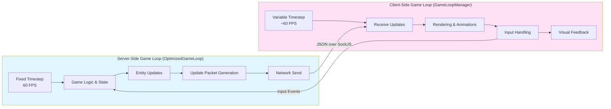
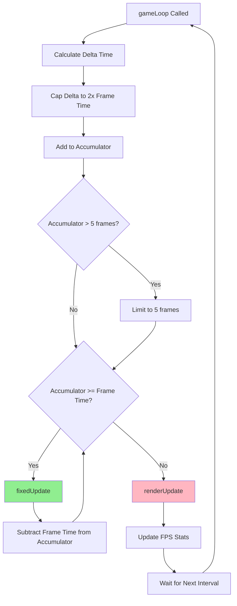
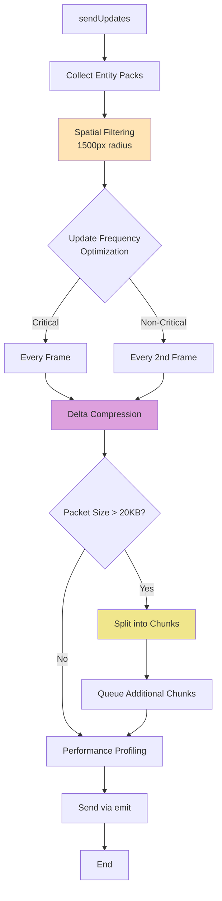
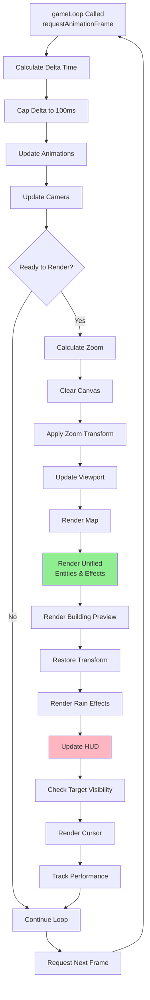
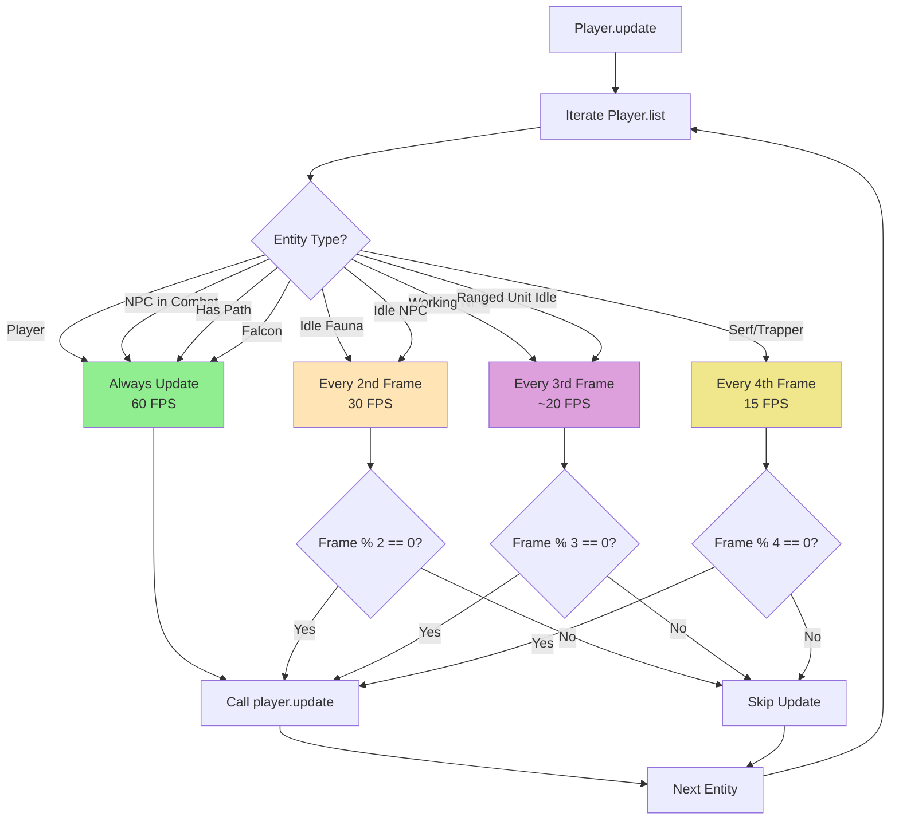
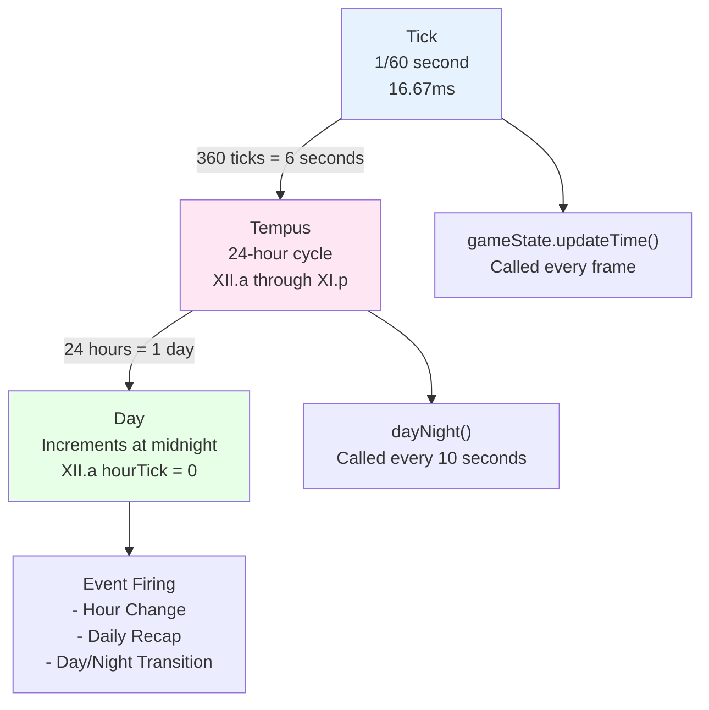
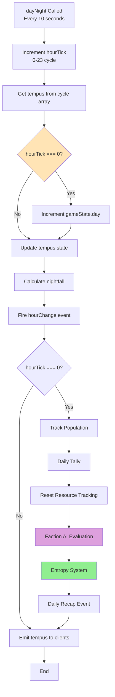
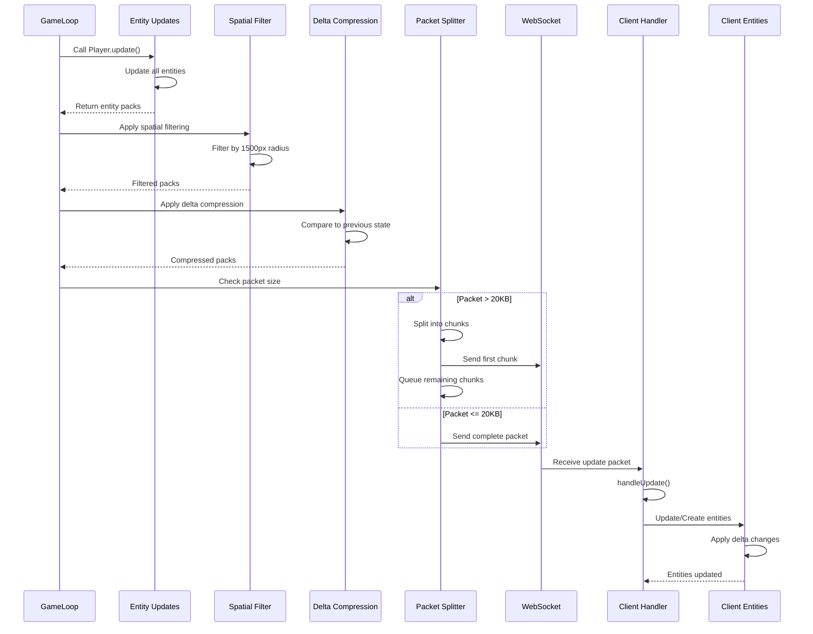

# Game Loop System Documentation

## Table of Contents
1. [System Architecture Overview](#1-system-architecture-overview)
2. [Server-Side Game Loop](#2-server-side-game-loop-optimizedgameloopjs)
3. [Client-Side Game Loop](#3-client-side-game-loop-gameloopmanagerjs)
4. [Entity Update System](#4-entity-update-system)
5. [Time and Day/Night System](#5-time-and-daynight-system)
6. [Periodic Systems](#6-periodic-systems)
7. [Update Message Flow](#7-update-message-flow)
8. [Performance Monitoring](#8-performance-monitoring)
9. [Optimization Strategies](#9-optimization-strategies)
10. [Integration Points](#10-integration-points)

---

## 1. System Architecture Overview

The Lambic game uses a **dual-loop architecture** that separates game logic (server-side) from rendering (client-side). This design ensures deterministic game state on the server while allowing smooth client-side rendering with variable framerates.

### 1.1 Dual-Loop Architecture



### 1.2 Separation of Concerns

**Server-Side Responsibilities:**
- Authoritative game state management
- Entity behavior and AI updates
- Physics and collision detection
- Combat resolution
- Resource management
- Faction AI processing
- Network synchronization

**Client-Side Responsibilities:**
- Visual rendering (map, entities, effects)
- Animation interpolation
- Camera/viewport management
- User input collection
- UI/HUD rendering
- Audio playback
- Visual effects (rain, lighting)

### 1.3 Synchronization Strategy

The system uses a **server-authoritative** approach:
- Server maintains the "source of truth" for all game state
- Client receives update packets via WebSocket (SockJS)
- Client applies updates to local entity representations
- Client performs interpolation and prediction for smooth visuals
- All critical actions (combat, building, movement) are validated server-side

### 1.4 Key Design Patterns

1. **Fixed Timestep (Server)**: Ensures consistent game simulation regardless of system load
2. **Variable Timestep (Client)**: Allows rendering to match display refresh rate
3. **Accumulator Pattern**: Server catches up on missed frames when lag occurs
4. **Delta Compression**: Only changed entity properties are sent over network
5. **Spatial Filtering**: Only entities near players are synchronized

---

## 2. Server-Side Game Loop (`OptimizedGameLoop.js`)

**File**: [`server/js/core/OptimizedGameLoop.js`](server/js/core/OptimizedGameLoop.js)

The server-side game loop is responsible for running all game logic at a consistent 60 FPS using a fixed timestep pattern.

### 2.1 Initialization

#### Constructor Setup

```javascript
constructor() {
  this.targetFPS = 60; // Back to 60 FPS for smooth gameplay
  this.targetFrameTime = 1000 / this.targetFPS; // ~16.67ms per frame
  this.lastFrameTime = 0;
  this.accumulator = 0;
  this.isRunning = false;
  
  // Performance monitoring structures
  this.frameTimeHistory = [];
  this.packetSizeHistory = [];
  this.memoryHistory = [];
  
  // Optimization features
  this.deltaCompressionEnabled = true;
  this.spatialFilteringEnabled = true;
  this.spatialFilterRadius = 1500; // pixels
  this.updateFrequencyOptimization = true;
  this.maxPacketSize = 20 * 1024; // 20KB
}
```

#### Initialize Method

```javascript
initialize(gameState, emitFunction) {
  this.gameState = gameState;
  this.emit = emitFunction;
}
```

Called during server initialization to inject dependencies.

#### Start Method

```javascript
start() {
  if (this.isRunning) return;
  this.isRunning = true;
  this.lastFrameTime = Date.now();
  this.intervalId = setInterval(() => this.gameLoop(), this.targetFrameTime);
}
```

Uses Node.js `setInterval` to run at consistent 60 FPS. Integration point in [`lambic.js`](lambic.js) at lines 8890-8893:

```javascript
optimizedGameLoop.initialize(gameState, emit);
// ... system registration ...
optimizedGameLoop.start();
```

### 2.2 Main Loop Structure (`gameLoop()`)

The main loop implements a fixed timestep with accumulator pattern:



```javascript
gameLoop() {
  if (!this.isRunning) return;
  const currentTime = Date.now();
  const deltaTime = currentTime - this.lastFrameTime;
  this.lastFrameTime = currentTime;
  
  // Cap delta time to prevent spiral of death
  const cappedDeltaTime = Math.min(deltaTime, this.targetFrameTime * 2);
  this.accumulator += cappedDeltaTime;
  
  // Max 5 frames worth of accumulation = max 5 updates per iteration
  const maxAccumulator = this.targetFrameTime * 5; // ~83ms at 60fps
  if(this.accumulator > maxAccumulator) {
    this.accumulator = maxAccumulator;
  }
  
  // Fixed timestep updates
  while (this.accumulator >= this.targetFrameTime) {
    this.fixedUpdate();
    this.accumulator -= this.targetFrameTime;
  }
  
  // Variable timestep hook (for telemetry)
  this.renderUpdate(deltaTime);
}
```

**Key Features:**
- **Delta Time Capping**: Prevents catastrophic lag from causing hundreds of updates in one frame
- **Accumulator Pattern**: Catches up on missed frames gradually (max 5 frames = ~83ms)
- **Fixed Timestep**: Ensures consistent game simulation (exactly 16.67ms per update)
- **Performance Tracking**: Updates FPS and frame time history

### 2.3 Fixed Update Phase (`fixedUpdate()`)

This is where all game logic runs:

```javascript
fixedUpdate() {
  const frameStartTime = Date.now();
  const frameBudget = this.targetFrameTime; // 16.67ms for 60fps
  
  // Process pathfinding queue (spread across frames)
  if (global.tilemapSystem && global.tilemapSystem.pathfindingSystem) {
    global.tilemapSystem.pathfindingSystem.processPathfindingQueue();
  }
  
  // Update game state (tick counter)
  if (this.gameState) {
    this.gameState.updateTime();
  }
  
  // Update social system (if budget remains)
  if (global.socialSystem && remainingBudget > frameBudget * 0.2) {
    global.socialSystem.update();
  }
  
  // Send updates to clients (always executed)
  this.sendUpdates();
  
  // Clear dirty flags
  this.performanceOptimizer.clearDirty();
}
```

#### Entity Update Calls

The `sendUpdates()` method calls static update methods on each entity type:

1. **Player.update()** (lines 186-187)
   - Main entity coordinator
   - Iterates through all entities in `Player.list`
   - Handles player, NPC, fauna, and ship updates
   - Returns update pack array

2. **Arrow.update()** (lines 190-191)
   - Projectile movement and collision
   - Returns arrow update pack

3. **Item.update()** (lines 194-195)
   - Item state updates (dropped items, containers)
   - Returns item update pack

4. **Light.update()** (lines 198-199)
   - Dynamic lighting updates (torches, fire)
   - Returns light update pack

5. **Building.update()** (lines 202-203)
   - Building state (construction progress, interactions)
   - Returns building update pack

6. **Weather.update()** (lines 206-207)
   - Weather entity movement and lifecycle
   - Returns weather update pack via `Weather.getAllUpdatePack()`

All update methods return "packs" - arrays of entity data dictionaries that represent the current state of entities that have changed.

### 2.4 Update Packet Generation (`sendUpdates()`)

This method (lines 166-383) is the heart of server-to-client synchronization:



#### Step 1: Collect Entity Packs

```javascript
const playerPack = Player.update();
const arrowPack = Arrow.update();
const itemPack = Item.update();
const lightPack = Light.update();
const buildingPack = Building.update();
const weatherPack = Weather.getAllUpdatePack();
```

#### Step 2: Spatial Filtering

Only entities within 1500 pixels of any player are included (unless god mode is active):

```javascript
if(this.spatialFilteringEnabled && playerPack) {
  filteredPlayerPack = this.spatialFilterEntities(playerPack);
}
```

**Spatial Filtering Logic** (`spatialFilterEntities()`, lines 630-695):
- Calculates distance from each entity to all player positions
- Includes entity if within `spatialFilterRadius` (1500px) on same Z-level
- Always includes: player's own entity, entities on different Z-levels, falcons
- Bypassed if any player is in god mode (spectator sees everything)

#### Step 3: Update Frequency Optimization

Separates entities into critical and non-critical:

```javascript
// Critical: players, entities in combat, entities with paths, falcons
if(isPlayer || isInCombat || hasPath || isFalcon) {
  criticalPlayerPack.push(entity);
} else if(shouldSendNonCritical) {
  // Non-critical: idle NPCs (sent every 2nd frame = 30 FPS)
  nonCriticalPlayerPack.push(entity);
}
```

**Update Frequencies:**
- Critical entities: Every frame (60 FPS)
- Non-critical entities: Every 2nd frame (30 FPS)

#### Step 4: Delta Compression

Only changed properties are sent:

```javascript
if(this.deltaCompressionEnabled && combinedPlayerPack) {
  compressedPlayerPack = this.compressEntityPack(combinedPlayerPack, 'player');
}
```

**Delta Compression Logic** (`compressEntityPack()`, lines 504-627):
- Maintains previous state for each entity (`previousEntityStates` Map)
- Compares current state to previous state
- Only includes changed properties in delta packet
- Special handling for falcons (always includes position/facing for smooth flight)
- Cleans up states for entities that no longer exist

#### Step 5: Packet Size Management

Large packets are split across multiple frames:

```javascript
const packetString = JSON.stringify({ msg: 'update', pack });
let packetSize = Buffer.byteLength(packetString, 'utf8');

if(packetSize > this.maxPacketSize && pack.player && Array.isArray(pack.player)) {
  // Split player entities into chunks
  const chunkSize = Math.ceil(pack.player.length / Math.ceil(packetSize / this.maxPacketSize));
  // Send first chunk now, queue rest
  this.packetSplitQueue = chunks.slice(1).map(...);
}
```

**Packet Limits:**
- Maximum size: 20 KB per packet
- Splitting: Player entities divided into chunks
- Queue system: Additional chunks sent one per frame

#### Step 6: Performance Profiling

Tracks timing for each system:

```javascript
this._perfData.playerTimes.push(playerTime);
this._perfData.arrowTimes.push(arrowTime);
this._perfData.itemTimes.push(itemTime);
this._perfData.buildingTimes.push(buildingTime);
this._perfData.totalTimes.push(totalTime);
```

Keeps last 300 samples (5 seconds at 60 FPS) for analysis.

#### Step 7: Send Packets

```javascript
this.emit({ msg: 'update', pack: finalPack });
```

Uses the injected `emit` function to broadcast to all connected clients via SockJS.

### 2.5 Performance Optimizations

#### Spatial Filtering (`spatialFilterEntities()`)

**Purpose**: Reduce network traffic by only sending entities visible to players

**Algorithm**:
1. Collect all player positions (x, y, z)
2. For each entity, check distance to nearest player on same Z-level
3. Include if distance ≤ 1500px or special case (falcons, different Z-levels)

**Special Cases**:
- God mode players receive all entities (spectator mode)
- Falcons always included (they move quickly and should be visible)
- Entities on different Z-levels always included (building interiors)

#### Delta Compression (`compressEntityPack()`)

**Purpose**: Reduce packet size by only sending changed properties

**Algorithm**:
1. Store previous state per entity ID in Map
2. Compare current state to previous (shallow then deep comparison)
3. Build delta object with only changed properties + entity ID
4. Update stored state for next comparison
5. Clean up states for deleted entities

**Optimizations**:
- Fast shallow comparison for primitives
- Array length check before deep comparison
- JSON.stringify comparison for objects (could be optimized further)
- Falcon special case: Always include position/facing even if unchanged

**Compression Ratio**: Typically 30-70% reduction in packet size depending on entity activity

#### Update Frequency Optimization

**Purpose**: Reduce CPU and network load for non-critical entities

**Strategy**:
- Critical entities (players, combat, pathing, falcons): 60 FPS
- Non-critical entities (idle NPCs): 30 FPS (every 2nd frame)

**Implementation**: Frame counter tracks which frame we're on, modulo operation determines if entity should be included

#### Packet Splitting

**Purpose**: Handle large update packets that exceed size limits

**Algorithm**:
1. Calculate total packet size
2. If exceeds 20KB, split player array into chunks
3. Send first chunk immediately
4. Queue remaining chunks (sent one per frame)

**Trade-off**: Slightly delayed updates for some entities, but prevents packet drops

#### Performance Monitoring

**Metrics Tracked**:
- Frame time history (60 samples = 1 second)
- Packet size history (300 samples = 5 seconds)
- Memory usage (every 1 second, includes RSS, heap used/total, external)
- Entity update times (per system: Player, Arrow, Item, Building)
- Entity counts (per type breakdown)

**Usage**: Logged periodically (once per tempus hour) for server monitoring and optimization

---

## 3. Client-Side Game Loop (`GameLoopManager.js`)

**File**: [`client/js/core/GameLoopManager.js`](client/js/core/GameLoopManager.js)

The client-side game loop handles all rendering and visual updates using `requestAnimationFrame` for smooth 60 FPS rendering.

### 3.1 Initialization

#### Constructor Setup

```javascript
constructor() {
  this.lastFrameTime = performance.now();
  this.renderStats = null;
  this.initRenderStats();
}

initRenderStats() {
  if (!window._renderStats) {
    window._renderStats = {
      frameTimes: [],
      entitiesIterated: { players: 0, items: 0, arrows: 0, buildings: 0 },
      entitiesRendered: { players: 0, items: 0, arrows: 0, buildings: 0 },
      lastLog: Date.now()
    };
  }
  this.renderStats = window._renderStats;
}
```

Tracks rendering performance statistics for debugging.

#### Start Method

```javascript
start(config) {
  requestAnimationFrame((time) => this.gameLoop(time, config));
}
```

Uses browser's `requestAnimationFrame` API for optimal rendering timing. Integration point in [`client/js/client.js`](client/js/client.js) at lines 1626-1629:

```javascript
if (gameLoopManager?.start) {
  gameLoopManager.start({ selfId, loginCameraSystem, ... });
} else {
  console.warn('GameLoopManager not available, using legacy game loop');
  requestAnimationFrame(gameLoop);
}
```

### 3.2 Main Loop Structure (`gameLoop()`)

The main client loop runs at variable timestep (typically 60 FPS):



```javascript
gameLoop(currentTime, config) {
  // Read values from config and global scope
  const selfId = window.selfId || config.selfId;
  // ... extract config values ...
  
  // Calculate delta time
  let deltaTime = currentTime - this.lastFrameTime;
  
  // Cap deltaTime to prevent fast-forward animations when tab becomes visible
  if (deltaTime > 100) {
    deltaTime = 100; // Max 100ms = ~6 frames at 60fps
  }
  
  this.lastFrameTime = currentTime;
  
  // Update animations
  if (updateAnimations) {
    updateAnimations(deltaTime);
  }
  
  // Update camera
  if (godModeCamera && godModeCamera.update) {
    godModeCamera.update(mapSize, tileSize);
  }
  
  // Early exit if not ready to render
  if (!selfId && !loginCameraSystem.isActive && !spectateCameraSystem.isActive) {
    requestAnimationFrame((time) => this.gameLoop(time, config));
    return;
  }
  
  if (!world || world.length === 0 || !tileSize || !mapSize) {
    requestAnimationFrame((time) => this.gameLoop(time, config));
    return;
  }
  
  // ... rendering pipeline ...
  
  // Continue the loop
  requestAnimationFrame((time) => this.gameLoop(time, config));
}
```

**Key Features:**
- **Variable Timestep**: Matches browser refresh rate (typically 60 FPS, but adapts to display)
- **Delta Time Capping**: Prevents catch-up animations when tab regains focus (max 100ms = ~6 frames)
- **Early Exit**: Skips rendering if not logged in or world data missing
- **Config Injection**: All dependencies passed via config object (allows runtime updates)

### 3.3 Rendering Pipeline

The rendering pipeline follows a specific order:

#### Step 1: Zoom Calculation

```javascript
// Update zoom based on current z-level (buildings/caves) with smooth transition
const newTargetZoom = getTargetZoom();
config.targetZoom = newTargetZoom;

// Smoothly interpolate current zoom towards target zoom
if (Math.abs(config.currentZoom - newTargetZoom) > 0.01) {
  const zoomDiff = newTargetZoom - config.currentZoom;
  config.currentZoom += zoomDiff * zoomTransitionSpeed;
} else {
  config.currentZoom = newTargetZoom; // Snap to target when very close
}

// Sync to global currentZoom so lighting system uses correct zoom
window.currentZoom = config.currentZoom;
```

**Zoom Behavior**:
- Different Z-levels use different zoom levels (buildings zoomed in, overworld normal)
- Smooth interpolation prevents jarring transitions
- Global sync ensures lighting system uses correct zoom

#### Step 2: Canvas Setup

```javascript
ctx.clearRect(0, 0, WIDTH, HEIGHT);

// Apply zoom transform
ctx.save();
ctx.translate(WIDTH / 2, HEIGHT / 2);
ctx.scale(config.currentZoom, config.currentZoom);
ctx.translate(-WIDTH / 2, -HEIGHT / 2);
```

Canvas is cleared and zoom transform applied. Transform is restored after rendering.

#### Step 3: Viewport Update

Viewport must be updated before rendering to ensure correct culling:

```javascript
// Update viewport BEFORE rendering
const cameraPos = getCameraPosition(); // or spectateCameraSystem.getCameraPosition()
if (config.viewport && config.viewport.update) {
  config.viewport.update(cameraPos.x, cameraPos.y, config.currentZoom, tileSize, mapSize);
}
```

Viewport calculates which tiles/entities are visible for culling.

#### Step 4: Map Rendering

```javascript
renderMap();
```

Renders the tilemap for the current viewport.

#### Step 5: Unified Rendering

Calls `renderUnified()` which handles all entity rendering based on mode:

```javascript
// SPECTATE MODE
if (spectateCameraSystem.isActive) {
  renderUnified('spectate', currentZ, nightfall);
}
// LOGIN CAMERA MODE
else if (!selfId || (selfId && !Player.list[selfId])) {
  renderUnified('login', currentZ, nightfall);
}
// NORMAL + GOD MODE
else if (selfId && Player.list[selfId]) {
  const mode = godModeCamera.isActive ? 'godmode' : 'normal';
  renderUnified(mode, currentZ, nightfall);
}
```

**Rendering Modes**:
- `'spectate'`: Spectator camera following entities
- `'login'`: Cinematic camera before login (falcon camera)
- `'normal'`: Player camera following player entity
- `'godmode'`: Free camera controlled by keyboard

The `renderUnified()` function (defined in [`client/js/client.js`](client/js/client.js)) renders:
- Buildings
- Items
- Players/NPCs/Fauna
- Arrows
- Lights
- Weather effects (fog)

All rendering respects Z-level (`currentZ`) and nightfall state for lighting.

#### Step 6: Building Preview

```javascript
const previewMode = window.buildPreviewMode || buildPreviewMode;
const previewType = window.buildPreviewType || buildPreviewType;
if (previewMode && previewType) {
  renderBuildingPreview();
}
```

Renders building preview that follows mouse cursor when in build mode.

#### Step 7: Restore Transform

```javascript
ctx.restore();
```

Restores canvas transform (removes zoom scaling).

#### Step 8: Screen-Space Effects

```javascript
// Render rain effects AFTER zoom transform is restored (in screen-space)
const currentZ = getCurrentZ();
if (currentZ === 0) {
  const cameraPos = getCameraPosition();
  const weatherEffects = getWeatherEffects(cameraPos.x, cameraPos.y, currentZ);
  updateRain(weatherEffects);
  renderRain();
} else {
  // Clear rain particles when indoors (z > 0) or underground (z < 0)
  updateRain(null);
}
```

Rain effects are rendered in screen space (not world space) and only on overworld (Z=0).

#### Step 9: HUD Updates

```javascript
// Update portrait HUDs (real-time HP/Spirit updates)
updatePlayerPortraitHUD();
updateTargetPortraitHUD();

// Update character UI sprite/portrait every frame when popup is open
if (typeof window !== 'undefined') {
  const characterPopup = document.getElementById('character-popup');
  if (characterPopup && characterPopup.style.display === 'block') {
    if (typeof updateCharacterDisplay !== 'undefined') {
      updateCharacterDisplay(false); // Update sprite/portrait without full refresh
    }
  }
}
```

HUD elements updated every frame for real-time feedback.

#### Step 10: Target Visibility Check

```javascript
// Check target visibility and auto-deselect if needed (after HUD update)
this.checkTargetVisibility(config);
```

Automatically deselects target if it moves out of viewport or changes Z-level (unless in combat).

**Target Visibility Logic** (`checkTargetVisibility()`, lines 35-104):
1. Check if target exists
2. Skip if player is in combat with target (don't deselect during combat)
3. Check Z-level mismatch
4. Check viewport bounds (with margin for smooth scrolling)
5. Clear target if conditions not met

#### Step 11: Cursor Rendering

```javascript
renderCursor();
```

Renders custom cursor sprite (replaces default browser cursor).

#### Step 12: Performance Tracking

```javascript
// Track rendering performance
const renderTime = performance.now() - renderStart;
this.renderStats.frameTimes.push(renderTime);
if (this.renderStats.frameTimes.length > 300) {
  this.renderStats.frameTimes.shift();
}

// Hook performance HUD tracking (if enabled)
if (window.performanceHUD && window.performanceHUD.enabled) {
  window.performanceHUD.recordFrame(deltaTime);
}
```

Tracks frame rendering time for performance monitoring (available in PerformanceHUD when enabled).

---

## 4. Entity Update System

**File**: [`lambic.js`](lambic.js) (line 5130+)

The `Player.update()` function is the main entity coordinator that iterates through all entities and updates them according to their type and state.

### 4.1 Player.update() Coordinator

This is **not** a Character-level update function - it's the game loop coordinator that:
- Manages ghost timers and auto-respawn
- Implements performance optimization (update throttling for NPCs)
- Calls `player.update()` for each entity (which triggers `Character.update`)
- Handles ship docking checks
- Manages zone transitions for players
- Cleans up entities marked for removal
- Collects and returns update packs for network synchronization
- Tracks performance metrics

**Function Signature**:
```javascript
Player.update = function() {
  const pack = [];
  // ... entity iteration and updates ...
  return pack;
}
```

### 4.2 Update Throttling by Entity Type

Different entity types are updated at different frequencies to optimize performance:



#### Always Update Every Frame (60 FPS):
- **Players** (`player.type === 'player'`): Human players always need smooth updates
- **NPCs in Combat**: Entities with `player.action === 'combat'` need real-time combat updates
- **Entities with Paths**: Entities with `player.path && player.path.length > 0` need smooth movement
- **Falcons**: `player.class === 'Falcon'` always update for smooth flight animation

#### Update Every 2nd Frame (30 FPS):
- **Idle Fauna**: Deer, Boar, Wolf when not moving/fleeing/combat
- **Idle NPCs**: Faction units when not in combat or pathing

#### Update Every 3rd Frame (~20 FPS):
- **Working NPCs**: NPCs with `player.working === true` (mostly stationary)
- **Ranged Units**: TeutonBow, FrankBow, Poacher when idle

#### Update Every 4th Frame (15 FPS):
- **Serfs/Trappers**: Serf, SerfM, SerfF, Trapper when idle (resource gathering doesn't need high frequency)

**Implementation** (lines 5192-5246):
```javascript
var shouldUpdate = true;
if(player.type === 'npc'){
  if(player.action === 'combat' || player.path){
    shouldUpdate = true; // Always update if active
  }
  else if(player.working){
    shouldUpdate = (Player._updateFrame % 3 === 0);
  }
  else if(player.class === 'Deer' || player.class === 'Sheep' || player.class === 'Boar' || player.class === 'Wolf'){
    if(player.path || player.action === 'flee' || player.action === 'combat'){
      shouldUpdate = true; // Active fauna update every frame
    } else {
      shouldUpdate = (Player._updateFrame % 2 === 0); // Idle fauna every 2nd frame
    }
  }
  // ... more type checks ...
}
```

**Frame Counter**: `Player._updateFrame` increments every call to `Player.update()`, used with modulo for throttling.

### 4.3 Ghost Timer Handling

Ghost entities (dead players) have a respawn timer:

```javascript
if(player.ghost && player.ghostTimer > 0){
  player.ghostTimer--;
  
  // First message: announce total time (only once at start)
  if(player.ghostTimer === 5399){ // First frame (90 seconds = 5400 frames at 60fps)
    var socket = SOCKET_LIST[i];
    if(socket){
      socket.write(JSON.stringify({msg:'addToChat',message:'<span style="color:#aaaaff;">👻 You are dead. Respawning in 1:30...</span>'}));
    }
  }
  
  // Countdown last 10 seconds only
  if(player.ghostTimer <= 600 && player.ghostTimer % 60 === 0 && player.ghostTimer > 0){
    var socket = SOCKET_LIST[i];
    if(socket){
      var seconds = Math.ceil(player.ghostTimer / 60);
      socket.write(JSON.stringify({msg:'addToChat',message:'<span style="color:#aaaaff;">👻 Respawning in ' + seconds + ' second' + (seconds > 1 ? 's' : '') + '...</span>'}));
    }
  }
  
  // Auto-respawn when timer expires
  if(player.ghostTimer <= 0){
    player.respawnFromGhost();
  }
}
```

**Ghost Timer**: 5400 frames = 90 seconds at 60 FPS. Countdown messages sent during last 10 seconds.

### 4.4 Ship Docking Checks

Ships check for dock contact before updating:

```javascript
if(player.type === 'ship' && player.checkDockContact){
  if(player.checkDockContact()){
    continue; // Ship is now stored, skip remaining updates
  }
}
```

If ship docks, it's removed from active entities and stored in dock building.

### 4.5 Individual Entity Updates

Each entity's `update()` method is called:

```javascript
player.update();
```

This triggers the `Character.update()` method which handles:
- Movement and pathfinding
- Combat state
- Animation updates
- Status effects
- Resource gathering
- Building interactions

### 4.6 Combat Updates

NPCs in combat are processed via SimpleCombat system:

```javascript
// NPC COMBAT UPDATE - Handle combat for NPCs (and players with pending stealth attacks)
if (player.type === 'npc' && player.action === 'combat' && global.simpleCombat) {
  global.simpleCombat.update(player);
} else if (player.type === 'npc' && player.stealthed && !player.revealed && player._pendingCombatTarget) {
  // NPC with pending stealth attack - update to handle stealth combat
  global.simpleCombat.update(player);
}
```

Combat system handles attack timing, damage calculation, and combat state transitions.

### 4.7 Fishing Updates

Entities that are fishing have special update logic:

```javascript
if(player.fishing && player.updateFishing){
  player.updateFishing();
}
```

Handles fishing rod animation and catch timing.

### 4.8 Attack-Move Logic

Entities with `attackMoveTarget` check for enemies while pathing:

```javascript
if(player.attackMoveTarget && player.path && player.path.length > 0 && !player.combat.target){
  var aggroRange = player.aggroRange || 256;
  var aggroRangeSquared = aggroRange * aggroRange;
  
  // Iterate through all entities to find nearby enemies
  for(var j = 0; j < enemiesToCheck.length; j++){
    var enemy = enemiesToCheck[j];
    // ... distance check ...
    if(distanceSquared <= aggroRangeSquared){
      // Enemy in range - interrupt path and engage
      if (global.simpleCombat) {
        global.simpleCombat.startCombat(player, enemy);
      }
      break;
    }
  }
}
```

If enemy found within aggro range, combat starts and pathing is interrupted.

### 4.9 Update Pack Generation

After updating each entity, update pack data is collected:

```javascript
// Entity is added to pack with current state
if(player.type === 'player' || player.type === 'npc' || player.type === 'fauna' || player.type === 'ship'){
  pack.push({
    id: player.id,
    type: player.type,
    class: player.class,
    x: player.x,
    y: player.y,
    z: player.z,
    facing: player.facing,
    hp: player.hp,
    hpMax: player.hpMax,
    // ... more properties ...
  });
}
```

The pack is returned to `OptimizedGameLoop.sendUpdates()` for network synchronization.

### 4.10 Performance Tracking

Update times are tracked per entity type:

```javascript
const entityUpdateStart = Date.now();
player.update();
const entityUpdateTime = Date.now() - entityUpdateStart;

// Track slow entity updates (>1ms) by type
if(entityUpdateTime > 1 && !Player._perfData.entityUpdateTimes[entityClass]) {
  Player._perfData.entityUpdateTimes[entityClass] = [];
}
if(entityUpdateTime > 1 && Player._perfData.entityUpdateTimes[entityClass]) {
  Player._perfData.entityUpdateTimes[entityClass].push(entityUpdateTime);
  // Keep only last 100 samples per entity type
  if(Player._perfData.entityUpdateTimes[entityClass].length > 100) {
    Player._perfData.entityUpdateTimes[entityClass].shift();
  }
}
```

Used to identify performance bottlenecks by entity type.

---

## 5. Time and Day/Night System

The game uses a multi-layered time system that manages ticks, hours (tempus), and days.

### 5.1 GameState Time Management

**File**: [`server/js/core/GameState.js`](server/js/core/GameState.js)

The `GameState` class manages the core time state:

```javascript
class GameState {
  constructor() {
    this.day = 1;
    this.tick = 1;
    this.tempus = 'XII.a'; // Current hour
    this.previousTempus = 'XII.a';
    this.previousHourIndex = 0;
    this.nightfall = true;
    this.period = 360; // Ticks per hour (360 ticks = 6 seconds at 60fps)
  }
}
```

#### Time Hierarchy



**Time Constants**:
- **Tick**: Increments every frame (60 FPS = 16.67ms per tick)
- **Period**: 360 ticks = 6 seconds = 1 hour (tempus)
- **Day**: 24 hours (tempus) = 8640 ticks = 144 seconds = 2.4 minutes real-time

#### updateTime() Method

Called every frame from `OptimizedGameLoop.fixedUpdate()`:

```javascript
updateTime() {
  this.tick++;
  this.updateTempus();
  
  if (this.tick >= this.period) {
    this.tick = 1; // Reset tick counter (day increment handled by dayNight())
  }
}

updateTempus() {
  // NOTE: Tempus is now managed by dayNight() function, not calculated from tick
  // This function only updates nightfall based on current tempus
  this.nightfall = ['VIII.p', 'IX.p', 'X.p', 'XI.p', 'XII.a', 'I.a', 'II.a', 'III.a', 'IV.a'].includes(this.tempus);
}
```

**Important Note**: `tempus` is no longer calculated from ticks. It's managed by the `dayNight()` function which runs on a separate interval (every 10 seconds).

### 5.2 Day/Night Cycle (`dayNight()`)

**File**: [`lambic.js`](lambic.js) (lines 6080-6280)

The day/night cycle runs independently on a 10-second interval:

```javascript
// Initialize day/night cycle
setInterval(dayNight, 3600000 / gameState.period); // Every 10 seconds
```

#### Tempus Cycle Array

```javascript
const cycle = [
  'XII.a','I.a','II.a','III.a','IV.a','V.a','VI.a','VII.a','VIII.a','IX.a','X.a','XI.a', // Ante meridiem (AM)
  'XII.p','I.p','II.p','III.p','IV.p','V.p','VI.p','VII.p','VIII.p','IX.p','X.p','XI.p'  // Post meridiem (PM)
];
```

24 hours total, using Roman numerals with `.a` (ante meridiem) and `.p` (post meridiem) suffixes.

#### dayNight() Flow



#### dayNight() Function

```javascript
let hourTick = 0; // Tracks which hour we're in (0-23, where 0 = XII.a)

function dayNight() {
  // Increment hour counter (0-23, cycles through all 24 hours)
  hourTick = (hourTick + 1) % 24;
  const newTempus = cycle[hourTick];
  
  // When we cycle back to XII.a (hourTick = 0), increment the day
  if (hourTick === 0) {
    gameState.day++;
    global.day = gameState.day;
  }
  
  // Update tempus in gameState and sync local/global variables
  const previousTempus = gameState.tempus;
  gameState.tempus = newTempus;
  gameState.previousTempus = previousTempus;
  tempus = newTempus;
  global.tempus = newTempus;
  
  // Calculate nightfall
  nightfall = ['VIII.p', 'IX.p', 'X.p', 'XI.p', 'XII.a', 'I.a', 'II.a', 'III.a', 'IV.a'].includes(newTempus);
  gameState.nightfall = nightfall;
  global.nightfall = nightfall;
  
  // Fire hour change event
  if (global.eventManager) {
    global.eventManager.hourChange(newTempus, gameState.day);
  }
  
  // ... midnight processing ...
  
  // Emit tempus update to clients
  emit({ msg: 'tempus', tempus: newTempus, nightfall: nightfall });
}
```

#### Midnight Processing (hourTick === 0)

When the hour counter cycles back to 0 (midnight), several systems run:

1. **Population Tracking**:
   - Counts players, NPCs, fauna before updates
   - Tracks serfs by house
   - Tracks military units by house

2. **Daily Tally** (`dailyTally()`, line 2538):
   ```javascript
   function dailyTally() {
     for (const i in Building.list) {
       const b = Building.list[i];
       if (b.built && (b.type === 'mill' || b.type === 'lumbermill' || b.type === 'mine' || b.type === 'dock')) {
         Building.list[i].tally();
       }
     }
   }
   ```
   Processes resource production from production buildings.

3. **Resource Tracking Reset**:
   ```javascript
   resetDailyResourceTracking();
   ```

4. **Faction AI Evaluation**:
   ```javascript
   for (var houseId in House.list) {
     var house = House.list[houseId];
     if (house.ai && house.ai.evaluateAndAct) {
       house.ai.evaluateAndAct();
     }
   }
   ```
   Each faction evaluates goals and takes actions for the new day.

5. **Entropy System** (`entropy()`, line 2269):
   - Flora growth (forest spreading)
   - Fauna spawning (deer, boar, wolf, falcon)
   - Tile changes

6. **Daily Recap Event**:
   ```javascript
   global.eventManager.dailyRecap(dayForRecap, populationBefore, {
     tilesChanged: entropyStats.tilesChanged || 0,
     faunaAdded: entropyStats.faunaAdded || 0,
     serfsAdded: serfsAdded,
     militaryUnitsAdded: militaryUnitsAdded
   });
   ```

#### Work Day End Processing

At tempus `VII.p` (7 PM), work day ends:

```javascript
if (newTempus === 'VII.p') {
  sendDailyResourceReport();
}
```

Sends resource reports to players.

#### Day/Night Transition Events

```javascript
if (global.eventManager) {
  const wasNight = global.lastNightfall;
  if (nightfall !== wasNight) {
    // Transition occurred
    if (nightfall) {
      global.eventManager.dayNightTransition('Nightfall', true);
    } else {
      global.eventManager.dayNightTransition('Dawn', false);
    }
  }
  global.lastNightfall = nightfall;
}
```

Fires events when transitioning between day and night.

#### Tempus Update Broadcasting

Every hour change, clients are notified:

```javascript
emit({ msg: 'tempus', tempus: newTempus, nightfall: nightfall });
```

Clients receive this and update lighting, music, and visual effects accordingly.

---

## 6. Periodic Systems

Several systems run on independent intervals outside the main game loop.

### 6.1 Weather Updates

**File**: [`lambic.js`](lambic.js) (lines 2500-2536, 310-312)

Runs every 1 second via `setInterval`:

```javascript
// Weather update (every 60 ticks = 1 second at 60 FPS)
setInterval(function() {
  updateWeather(gameState.tempus);
}, 1000); // Every second
```

#### updateWeather() Function

```javascript
function updateWeather(tempus) {
  // Scale max counts based on map size (for consistent density)
  const mapArea = mapSize * mapSize;
  const baseMapArea = 200 * 200; // 40,000 tiles
  const scaleFactor = mapArea / baseMapArea;
  
  const maxFog = Math.max(3, Math.ceil(3 * scaleFactor));
  const maxStorms = Math.max(3, Math.ceil(3 * scaleFactor));
  
  // Fog spawning (only during early morning hours)
  if(['IV.a', 'V.a', 'VI.a', 'VII.a', 'VIII.a', 'IX.a'].includes(tempus)) {
    if(Math.random() < weatherSpawnChance.fog) {
      const fogCount = Object.values(Weather.list).filter(w => w.weatherType === 'fog').length;
      if(fogCount < maxFog) {
        spawnWeather('fog');
      }
    }
  }
  
  // Storm spawning (any time)
  if(Math.random() < weatherSpawnChance.storm) {
    const stormCount = Object.values(Weather.list).filter(w => w.weatherType === 'storm').length;
    if(stormCount < maxStorms) {
      spawnWeather('storm');
    }
  }
  
  // Update all weather entities
  Weather.update();
}
```

**Weather Spawn Chances**:
- Fog: 0.5% per second during morning hours (IV.a - IX.a)
- Storm: 0.08% per second (any time)

**Weather Updates**: All weather entities update their position and lifecycle via `Weather.update()`.

### 6.2 Entropy System

**File**: [`lambic.js`](lambic.js) (lines 2269-2465)

Runs once per day at midnight (when `hourTick === 0` in `dayNight()`):

```javascript
// Run entropy at midnight
if (lastEntropyTempus !== newTempus) {
  entropyStats = entropy() || { tilesChanged: 0, faunaAdded: 0 };
  lastEntropyTempus = newTempus;
}
```

#### entropy() Function

The entropy system manages natural world evolution:

1. **Flora Growth**:
   - Light forest → Heavy forest (when resource > 100)
   - Brush → Light forest (when near heavy/light forest)
   - Empty → Brush (when near forest/brush)

2. **Fauna Spawning**:
   - Deer: Spawn to maintain ratio (1 per 300 heavy forest tiles)
   - Boar: Spawn to maintain ratio (1 per 600 heavy forest tiles)
   - Wolf: Spawn to maintain ratio (1 per 500 heavy forest tiles)
   - Falcon: Spawn to maintain ratio (1 per 800 heavy forest tiles, capped by map size)

3. **Population Management**:
   - Counts existing fauna
   - Calculates deficit from target ratio
   - Spawns new fauna at 33% recovery rate (or 61.8% on day 1 for initial spawn)

**Entropy Guard**: Uses `lastEntropyTempus` to ensure entropy only runs once per midnight, preventing multiple calls.

---

## 7. Update Message Flow

The server sends update packets to clients via WebSocket (SockJS), and clients process them to update local entity state.

### 7.1 Server to Client

#### Update Packet Flow



#### Update Packet Format

**Main Update Packet** (`{ msg: 'update', pack: {...} }`):
```javascript
{
  msg: 'update',
  pack: {
    player: [ /* array of player/entity update objects */ ],
    arrow: [ /* array of arrow update objects */ ],
    item: [ /* array of item update objects */ ],
    light: [ /* array of light update objects */ ],
    building: [ /* array of building update objects */ ],
    weather: [ /* array of weather update objects */ ]
  }
}
```

**Render Update Packet** (`{ msg: 'renderUpdate', pack: {...} }`):
```javascript
{
  msg: 'renderUpdate',
  pack: {
    deltaTime: 16.67,
    fps: 60,
    stats: { /* performance statistics */ }
  }
}
```

**Tempus Update Packet** (`{ msg: 'tempus', ... }`):
```javascript
{
  msg: 'tempus',
  tempus: 'VII.a',
  nightfall: false
}
```

#### Packet Generation Location

**File**: [`server/js/core/OptimizedGameLoop.js`](server/js/core/OptimizedGameLoop.js)

- `sendUpdates()` (line 166): Main update packet
- `sendRenderUpdates()` (line 386): Render/performance packet
- `dayNight()` in [`lambic.js`](lambic.js) (line 6277): Tempus packet

#### Packet Optimization

Before sending, packets are optimized:
1. Spatial filtering (only nearby entities)
2. Delta compression (only changed properties)
3. Update frequency optimization (critical vs non-critical)
4. Packet splitting (if > 20KB)

### 7.2 Client Processing

**File**: [`client/js/core/SocketMessageHandler.js`](client/js/core/SocketMessageHandler.js)

#### handleUpdate() Method

Processes `{ msg: 'update', pack: {...} }` messages:

```javascript
handleUpdate: function(data) {
  // Track update packets for performance HUD
  if (window.performanceHUD && window.performanceHUD.enabled) {
    window.performanceHUD.recordUpdatePacket();
  }
  
  // Process player/entity updates
  var playerPackLength = data.pack.player ? data.pack.player.length : 0;
  for(var i = 0 ; i < playerPackLength; i++){
    var pack = data.pack.player[i];
    if(!pack || !pack.id) continue;
    
    var p = Player.list[pack.id];
    
    // Create entity from update pack if it doesn't exist (fallback)
    if (!p && pack.class) {
      new Player(pack); // Create from update data
      p = Player.list[pack.id];
    }
    
    if(p){
      // Update existing entity with delta data
      // Only update properties that exist in pack (delta compression)
      if(pack.x !== undefined) p.x = pack.x;
      if(pack.y !== undefined) p.y = pack.y;
      if(pack.z !== undefined) p.z = pack.z;
      // ... update other properties ...
    }
  }
  
  // Process arrows, items, lights, buildings similarly
  // ...
}
```

#### Entity Update Logic

**Delta Application**:
- If entity exists: Update only properties present in pack (delta compression)
- If entity doesn't exist: Create new entity from pack data (fallback for missed init)

**Position Optimization**:
- Skips position update if position hasn't changed (common for stationary entities)
- Reduces unnecessary sprite repositioning

**Sprite Assignment**:
- Sprites assigned during entity creation (via `PlayerEntity` constructor)
- Update packs don't include sprite data (client handles sprite lookup)

#### handleTempus() Method

Processes `{ msg: 'tempus', ... }` messages:

```javascript
handleTempus: function(data) {
  // Update global time state
  if (typeof window !== 'undefined') {
    window.tempus = data.tempus;
    window.nightfall = data.nightfall;
  }
  tempus = data.tempus;
  nightfall = data.nightfall;
  
  // Update lighting, music, effects based on time of day
  // ...
}
```

Updates lighting system, background music, and visual effects based on tempus and nightfall.

---

## 8. Performance Monitoring

Both server and client track performance metrics for optimization and debugging.

### 8.1 Server-Side Metrics

**File**: [`server/js/core/OptimizedGameLoop.js`](server/js/core/OptimizedGameLoop.js)

#### Frame Time History

```javascript
this.frameTimeHistory = [];
this.maxHistorySize = 60; // Keep 1 second of history at 60 FPS

updateFrameTimeHistory(deltaTime) {
  this.frameTimeHistory.push(deltaTime);
  if (this.frameTimeHistory.length > this.maxHistorySize) {
    this.frameTimeHistory.shift();
  }
}
```

Tracks last 60 frame times (1 second at 60 FPS) for average/min/max calculations.

#### Packet Size History

```javascript
this.packetSizeHistory = [];
this.maxPacketHistorySize = 300; // Keep 5 seconds of history at 60 FPS

// In sendUpdates():
this.packetSizeHistory.push(packetSize);
if(this.packetSizeHistory.length > this.maxPacketHistorySize) {
  this.packetSizeHistory.shift();
}
```

Tracks last 300 packet sizes (5 seconds) for network bandwidth analysis.

#### Memory Usage

```javascript
this.memoryHistory = [];
this.memoryCheckInterval = 1000; // Check every second

// In sendUpdates() (periodically):
if(now - this.lastMemoryCheck >= this.memoryCheckInterval) {
  if(global.gc) {
    global.gc(); // Force garbage collection if available
  }
  const memUsage = process.memoryUsage();
  this.memoryHistory.push({
    timestamp: now,
    rss: memUsage.rss,
    heapTotal: memUsage.heapTotal,
    heapUsed: memUsage.heapUsed,
    external: memUsage.external
  });
}
```

Tracks memory usage every second (RSS, heap used/total, external).

#### Entity Update Times

```javascript
this._perfData = {
  playerTimes: [],
  arrowTimes: [],
  itemTimes: [],
  buildingTimes: [],
  totalTimes: []
};

// Track individual system times
const t1 = Date.now();
const playerPack = Player.update();
const playerTime = Date.now() - t1;
// ... track other systems ...
this._perfData.playerTimes.push(playerTime);
```

Tracks update time for each entity system separately to identify bottlenecks.

#### Packet Analysis

```javascript
this._packetAnalysis = {
  entityCounts: [],
  entityTypeBreakdown: {}
};

// Track entity counts per update
const entityCounts = {
  players: playerPack ? playerPack.length : 0,
  arrows: arrowPack ? arrowPack.length : 0,
  items: itemPack ? itemPack.length : 0,
  lights: lightPack ? lightPack.length : 0,
  buildings: buildingPack ? buildingPack.length : 0,
  total: 0
};
```

Tracks entity counts per update for capacity planning.

#### Performance Statistics

```javascript
getPerformanceStats() {
  const avgFrameTime = this.frameTimeHistory.length > 0 
    ? this.frameTimeHistory.reduce((a, b) => a + b, 0) / this.frameTimeHistory.length 
    : 0;
  
  const avgPacketSize = this.packetSizeHistory.length > 0
    ? this.packetSizeHistory.reduce((a, b) => a + b, 0) / this.packetSizeHistory.length
    : 0;
  
  return {
    fps: this.performanceOptimizer.fps,
    avgFrameTime: avgFrameTime.toFixed(2),
    avgPacketSize: (avgPacketSize / 1024).toFixed(2) + ' KB',
    memory: { /* memory stats */ },
    entityStats: this.entityManager.getStats(),
    optimizerStats: this.performanceOptimizer.getStats()
  };
}
```

Provides aggregated statistics for logging/monitoring.

**Logging**: Performance data is logged once per tempus hour (see [`lambic.js`](lambic.js) for logging integration).

### 8.2 Client-Side Metrics

**File**: [`client/js/core/GameLoopManager.js`](client/js/core/GameLoopManager.js)

#### Render Statistics

```javascript
window._renderStats = {
  frameTimes: [],
  entitiesIterated: { players: 0, items: 0, arrows: 0, buildings: 0 },
  entitiesRendered: { players: 0, items: 0, arrows: 0, buildings: 0 },
  lastLog: Date.now()
};

// In gameLoop():
const renderStart = performance.now();
// ... rendering ...
const renderTime = performance.now() - renderStart;
this.renderStats.frameTimes.push(renderTime);
if (this.renderStats.frameTimes.length > 300) {
  this.renderStats.frameTimes.shift();
}
```

Tracks frame rendering time and entity iteration/rendering counts.

#### Performance HUD Integration

```javascript
// Hook performance HUD tracking (if enabled)
if (window.performanceHUD && window.performanceHUD.enabled) {
  window.performanceHUD.recordFrame(deltaTime);
}
```

When Performance HUD is enabled, frame times are recorded for display.

#### Update Packet Tracking

```javascript
// In SocketMessageHandler.handleUpdate():
if (window.performanceHUD && window.performanceHUD.enabled) {
  window.performanceHUD.recordUpdatePacket();
}
```

Tracks when update packets are received for network latency analysis.

---

## 9. Optimization Strategies

The game loop system employs multiple optimization strategies to maintain 60 FPS and minimize network bandwidth.

### 9.1 Server Optimizations

#### Spatial Filtering

**Purpose**: Reduce network traffic by only sending entities visible to players

**Implementation**: `spatialFilterEntities()` in [`OptimizedGameLoop.js`](server/js/core/OptimizedGameLoop.js) (lines 630-695)

**Effect**: Typically reduces player pack size by 50-80% depending on player distribution

#### Delta Compression

**Purpose**: Reduce packet size by only sending changed properties

**Implementation**: `compressEntityPack()` in [`OptimizedGameLoop.js`](server/js/core/OptimizedGameLoop.js) (lines 504-627)

**Compression Ratio**: 30-70% reduction in packet size depending on entity activity

**Trade-off**: Requires storing previous state per entity (memory overhead)

#### Update Frequency Reduction

**Purpose**: Reduce CPU and network load for non-critical entities

**Strategy**:
- Critical entities: 60 FPS (players, combat, pathing, falcons)
- Non-critical entities: 30 FPS (idle NPCs)

**Implementation**: Frame counter with modulo operation in `sendUpdates()`

**Effect**: ~30% reduction in network traffic for non-critical entities

#### Packet Splitting

**Purpose**: Handle large update packets that exceed size limits

**Implementation**: Chunking system in `sendUpdates()` (lines 307-335)

**Trade-off**: Slightly delayed updates for some entities, but prevents packet drops

#### Pathfinding Throttling

**Purpose**: Spread pathfinding work across frames to prevent frame spikes

**Implementation**: `processPathfindingQueue()` in pathfinding system (called from `fixedUpdate()`)

**Strategy**: Process limited number of pathfinding requests per frame based on frame budget

### 9.2 Client Optimizations

#### Delta Time Capping

**Purpose**: Prevent catch-up animations when tab regains focus

**Implementation**: In `GameLoopManager.gameLoop()`:
```javascript
if (deltaTime > 100) {
  deltaTime = 100; // Max 100ms = ~6 frames at 60fps
}
```

**Effect**: Prevents jarring fast-forward animations when browser tab was inactive

#### Viewport Culling

**Purpose**: Only render entities visible in viewport

**Implementation**: Viewport system calculates visible tiles/entities before rendering

**Effect**: Reduces rendering workload by 60-90% depending on zoom level

#### Animation Throttling

**Purpose**: Reduce animation update frequency for non-critical entities

**Implementation**: Entity update throttling in `Player.update()` (server-side affects client via update frequency)

**Effect**: Smoother frame times, less CPU usage

#### Update Throttling

**Purpose**: Skip redundant position updates

**Implementation**: In `SocketMessageHandler.handleUpdate()`, position updates are skipped if unchanged

**Effect**: Reduces sprite repositioning work

---

## 10. Integration Points

The game loop system integrates with several other systems:

### 10.1 SystemRegistry

**File**: [`server/js/core/SystemRegistry.js`](server/js/core/SystemRegistry.js)

The game loop is registered in the system registry:

```javascript
systemRegistry.register('gameLoop', optimizedGameLoop, { 
  dependsOn: ['gameState'], 
  priority: 2 
});
```

Allows other systems to access the game loop and ensures proper initialization order.

### 10.2 EventManager

**File**: Various event hooks in [`lambic.js`](lambic.js)

The game loop triggers several events:

- **Hour Change**: `eventManager.hourChange(newTempus, gameState.day)` - Fired every hour
- **Day/Night Transition**: `eventManager.dayNightTransition(type, isNight)` - Fired when transitioning
- **Daily Recap**: `eventManager.dailyRecap(day, populationBefore, stats)` - Fired at midnight

These events allow other systems to react to time changes.

### 10.3 Tilemap System

**File**: [`server/js/core/TilemapIntegration.js`](server/js/core/TilemapIntegration.js)

The game loop processes pathfinding queue:

```javascript
if (global.tilemapSystem && global.tilemapSystem.pathfindingSystem) {
  global.tilemapSystem.pathfindingSystem.processPathfindingQueue();
}
```

Pathfinding requests are queued and processed across multiple frames to prevent frame spikes.

### 10.4 Social System

**File**: [`server/js/core/SocialSystem.js`](server/js/core/SocialSystem.js)

Social system updates are called conditionally:

```javascript
if (global.socialSystem && remainingBudget > frameBudget * 0.2) {
  global.socialSystem.update();
}
```

Only runs if frame budget allows (low priority).

### 10.5 Combat System

**File**: [`server/js/core/SimpleCombat.js`](server/js/core/SimpleCombat.js)

Combat updates are called during entity updates:

```javascript
if (player.type === 'npc' && player.action === 'combat' && global.simpleCombat) {
  global.simpleCombat.update(player);
}
```

Handles attack timing, damage, and combat state for NPCs.

### 10.6 Performance Optimizer

**File**: [`server/js/core/PerformanceOptimizer.js`](server/js/core/PerformanceOptimizer.js)

The game loop uses PerformanceOptimizer for:
- FPS calculation
- Viewport tracking
- Dirty entity marking (currently not fully utilized)
- Performance statistics

---

## Appendix: Configuration Values

### Server-Side Configuration

| Setting | Value | Location |
|---------|-------|----------|
| Target FPS | 60 | `OptimizedGameLoop.targetFPS` |
| Target Frame Time | ~16.67ms | `1000 / targetFPS` |
| Max Accumulator | ~83ms (5 frames) | `targetFrameTime * 5` |
| Spatial Filter Radius | 1500 pixels | `spatialFilterRadius` |
| Max Packet Size | 20 KB | `maxPacketSize` |
| Non-Critical Update Interval | Every 2nd frame (30 FPS) | `nonCriticalUpdateInterval` |
| Frame Time History Size | 60 samples (1 second) | `maxHistorySize` |
| Packet Size History Size | 300 samples (5 seconds) | `maxPacketHistorySize` |
| Memory Check Interval | 1000ms (1 second) | `memoryCheckInterval` |
| Day/Night Interval | 10 seconds | `3600000 / gameState.period` |
| Weather Update Interval | 1000ms (1 second) | `setInterval(..., 1000)` |
| Ticks Per Hour | 360 ticks | `gameState.period` |
| Hours Per Day | 24 hours | Cycle array length |

### Client-Side Configuration

| Setting | Value | Location |
|---------|-------|----------|
| Max Delta Time | 100ms (~6 frames) | `GameLoopManager.gameLoop()` |
| Render Stats History | 300 samples | `renderStats.frameTimes.length` |
| Zoom Transition Speed | Variable | `zoomTransitionSpeed` config |

### Entity Update Frequencies

| Entity Type | Update Frequency | Condition |
|-------------|------------------|-----------|
| Players | Every frame (60 FPS) | Always |
| NPCs in Combat | Every frame (60 FPS) | `action === 'combat'` |
| Entities with Paths | Every frame (60 FPS) | `path && path.length > 0` |
| Falcons | Every frame (60 FPS) | Always (smooth flight) |
| Working NPCs | Every 3rd frame (~20 FPS) | `working === true` |
| Idle Fauna | Every 2nd frame (30 FPS) | Not moving/fleeing/combat |
| Idle NPCs | Every 2nd frame (30 FPS) | Not combat/pathing |
| Serfs/Trappers | Every 4th frame (15 FPS) | Idle |
| Ranged Units | Every 3rd frame (~20 FPS) | Idle |

---

## Conclusion

The game loop system in Lambic is a sophisticated dual-loop architecture that separates authoritative game logic (server) from visual rendering (client). Through careful optimization strategies including spatial filtering, delta compression, and update frequency reduction, the system maintains 60 FPS gameplay while minimizing network bandwidth. The time system provides a rich day/night cycle with periodic events that drive gameplay systems like entropy, faction AI, and resource production.

For developers working on the game loop system, key areas to understand are:
1. The fixed timestep accumulator pattern on the server
2. The variable timestep rendering loop on the client
3. The update packet optimization pipeline
4. The entity update throttling system
5. The time system hierarchy (tick → tempus → day)

This architecture ensures consistent, deterministic gameplay while providing smooth, responsive visuals for players.

