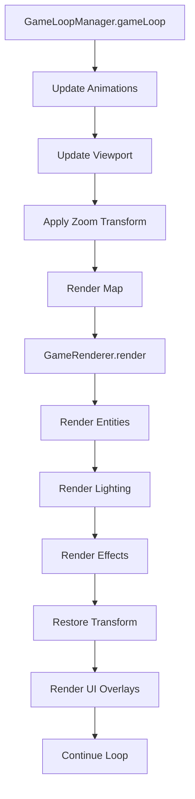
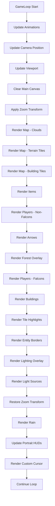
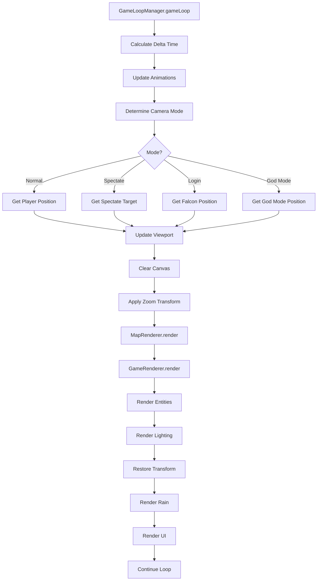
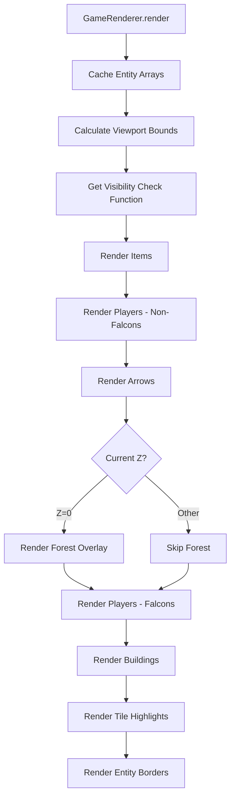
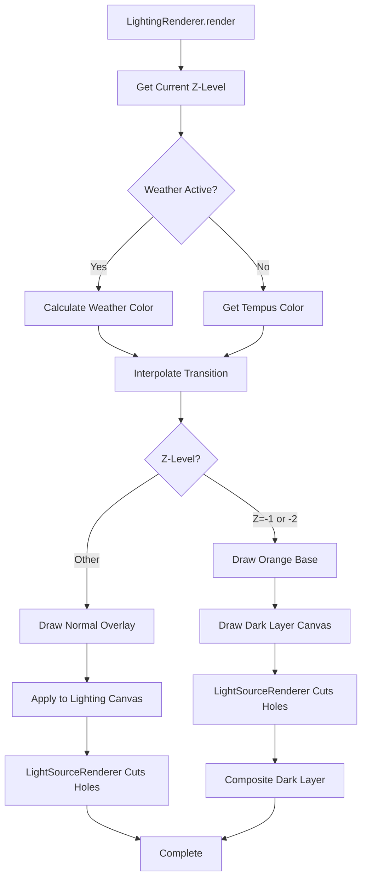
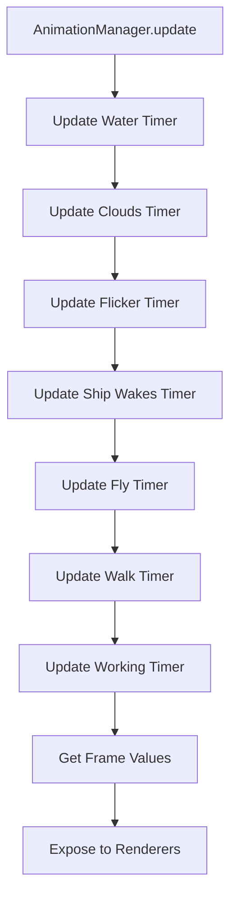
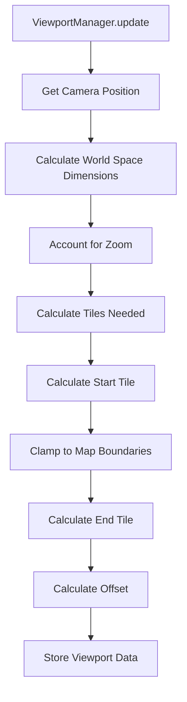
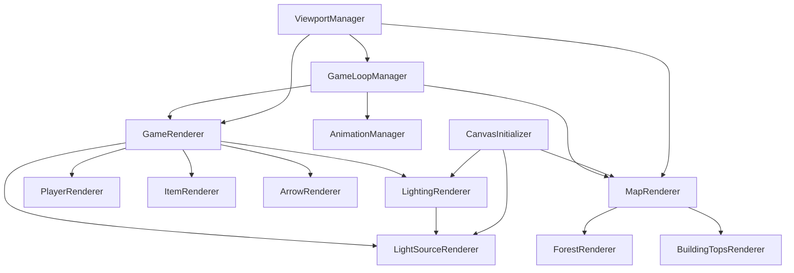

# Rendering System Documentation

## Table of Contents
1. [Executive Summary](#executive-summary)
2. [Core Rendering Pipeline](#core-rendering-pipeline)
3. [Canvas Architecture](#canvas-architecture)
4. [Viewport System](#viewport-system)
5. [Map Rendering](#map-rendering)
6. [Entity Rendering System](#entity-rendering-system)
7. [Lighting System](#lighting-system)
8. [Effects Rendering](#effects-rendering)
9. [Animation System](#animation-system)
10. [UI Overlays](#ui-overlays)
11. [Rendering Order & Layering](#rendering-order--layering)
12. [Performance Optimizations](#performance-optimizations)
13. [Coordinate Systems](#coordinate-systems)
14. [Camera Systems Integration](#camera-systems-integration)
15. [Data Flow Diagrams](#data-flow-diagrams)
16. [File Reference](#file-reference)

---

## Executive Summary

The Lambic client rendering system is a sophisticated, multi-layered canvas-based architecture designed for real-time game world visualization. The system employs a modular renderer pattern where specialized components handle different aspects of rendering (terrain, entities, lighting, effects) while a unified coordinator manages the overall pipeline.

### Key Design Principles

1. **Modular Renderers**: Each rendering concern (map, players, items, lighting, etc.) is handled by a dedicated renderer class, promoting maintainability and separation of concerns.

2. **Unified Rendering Path**: All camera modes (normal, spectate, login, god mode) share the same rendering pipeline through `GameRenderer`, reducing code duplication.

3. **Canvas Layering**: Three distinct canvas layers work together:
   - **Main Canvas** (`ctx`): Game world content (terrain, entities)
   - **Lighting Canvas** (`lighting`): Day/night and weather overlays
   - **Cursor Overlay Canvas** (`cursor-overlay`): UI elements (custom cursor)

4. **Viewport-Based Culling**: Only visible tiles and entities are rendered, calculated dynamically based on camera position and zoom level.

5. **Z-Layer System**: The game world exists on multiple Z-levels (overworld z=0, buildings z=1-2, caves z=-1 to -2, underwater z=-3), each with distinct rendering rules.

### Main Rendering Pipeline Flow



---

## Core Rendering Pipeline

### GameLoopManager

**File**: [`client/js/core/GameLoopManager.js`](client/js/core/GameLoopManager.js)

The `GameLoopManager` orchestrates the entire rendering cycle, running at 60 FPS via `requestAnimationFrame`. It coordinates all rendering subsystems and manages camera modes.

#### Main Responsibilities

1. **Frame Timing**: Calculates delta time between frames, capped at 100ms to prevent catch-up effects when the tab regains focus.

2. **Animation Updates**: Calls `updateAnimations(deltaTime)` to advance all animation timers (water, clouds, walk cycles, etc.).

3. **Viewport Updates**: Updates viewport bounds based on current camera position before rendering.

4. **Zoom Management**: Smoothly interpolates zoom level based on current Z-layer (buildings/caves use different zoom).

5. **Camera Mode Routing**: Determines which camera system to use:
   - **Normal Mode**: Player-following camera
   - **Spectate Mode**: Spectator camera system
   - **Login Mode**: Falcon-following camera (before player spawns)
   - **God Mode**: Free-roaming camera

#### Rendering Sequence

The exact sequence executed each frame:

```javascript
1. Update animations (AnimationManager.update)
2. Update camera position (based on mode)
3. Update viewport (ViewportManager.update)
4. Clear main canvas
5. Apply zoom transform to main canvas
6. Render map (MapRenderer.render)
7. Render entities (GameRenderer.render)
8. Restore zoom transform
9. Render rain (if outdoors, z=0)
10. Update portrait HUDs
11. Render custom cursor (CursorRenderer.render)
12. Continue loop (requestAnimationFrame)
```

#### Key Code Snippet

```javascript
// From GameLoopManager.gameLoop()
ctx.clearRect(0, 0, WIDTH, HEIGHT);

// Apply zoom transform
ctx.save();
ctx.translate(WIDTH / 2, HEIGHT / 2);
ctx.scale(config.currentZoom, config.currentZoom);
ctx.translate(-WIDTH / 2, -HEIGHT / 2);

// Render map after viewport is updated
renderMap();

// Use unified rendering function
renderUnified(mode, currentZ, nightfall);

// Restore canvas transform after rendering
ctx.restore();
```

---

## Canvas Architecture

### CanvasInitializer

**File**: [`client/js/core/CanvasInitializer.js`](client/js/core/CanvasInitializer.js)

The `CanvasInitializer` manages the setup and initialization of all canvas elements and their associated renderers.

#### Multi-Canvas Setup

The system uses three HTML5 canvas elements:

1. **Main Canvas** (`#ctx`)
   - Primary game world rendering
   - Contains terrain, entities, buildings
   - Size: `window.innerWidth × window.innerHeight`

2. **Lighting Canvas** (`#lighting`)
   - Day/night cycle overlay
   - Weather effects (fog, storms)
   - Light source cutouts
   - Same size as main canvas, composited on top

3. **Cursor Overlay Canvas** (`#cursor-overlay`)
   - Custom cursor rendering
   - UI overlays
   - Same size as main canvas, topmost layer

#### Initialization Order

The initialization sequence is critical:

```javascript
1. Get canvas elements from DOM
2. Set canvas dimensions (must be done before getting context)
3. Get 2D rendering contexts
4. Initialize LightingRenderer (must be first)
5. Initialize LightSourceRenderer (depends on LightingRenderer)
6. Initialize MapRenderer
7. Expose contexts to global scope for backward compatibility
```

#### Canvas Size Management

Canvas dimensions are set to match window size and updated on resize:

```javascript
const WIDTH = window.innerWidth || 800;
const HEIGHT = window.innerHeight || 600;

ctxCanvas.width = WIDTH;
ctxCanvas.height = HEIGHT;
ctxCanvas.style.width = WIDTH + 'px';
ctxCanvas.style.height = HEIGHT + 'px';
```

---

## Viewport System

### ViewportManager

**File**: [`client/js/core/ViewportManager.js`](client/js/core/ViewportManager.js)

The `ViewportManager` calculates which tiles are visible on screen, enabling efficient culling of off-screen content.

#### Viewport Calculation Algorithm

The viewport calculation accounts for zoom transformations:

```javascript
// Calculate effective world space dimensions
const worldSpaceWidth = screenWidth / zoom;
const worldSpaceHeight = screenHeight / zoom;

// Calculate tiles needed to cover viewport
const tilesWide = Math.ceil(worldSpaceWidth / tileSize) + bufferTiles;
const tilesHigh = Math.ceil(worldSpaceHeight / tileSize) + bufferTiles;

// Calculate start tile (top-left corner)
const cameraTileX = cameraX / tileSize;
const cameraTileY = cameraY / tileSize;
startTile[0] = Math.floor(cameraTileX - tilesWide / 2);
startTile[1] = Math.floor(cameraTileY - tilesHigh / 2);

// Calculate offset for positioning tiles on screen
offset[0] = screenWidth / 2 - cameraX;
offset[1] = screenHeight / 2 - cameraY;
```

#### Zoom-Aware Viewport Bounds

When zoom is applied via `ctx.scale(zoom, zoom)`:
- **Zoomed In** (zoom > 1): Fewer tiles visible, larger appearance
- **Zoomed Out** (zoom < 1): More tiles visible, smaller appearance

The viewport calculation divides screen dimensions by zoom to determine how many tiles to render.

#### Screen-to-World Coordinate Conversion

World coordinates are converted to screen coordinates using:

```javascript
screenX = worldX - cameraX + WIDTH / 2;
screenY = worldY - cameraY + HEIGHT / 2;
```

When zoom transform is active, this happens in transformed coordinate space.

#### Tile Culling Optimization

Only tiles within `[startTile, endTile]` are rendered:

```javascript
for (let c = viewport.startTile[0]; c < viewport.endTile[0]; c++) {
  for (let r = viewport.startTile[1]; r < viewport.endTile[1]; r++) {
    // Render tile at (c, r)
  }
}
```

This dramatically reduces rendering work for large maps.

---

## Map Rendering

### MapRenderer

**File**: [`client/js/rendering/MapRenderer.js`](client/js/rendering/MapRenderer.js)

The `MapRenderer` is responsible for rendering all terrain tiles, building tiles, and map-level effects. It's one of the largest rendering components (~3,600 lines) due to the complexity of multi-layer tile rendering.

#### Z-Layer Rendering

The renderer handles different Z-levels with distinct logic:

- **Z=0 (Overworld)**: Terrain tiles, clouds, water animations, forest overlays
- **Z=1-2 (Buildings)**: Building floors, walls, interior tiles
- **Z=-1 to -2 (Caves/Cellars)**: Cave walls, cave floors, stone structures
- **Z=-3 (Underwater)**: Underwater terrain

#### Terrain Tile Rendering

Terrain tiles are rendered based on tile values from the world array:

```javascript
// Water tiles (tile == 0)
ctx.drawImage(waterTiles[wtr], xOffset, yOffset, tileSize, tileSize);

// Grass tiles (tile >= 1 && tile < 2)
ctx.drawImage(Img.grass, xOffset, yOffset, tileSize, tileSize);

// Forest overlays (tile >= 1 && tile < 2, with variations)
if (tile >= 1 && tile < 1.3) {
  ctx.drawImage(Img.hforest, xOffset - tileSize/4, yOffset - tileSize/1.75, ...);
}
```

#### Building Tile Rendering

Buildings are rendered across multiple layers:

- **Layer 0**: Foundation/floor tiles
- **Layer 1**: Building base tiles (with adaptive base terrain rendering)
- **Layer 2**: Building walls
- **Layer 3**: Building details
- **Layer 4**: Building interiors (for z=1,2)
- **Layer 5**: Building roofs (rendered separately by BuildingTopsRenderer)

#### Adaptive Base Terrain Rendering

Buildings store the original terrain values that existed before they were constructed in a `baseTerrain` array. This allows buildings to render with the correct base layer (grass, rocks, etc.) instead of always defaulting to grass. This is particularly important for buildings like mines that are often constructed on rock terrain.

**How it works:**

1. **Server-side**: When a building is created, the original terrain values are captured before `tileChange` modifies the tiles:
   ```javascript
   var baseTerrain = [];
   for(var i in plot){
     baseTerrain.push(getTile(0, plot[i][0], plot[i][1])); // Capture BEFORE tileChange
     tileChange(0, plot[i][0], plot[i][1], 13); // Change to building tile
   }
   Building({ ..., baseTerrain: baseTerrain });
   ```

2. **Building Serialization**: Buildings are serialized using `Building.getInitPack()`, which includes `baseTerrain`:
   ```javascript
   self.getInitPack = function(){
     return {
       id: self.id,
       type: self.type,
       plot: self.plot,
       baseTerrain: self.baseTerrain || [], // Critical for client rendering
       // ... other properties
     }
   }
   ```

3. **Client-side Rendering**: When rendering building tiles (tiles 11, 12, 13), `MapRenderer` looks up the building entity and uses its `baseTerrain` array to determine which base image to draw:
   ```javascript
   const building = getBuilding(bCoords[0], bCoords[1], true);
   if (building && BuildingRef.list[building]) {
     const b = BuildingRef.list[building];
     if (b.plot && b.baseTerrain && b.baseTerrain.length > 0) {
       baseTerrainValue = this.getBaseTerrainForTile(c, r, getBuilding, getCoords, b.plot, b.baseTerrain);
     }
   }
   ```

**Important Notes:**

- **Empty Arrays**: The code checks `b.baseTerrain.length > 0` because empty arrays are truthy but don't contain terrain data. Buildings without `baseTerrain` data will default to grass (terrain value 7).

- **Login Camera Mode**: The `previewData` message (used for login camera mode) must use `Building.getInitPack()` when serializing buildings, not manual object construction. Manual serialization can miss properties like `baseTerrain` and `topPlot`.

- **Faction AI Buildings**: Buildings created by faction AI with `built:true` must also capture `baseTerrain` before `tileChange` calls, just like player-constructed buildings.

**Troubleshooting Base Terrain Issues:**

If buildings are rendering with incorrect base layers:

1. **Check Server Serialization**: Verify that `Building.getInitPack()` includes `baseTerrain` in the return object.

2. **Check Message Construction**: For `previewData` messages, ensure buildings are serialized using `building.getInitPack()` rather than manually constructing objects:
   ```javascript
   // CORRECT:
   previewPack.building.push(building.getInitPack());
   
   // INCORRECT (missing baseTerrain):
   previewPack.building.push({
     id: building.id,
     type: building.type,
     plot: building.plot
     // Missing baseTerrain!
   });
   ```

3. **Check Building Creation**: Verify that `baseTerrain` is captured before `tileChange` calls on the server, especially for faction AI-created buildings with `built:true`.

4. **Check Client-side Building Reference**: Ensure `BuildingRef` in `MapRenderer` correctly references the global `Building` object to access `Building.list`.

#### Cloud Pattern Rendering

Clouds are rendered as a repeating pattern covering the entire overworld:

```javascript
// Cache pattern to avoid recreating every frame
if (!this._cloudPattern || this._cloudPatternIndex != cld) {
  this._cloudPattern = ctx.createPattern(clouds[cld], "repeat");
  this._cloudPatternIndex = cld;
}

ctx.fillStyle = this._cloudPattern;
ctx.fillRect(0, 0, WIDTH, HEIGHT);
```

#### Ship Wake Effects

Ship wakes create lightened water tiles where ships have passed:

```javascript
if (shipWakes && typeof shipWakes.getBrightness === 'function') {
  const brightness = shipWakes.getBrightness(c, r);
  if (brightness > 0) {
    ctx.fillStyle = 'rgba(255, 255, 255, ' + brightness + ')';
    ctx.fillRect(xOffset, yOffset, tileSize, tileSize);
  }
}
```

---

## Entity Rendering System

### GameRenderer

**File**: [`client/js/rendering/GameRenderer.js`](client/js/rendering/GameRenderer.js)

The `GameRenderer` is the unified coordinator for all entity rendering. It consolidates rendering paths for all camera modes and manages entity visibility culling.

#### Unified Rendering Coordinator

All camera modes (normal, spectate, login, god mode) use the same rendering path:

```javascript
render(config) {
  const { mode, camera, viewport, nightfall, currentZ } = config;
  
  // Cache entity arrays once per frame
  this._cachedItems = Object.values(Item.list);
  this._cachedPlayers = Object.values(Player.list);
  this._cachedArrows = Object.values(Arrow.list);
  this._cachedBuildings = Object.values(Building.list);
  
  // Render entities based on mode
  this.renderEntities(config);
  
  // Render lighting and effects
  this.renderLightingAndEffects(config);
}
```

#### Entity Visibility Culling

The renderer uses mode-specific visibility checks:

- **Normal Mode**: Checks Z-level, viewport bounds, innaWoods compatibility, building filtering
- **Spectate/God Mode**: Simple viewport bounds check
- **Login Mode**: Viewport bounds for z=0 only

#### Rendering Order

Entities are rendered in a specific order to ensure proper depth:

```javascript
1. Items (ground items)
2. Players (non-falcons)
3. Arrows
4. Forest overlay (z=0 only)
5. Falcons (render above forest)
6. Buildings
7. Tile highlights
8. Entity borders (hover/selection)
```

This order ensures:
- Ground items appear below characters
- Forest appears behind characters but above ground
- Falcons appear above forest (they fly)
- Buildings appear on top
- UI overlays appear on top of everything

#### Building Filtering for Indoor Rendering

When inside a building (z=1 or z=2), only entities in the same building are rendered:

```javascript
if (isIndoor && playerBuilding !== null) {
  const entityBuilding = getBuilding(entity.x, entity.y, true);
  if (playerBuilding !== entityBuilding) return false;
}
```

### PlayerRenderer

**File**: [`client/js/rendering/PlayerRenderer.js`](client/js/rendering/PlayerRenderer.js)

The `PlayerRenderer` handles all player entity rendering, including sprites, animations, UI elements, and special cases.

#### Sprite Rendering

Players use direction-based sprite selection:

- **Idle**: `facedown`, `faceup`, `faceleft`, `faceright`
- **Walking**: `walkdown[wlk]`, `walkup[wlk]`, `walkleft[wlk]`, `walkright[wlk]`
- **Attacking**: `attackd`, `attacku`, `attackl`, `attackr` (melee) or `attackdb`, `attackub`, `attacklb`, `attackrb` (ranged)
- **Working**: `chopping[wrk]`, `mining[wrk]`, `farming[wrk]`, `building[wrk]`, `fishingd/u/l/r`

#### HP/Spirit Bars

Bars are rendered above the player sprite:

```javascript
// HP bar
const hpWidth = 60 * player.hp / player.hpMax;
ctx.fillStyle = 'orangered';
ctx.fillRect(barX, barY - 30, 60, 6);
ctx.fillStyle = 'limegreen';
ctx.fillRect(barX, barY - 30, hpWidth, 6);

// Spirit bar
const spiritWidth = 60 * player.spirit / player.spiritMax;
ctx.fillStyle = 'royalblue';
ctx.fillRect(barX, barY - 20, spiritWidth, 4);
```

#### Name/Rank Display

Player names are colored based on relationship:

- **Same Player** (allied === 2): `lightskyblue`
- **Ally** (allied === 1): `palegreen`
- **Neutral** (allied === 0): `white`
- **Enemy** (allied === -1): `orangered`

#### Stealth Transparency

Stealthed players are rendered with reduced opacity:

```javascript
if (stealth === 2) {
  ctx.globalAlpha = 0.3; // Fully stealthed - 30% visible
} else if (stealth === 1.5 || stealth === 1) {
  ctx.globalAlpha = 0.7; // Revealed or ally view - 70% visible
} else {
  ctx.globalAlpha = 1.0; // Not stealthed - fully visible
}
```

#### Falcon Special Handling

Falcons require special sprite handling to prevent incorrect sprite assignment:

```javascript
// CRITICAL: Don't trust player.sprite - it might be incorrectly set to a serf sprite
// Always get the falcon sprite from proper sources
let falconSprite = falcon || window.falcon || 
  spriteHelper.getSpriteForClass('Falcon', false);
```

### ItemRenderer

**File**: [`client/js/rendering/ItemRenderer.js`](client/js/rendering/ItemRenderer.js)

The `ItemRenderer` uses a lookup-based system to map item types to sprites, supporting quantity-based sprite selection and animated items.

#### Item Image Lookup System

Items are mapped via a configuration object:

```javascript
this.itemImageMap = {
  'Wood': { images: ['wood1', 'wood2', 'wood3'], thresholds: [0, 5, 10] },
  'Silver': { 
    images: ['silver1', 'silver2', ..., 'silver9'], 
    thresholds: [0, 5, 10, 25, 50, 100, 250, 500, 1000] 
  },
  'Torch': { image: 'torch', static: true },
  'LitTorch': { animated: 'torchFlame' },
  // ...
};
```

#### Quantity-Based Sprite Selection

Items with multiple quantity thresholds select sprites based on quantity:

```javascript
if (config.images && config.thresholds) {
  let imageIndex = 0;
  for (let i = config.thresholds.length - 1; i >= 0; i--) {
    if (qty > config.thresholds[i]) {
      imageIndex = i;
      break;
    }
  }
  return Img[config.images[imageIndex]];
}
```

#### Animated Items

Items like torches and fires use animated frames:

```javascript
if (configMap.animated && animatedFrames) {
  const frameArray = animatedFrames[configMap.animated];
  const frameIndex = animatedFrames.frameIndex || 0;
  const frame = frameArray[frameIndex % frameArray.length];
  ctx.drawImage(frame, x, y, width, height);
}
```

### ArrowRenderer

**File**: [`client/js/rendering/ArrowRenderer.js`](client/js/rendering/ArrowRenderer.js)

The `ArrowRenderer` selects arrow sprites based on flight angle.

#### Angle-Based Sprite Selection

Arrows use angle ranges to select appropriate sprites:

```javascript
this.angleRanges = [
  { min: -120, max: -60, image: 'arrow1' },
  { min: -60, max: -30, image: 'arrow2' },
  { min: -30, max: 30, image: 'arrow3' },
  // ...
  { min: 150, max: -150, image: 'arrow7' }, // Wrap around
  { default: true, image: 'arrow8' }
];
```

---

## Lighting System

### LightingRenderer

**File**: [`client/js/rendering/LightingRenderer.js`](client/js/rendering/LightingRenderer.js)

The `LightingRenderer` manages day/night cycle lighting, weather transitions, and dark layers for caves/cellars.

#### Day/Night Cycle Lighting

Lighting colors vary by time period (`tempus`) and Z-layer:

```javascript
// Overworld (z=0) - Night hours
if (tempus == 'IX.p' || tempus == 'X.p' || ...) {
  return "rgba(5, 5, 30, 0.9)"; // Dark blue night
}

// Overworld - Daytime
if (tempus == 'VII.a' || tempus == 'VIII.a' || ...) {
  return "rgba(0, 0, 0, 0)"; // No overlay (bright)
}

// Overworld - Sunset
if (tempus == 'VI.p') {
  return "rgba(232, 112, 0, 0.25)"; // Orange sunset
}
```

#### Z-Layer Specific Lighting

Different Z-levels have distinct lighting:

- **Z=0 (Overworld)**: Full day/night cycle
- **Z=1-2 (Buildings)**: Darker at night, firepit lighting available
- **Z=-1 (Caves)**: `rgba(0, 0, 0, 0.95)` - Very dark
- **Z=-2 (Cellars)**: `rgba(0, 0, 0, 0.85)` - Dark
- **Z=-3 (Underwater)**: `rgba(0, 48, 99, 0.9)` - Blue underwater tint

#### Weather Lighting Transitions

Weather effects override normal lighting on z=0:

```javascript
// Fog (daytime only)
if (weatherEffects.fog && weatherEffects.fog.active && !nightfall) {
  const fogAlpha = weatherEffects.fog.intensity * 0.7;
  weatherColor = `rgba(150, 150, 150, ${fogAlpha})`;
}

// Storm (daytime only, overrides fog)
if (weatherEffects.storm && weatherEffects.storm.active && !nightfall) {
  const stormAlpha = weatherEffects.storm.intensity * 0.65;
  weatherColor = `rgba(80, 80, 100, ${stormAlpha})`;
}
```

Transitions are smoothly interpolated over 1.5 seconds.

#### Dark Layer Canvas for Caves/Cellars

For caves and cellars (z=-1, z=-2), a separate dark layer canvas is used:

```javascript
// Draw orange base layer on lighting canvas (stays visible)
lighting.fillStyle = "rgba(224, 104, 0, 0.3)";
lighting.fillRect(offsetX, offsetY, effectiveWidth, effectiveHeight);

// Draw dark layer on separate canvas (light sources will cut holes)
this.darkLayerCtx.fillStyle = finalColor;
this.darkLayerCtx.fillRect(0, 0, WIDTH, HEIGHT);
```

Light sources then cut holes in the dark layer, creating a "light in darkness" effect.

#### Color Interpolation

Smooth transitions between lighting states use RGBA interpolation:

```javascript
interpolateColors(color1, color2, t) {
  const rgba1 = this.parseRGBA(color1);
  const rgba2 = this.parseRGBA(color2);
  
  const r = Math.round(rgba1.r + (rgba2.r - rgba1.r) * t);
  const g = Math.round(rgba1.g + (rgba2.g - rgba1.g) * t);
  const b = Math.round(rgba1.b + (rgba2.b - rgba1.b) * t);
  const a = rgba1.a + (rgba2.a - rgba1.a) * t;
  
  return `rgba(${r}, ${g}, ${b}, ${a})`;
}
```

### LightSourceRenderer

**File**: [`client/js/rendering/LightSourceRenderer.js`](client/js/rendering/LightSourceRenderer.js)

The `LightSourceRenderer` handles dynamic light sources (torches, fires, campfires) that create both glow effects and cutouts in the lighting overlay.

#### Dynamic Light Sources

Light sources are stored in `Light.list` and rendered each frame:

```javascript
const lights = Light.list ? Object.values(Light.list) : [];

for (let i = 0, len = lights.length; i < len; i++) {
  const light = lights[i];
  const screenX = light.x - cameraPos.x + WIDTH / 2;
  const screenY = light.y - cameraPos.y + HEIGHT / 2;
  
  // Render glow and cutout
  this.illuminate(screenX, screenY, 45 * light.radius, env, ctx, flicker, ...);
}
```

#### Glow Rendering on Main Canvas

Light sources create a radial gradient glow on the main canvas:

```javascript
ctx.globalCompositeOperation = 'lighter';
const radialGradient = ctx.createRadialGradient(x, y, 0, x, y, adjustedRadius);
radialGradient.addColorStop(0.0, '#BB9');
radialGradient.addColorStop(0.2 + rnd, '#AA8');
radialGradient.addColorStop(0.7 + rnd, '#330');
radialGradient.addColorStop(0.90, '#110');
radialGradient.addColorStop(1, '#000');
ctx.fillStyle = radialGradient;
ctx.arc(x, y, adjustedRadius, 0, 2 * Math.PI);
ctx.fill();
```

#### Cutout Rendering on Lighting/Dark Layer

Light sources create cutouts in the lighting overlay using `destination-out` composite operation:

```javascript
targetCtx.globalCompositeOperation = 'destination-out';
const cutoutGradient = targetCtx.createRadialGradient(x, y, 0, x, y, cutoutRadius);
cutoutGradient.addColorStop(0, 'rgba(255, 255, 255, 1)');
cutoutGradient.addColorStop(0.5, 'rgba(255, 255, 255, 0.6)');
cutoutGradient.addColorStop(0.75, 'rgba(255, 255, 255, 0.2)');
cutoutGradient.addColorStop(1, 'rgba(255, 255, 255, 0)');
targetCtx.fillStyle = cutoutGradient;
targetCtx.arc(x, y, cutoutRadius, 0, 2 * Math.PI);
targetCtx.fill();
```

#### Flicker Animation

Light sources flicker using a random value from a range:

```javascript
const flickerRange = [0.95, 0.96, 0.97, 0.98, 0.99, 1.0, 1.01, 1.02, 1.03, 1.04, 1.05];
const rnd = (0.05 * Math.sin(1.1 * Date.now() / 200) * flicker);
const adjustedRadius = radius * (1 + rnd);
```

#### Environment-Based Radius Scaling

Light sources have larger cutout radius in dark environments:

```javascript
// env: 1 = normal (day), 2 = larger (night), 3 = largest (caves)
const cutoutRadius = adjustedRadius * env;
```

#### Zoom-Aware Coordinate Transformation

Light source rendering accounts for zoom transforms:

```javascript
// For lighting canvas (has zoom transform)
targetCtx.save();
targetCtx.translate(WIDTH / 2, HEIGHT / 2);
targetCtx.scale(currentZoom, currentZoom);
targetCtx.translate(-WIDTH / 2, -HEIGHT / 2);
// Use same coordinates as glow
targetCtx.arc(x, y, cutoutRadius, 0, 2 * Math.PI);
targetCtx.restore();

// For dark layer (no zoom, calculate actual position)
const actualX = (x - centerX) * currentZoom + centerX;
const actualY = (y - centerY) * currentZoom + centerY;
const scaledCutoutRadius = cutoutRadius * currentZoom;
```

---

## Effects Rendering

### WeatherRenderer

**File**: [`client/js/rendering/WeatherRenderer.js`](client/js/rendering/WeatherRenderer.js)

The `WeatherRenderer` manages rain particle effects and lightning flashes.

#### Rain Particle System

Rain particles are spawned based on storm intensity:

```javascript
const targetParticleCount = Math.floor(weatherEffects.storm.intensity * this.maxRainParticles);

while (this.rainParticles.length < targetParticleCount) {
  this.rainParticles.push({
    x: Math.random() * WIDTH,
    y: -10,
    speed: 15 + Math.random() * 10,
    length: 20 + Math.random() * 10
  });
}
```

Particles fall downward and are removed when off-screen:

```javascript
for (let i = this.rainParticles.length - 1; i >= 0; i--) {
  const particle = this.rainParticles[i];
  particle.y += particle.speed;
  
  if (particle.y > HEIGHT) {
    this.rainParticles.splice(i, 1);
  }
}
```

#### Rain Rendering

Rain is rendered as lines in screen-space (after zoom transform is restored):

```javascript
ctx.strokeStyle = 'rgba(180, 180, 220, 0.8)';
ctx.lineWidth = 2;

for (const particle of this.rainParticles) {
  ctx.beginPath();
  ctx.moveTo(particle.x, particle.y);
  ctx.lineTo(particle.x, particle.y + particle.length);
  ctx.stroke();
}
```

#### Lightning Flash Timing

Lightning flashes occur randomly during intense storms:

```javascript
if (weatherEffects.storm.intensity > 0.7) {
  this.lightningTimer++;
  if (this.lightningTimer > 180 + Math.random() * 120) { // 3-5 seconds
    this.lightningFlash = true;
    this.lightningTimer = 0;
    setTimeout(() => {
      this.lightningFlash = false;
    }, 100); // 100ms flash
  }
}
```

The flash is rendered by `LightingRenderer` as a white overlay.

### ForestRenderer

**File**: [`client/js/rendering/ForestRenderer.js`](client/js/rendering/ForestRenderer.js)

The `ForestRenderer` applies distance-based opacity to forest overlays, making nearby forests more transparent.

#### Distance-Based Forest Opacity

Forest opacity is calculated using Chebyshev distance (max of X and Y distance):

```javascript
calculateDistance(c, r, pc, pr) {
  const dc = Math.abs(c - pc);
  const dr = Math.abs(r - pr);
  const maxDist = Math.max(dc, dr);
  
  // Ring 1 (distance 40): immediate 3x3 grid (distance <= 1)
  if (maxDist <= 1) return 40;
  // Ring 2 (distance 60): next ring out (distance == 2)
  if (maxDist === 2) return 60;
  // Ring 3 (distance 80): outer ring (distance == 3)
  if (maxDist === 3) return 80;
  
  return null; // Beyond ring 3
}
```

#### Ring-Based Alpha Values

Distance values map to alpha values:

```javascript
getForestAlpha(distance) {
  if (distance === 40) return 0.4;  // Closest - most transparent
  if (distance === 60) return 0.6;
  if (distance === 80) return 0.8;
  return 1.0; // Default: fully opaque
}
```

This creates a "fog of war" effect where forests near the player are more see-through.

### BuildingTopsRenderer

**File**: [`client/js/rendering/BuildingTopsRenderer.js`](client/js/rendering/BuildingTopsRenderer.js)

The `BuildingTopsRenderer` handles building roof tiles (layer 5) that appear on the overworld.

#### Building Roof Tile Rendering

Roof tiles are rendered on z=0 to show building tops:

```javascript
for (let c = viewport.startTile[0]; c < viewport.endTile[0]; c++) {
  for (let r = viewport.startTile[1]; r < viewport.endTile[1]; r++) {
    const tile = getTile(5, c, r);
    if (!tile) continue;
    
    const imageName = this.buildingTopsMap[tile];
    if (imageName && Img[imageName]) {
      ctx.drawImage(Img[imageName], xOffset, yOffset, tileSize, tileSize);
    }
  }
}
```

#### Conditional Tile Rendering

Some tiles (like gates) need conditional logic:

```javascript
// Gate tiles check adjacent wall tile
if (this.specialTiles[tile]) {
  const adjacentTile = getTile(3, c - 1, r);
  const conditionMet = adjacentTile === 'wall';
  const imageName = specialConfig.images[conditionMet];
  ctx.drawImage(Img[imageName], xOffset, yOffset, tileSize, tileSize);
}
```

---

## Animation System

### AnimationManager

**File**: [`client/js/rendering/AnimationManager.js`](client/js/rendering/AnimationManager.js)

The `AnimationManager` coordinates all animation timers and frame indices used throughout the rendering system.

#### Frame Timing

All animations use delta-time-based timing:

```javascript
update(deltaTime, dependencies) {
  // Water animation (cycle every 1200ms)
  this.timers.water += deltaTime;
  if (this.timers.water >= 1200) {
    this.waterFrame = (this.waterFrame + 1) % 3;
    this.timers.water -= 1200;
  }
  
  // Similar pattern for all animations...
}
```

#### Animation Cycles

- **Water**: 3-frame cycle (1200ms per frame)
- **Clouds**: 3-frame cycle (2000ms per frame)
- **Walk**: 2-frame cycle (400ms per frame)
- **Fly**: 7-frame cycle (600ms per frame)
- **Working Icon**: 2-frame cycle (800ms per frame)
- **Flicker**: Random value from range (updated every 50ms)

#### Frame Value Access

Animation frames are exposed via `getFrames()`:

```javascript
getFrames() {
  return {
    water: this.waterFrame,
    clouds: this.cloudFrame,
    fly: this.flyFrame,
    walk: this.walkFrame,
    working: this.workingFrame,
    flicker: this.flicker
  };
}
```

These values are used by renderers to select appropriate sprite frames.

#### Ship Wake Updates

Ship wakes are updated every 100ms:

```javascript
if (this.timers.shipWakes >= 100) {
  if (shipWakes && typeof shipWakes.update === 'function') {
    shipWakes.update({ PlayerList, checkInView, tileSize });
  }
  this.timers.shipWakes -= 100;
}
```

#### Tile Highlight Updates

Tile highlights (for navigation) are also updated every 100ms:

```javascript
if (tileHighlights && typeof tileHighlights.update === 'function') {
  tileHighlights.update();
}
```

---

## UI Overlays

### CursorRenderer

**File**: [`client/js/rendering/CursorRenderer.js`](client/js/rendering/CursorRenderer.js)

The `CursorRenderer` manages custom cursor rendering, replacing the default browser cursor with game-specific cursors.

#### Custom Cursor Rendering

The default browser cursor is hidden, and a custom cursor is drawn on the overlay canvas:

```javascript
// Hide default cursor
canvas.style.cursor = 'none';
canvas.style.setProperty('cursor', 'none', 'important');

// Clear overlay canvas
cursorOverlayCtx.clearRect(0, 0, cursorOverlayCanvas.width, cursorOverlayCanvas.height);

// Draw cursor at mouse position
cursorOverlayCtx.drawImage(cursorImg, currentMouseX, currentMouseY, ...);
```

#### Mode-Based Cursor Selection

Cursor type is determined by game state:

```javascript
if (workCommandMode) {
  cursorImg = Img.cursorWork;
} else if (attackCommandMode) {
  cursorImg = Img.cursorAttack;
} else if (hoveredTarget && allyCheck(hoveredTarget) === -1) {
  // Enemy target
  cursorImg = Img.cursorAttack;
} else if (hoveredInteractable) {
  cursorImg = Img.cursorInteract;
} else {
  cursorImg = Img.cursor; // Default
}
```

#### Ally/Enemy Detection for Cursor

The cursor checks if hovered entities are enemies before showing attack cursor:

```javascript
const allyStatus = allyCheck(hoveredTarget);
if (allyStatus === -1) { // Enemy
  // Check innaWoods compatibility
  if (playerInnaWoods !== entityInnaWoods) {
    canShowAttackCursor = false;
  }
  if (canShowAttackCursor) {
    cursorImg = Img.cursorAttack;
  }
}
```

#### InnaWoods Compatibility Checking

Entities in different "innaWoods" states (in forest vs. out of forest) cannot interact, so the cursor reflects this:

```javascript
if (entity.z === 0) {
  const playerInnaWoods = player.innaWoods || false;
  const entityInnaWoods = entity.innaWoods || false;
  if (playerInnaWoods !== entityInnaWoods) {
    canShowAttackCursor = false;
  }
}
```

### Building Preview Rendering

Building previews show where buildings can be placed, with color-coded validation.

#### Tile Highlight System

The `TileHighlightSystem` manages navigation and building preview highlights:

```javascript
// Add highlight
tileHighlights.addHighlight(tileX, tileY, z, alpha);

// Render highlights
for (const highlight of highlights) {
  ctx.globalAlpha = highlight.alpha || 0.5;
  ctx.fillStyle = 'rgba(255, 255, 0, 0.6)';
  ctx.fillRect(screenX, screenY, tileSize, tileSize);
}
```

#### Validation-Based Color Coding

Building previews use server validation to color-code tiles:

```javascript
if (validation && validation.plot) {
  for (const plotTile of validation.plot) {
    const tileColor = plotTile.status === 'valid' ? '#66ff66' : '#ff6666';
    ctx.fillStyle = tileColor;
    ctx.fillRect(screenX, screenY, tileSize, tileSize);
  }
}
```

- **Green** (`#66ff66`): Valid placement
- **Red** (`#ff6666`): Blocked/invalid

#### Server Validation Integration

Building previews request validation from the server:

```javascript
socket.send(JSON.stringify({
  msg: 'requestBuildValidation',
  buildingType: buildingType,
  tileX: cursorTileX,
  tileY: cursorTileY
}));
```

The response is cached and used to render the preview.

---

## Rendering Order & Layering

### Complete Rendering Sequence

The full rendering sequence executed each frame:



### Canvas Layer Stack

The three canvas layers are composited in this order (bottom to top):

1. **Main Canvas** (`#ctx`)
   - Base layer
   - Contains all game world content
   - Has zoom transform applied

2. **Lighting Canvas** (`#lighting`)
   - Middle layer
   - Day/night overlay
   - Weather effects
   - Light source cutouts
   - Has zoom transform applied

3. **Cursor Overlay Canvas** (`#cursor-overlay`)
   - Top layer
   - Custom cursor
   - UI overlays
   - No zoom transform (screen-space)

### Z-Ordering Within Each Layer

Within the main canvas, entities are rendered in this order (back to front):

1. Terrain tiles (water, grass, etc.)
2. Ground items
3. Non-falcon players
4. Arrows
5. Forest overlay (z=0 only)
6. Falcons (above forest)
7. Buildings
8. Tile highlights
9. Entity borders

This ensures proper depth perception and visual hierarchy.

### Entity Depth Sorting

Entities are not explicitly depth-sorted by Y-position. Instead, they are rendered in a fixed order based on type. This works because:

- Items are always on the ground (lowest)
- Players are at character height
- Buildings are tallest
- UI overlays are always on top

---

## Performance Optimizations

### Entity Culling Strategies

Multiple culling strategies reduce rendering work:

1. **Z-Level Culling**: Only entities on current Z-level are considered
2. **Viewport Culling**: Only entities within viewport bounds are rendered
3. **InnaWoods Culling**: Entities in different innaWoods states are filtered (z=0 only)
4. **Building Culling**: When indoors, only entities in same building are rendered

### Viewport-Based Tile Culling

Only tiles within viewport bounds are rendered:

```javascript
for (let c = viewport.startTile[0]; c < viewport.endTile[0]; c++) {
  for (let r = viewport.startTile[1]; r < viewport.endTile[1]; r++) {
    // Render tile
  }
}
```

For a 192×192 tile map, this reduces rendered tiles from 36,864 to ~100-400 tiles per frame.

### Cached Entity Arrays

Entity lists are cached once per frame to avoid repeated `Object.values()` calls:

```javascript
// Cache once per frame
this._cachedItems = Object.values(Item.list);
this._cachedPlayers = Object.values(Player.list);
this._cachedArrows = Object.values(Arrow.list);
this._cachedBuildings = Object.values(Building.list);

// Use cached arrays for rendering
for (let i = 0, len = this._cachedItems.length; i < len; i++) {
  const item = this._cachedItems[i];
  // ...
}
```

### Cached Viewport Bounds

Viewport bounds are calculated once per frame and cached:

```javascript
// Calculate once
this._viewBounds.top = (viewport.startTile[1] - 1) * config.tileSize;
this._viewBounds.left = (viewport.startTile[0] - 1) * config.tileSize;
this._viewBounds.right = (viewport.endTile[0] + 2) * config.tileSize;
this._viewBounds.bottom = (viewport.endTile[1] + 2) * config.tileSize;

// Use cached bounds for visibility checks
if (entity.x > bounds.left && entity.x < bounds.right && 
    entity.y > bounds.top && entity.y < bounds.bottom) {
  // Visible
}
```

### Frame Time Tracking

Frame times are tracked for performance monitoring:

```javascript
const renderStart = performance.now();
// ... rendering ...
const renderTime = performance.now() - renderStart;
this.renderStats.frameTimes.push(renderTime);
```

The last 300 frame times are kept for averaging.

### Render Statistics

The system tracks detailed render statistics:

```javascript
this._renderStats = {
  entitiesIterated: { players: 0, items: 0, arrows: 0, buildings: 0 },
  entitiesRendered: { players: 0, items: 0, arrows: 0, buildings: 0 },
  frameTimes: [],
  lastLog: Date.now()
};
```

These stats are available to `PerformanceHUD` when enabled.

---

## Coordinate Systems

### World Coordinates

World coordinates are tile-based, measured in pixels:

- **Origin**: Top-left corner of map (0, 0)
- **Units**: Pixels (1 tile = 64 pixels by default)
- **Range**: 0 to `mapSize * tileSize` (e.g., 192 * 64 = 12,288 pixels)

Entities store world coordinates:
```javascript
player.x = 6400; // 100 tiles from left
player.y = 3200; // 50 tiles from top
```

### Screen Coordinates

Screen coordinates are pixel-based, measured from top-left of canvas:

- **Origin**: Top-left corner of canvas (0, 0)
- **Units**: Pixels
- **Range**: 0 to `WIDTH` (X) and 0 to `HEIGHT` (Y)

### Zoom Transformations

Zoom is applied via canvas transform:

```javascript
ctx.save();
ctx.translate(WIDTH / 2, HEIGHT / 2);
ctx.scale(currentZoom, currentZoom);
ctx.translate(-WIDTH / 2, -HEIGHT / 2);
// All drawing happens in transformed space
ctx.restore();
```

When zoomed:
- **Zoom > 1**: World appears larger, fewer tiles visible
- **Zoom < 1**: World appears smaller, more tiles visible
- **Zoom = 1**: Normal size

### Camera Position Calculations

Camera position is calculated differently per mode:

**Normal Mode**:
```javascript
cameraPos = { x: player.x, y: player.y };
```

**Spectate Mode**:
```javascript
cameraPos = spectateCameraSystem.getCameraPosition();
```

**Login Mode**:
```javascript
cameraPos = loginCameraSystem.getCameraPosition(Player.list);
```

**God Mode**:
```javascript
cameraPos = { x: godModeCamera.cameraX, y: godModeCamera.cameraY };
```

### Viewport Offset Calculations

Viewport offset positions the camera at screen center:

```javascript
offset[0] = WIDTH / 2 - cameraX;
offset[1] = HEIGHT / 2 - cameraY;
```

When zoom transform is active, this offset is applied in transformed space.

### World-to-Screen Conversion

World coordinates are converted to screen coordinates:

```javascript
screenX = worldX - cameraX + WIDTH / 2;
screenY = worldY - cameraY + HEIGHT / 2;
```

When zoom transform is active, this conversion happens in transformed coordinate space, so the zoom is automatically applied.

### Screen-to-World Conversion

Screen coordinates (mouse position) are converted to world coordinates:

```javascript
// Reverse zoom transform
const worldX = (mouseX - WIDTH / 2) / zoom + WIDTH / 2 - viewport.offset[0];
const worldY = (mouseY - HEIGHT / 2) / zoom + HEIGHT / 2 - viewport.offset[1];

// Convert to tile coordinates
const tileX = Math.floor(worldX / tileSize);
const tileY = Math.floor(worldY / tileSize);
```

---

## Camera Systems Integration

### Normal Camera (Player-Following)

The normal camera follows the player entity:

```javascript
if (selfId && Player.list[selfId]) {
  const player = Player.list[selfId];
  cameraPos = { x: player.x, y: player.y };
}
```

The camera position updates each frame as the player moves.

### Spectate Camera

The spectate camera follows a selected target entity:

```javascript
if (spectateCameraSystem.isActive) {
  spectateCameraSystem.update(Player.list);
  cameraPos = spectateCameraSystem.getCameraPosition();
}
```

The spectator can cycle through available targets.

### Login Camera (Falcon-Following)

Before the player spawns, the camera follows a falcon:

```javascript
if (!selfId || !Player.list[selfId]) {
  cameraPos = loginCameraSystem.getCameraPosition(Player.list);
}
```

This provides a cinematic preview of the world.

### God Mode Camera

God mode allows free-roaming camera movement:

```javascript
if (godModeCamera.isActive) {
  godModeCamera.update(mapSize, tileSize);
  cameraPos = { x: godModeCamera.cameraX, y: godModeCamera.cameraY };
}
```

The camera is controlled via keyboard input (WASD/arrow keys).

### Camera Position Providers

All camera systems implement a consistent interface:

```javascript
getCameraPosition() {
  return { x: number, y: number };
}
```

This allows `GameRenderer` to work with any camera system.

---

## Client-Server Data Synchronization

### Building Entity Synchronization

Buildings are synchronized from server to client through two primary message types:

#### Init Message (Player/God Mode)

When a player connects or enters god mode, buildings are sent via the `init` message:

```javascript
// Server-side (lambic.js)
emit({ msg: 'init', pack: initPack });

// Buildings are added to initPack when created
initPack.building.push(building.getInitPack());
```

The `init` message uses `Building.getInitPack()`, which ensures all properties including `baseTerrain` are included.

#### PreviewData Message (Login Camera Mode)

Before a player spawns, the login camera mode uses the `previewData` message:

```javascript
// Server-side (lambic.js - requestPreviewData handler)
socket.write(JSON.stringify({
  msg: 'previewData',
  pack: {
    building: [] // Must use building.getInitPack() here
  }
}));
```

**Critical**: The `previewData` message must use `building.getInitPack()` when adding buildings to the pack. Manual object construction will miss properties like `baseTerrain` and `topPlot`, causing rendering issues in login camera mode.

#### Client-side Building Initialization

On the client, both message types use the same construction path:

```javascript
// client/js/core/SocketMessageHandler.js
if(data.pack.building) {
  for(i in data.pack.building){
    new Building(data.pack.building[i]); // Uses BuildingEntity constructor
  }
}
```

The `BuildingEntity` constructor correctly handles `baseTerrain`:

```javascript
// client/js/entities/BuildingEntity.js
function BuildingEntity(initPack) {
  // ...
  self.baseTerrain = initPack.baseTerrain || [];
  // ...
}
```

**Key Insight**: If rendering works correctly in player/god mode but fails in login camera mode, check whether `previewData` message construction uses `getInitPack()` for buildings.

---

## Data Flow Diagrams

### Main Rendering Pipeline



### Entity Rendering Flow



### Lighting System Flow



### Animation Update Cycle



### Viewport Calculation Flow



---

## File Reference

### Core Rendering Files

- **GameLoopManager**: [`client/js/core/GameLoopManager.js`](client/js/core/GameLoopManager.js)
  - Main game loop coordination
  - Frame timing and delta calculation
  - Camera mode routing

- **CanvasInitializer**: [`client/js/core/CanvasInitializer.js`](client/js/core/CanvasInitializer.js)
  - Canvas setup and initialization
  - Renderer initialization

- **ViewportManager**: [`client/js/core/ViewportManager.js`](client/js/core/ViewportManager.js)
  - Viewport calculation
  - Screen-to-world conversion

### Renderer Files

- **GameRenderer**: [`client/js/rendering/GameRenderer.js`](client/js/rendering/GameRenderer.js)
  - Unified entity rendering coordinator

- **MapRenderer**: [`client/js/rendering/MapRenderer.js`](client/js/rendering/MapRenderer.js)
  - Terrain and building tile rendering

- **PlayerRenderer**: [`client/js/rendering/PlayerRenderer.js`](client/js/rendering/PlayerRenderer.js)
  - Player entity rendering

- **ItemRenderer**: [`client/js/rendering/ItemRenderer.js`](client/js/rendering/ItemRenderer.js)
  - Item entity rendering

- **ArrowRenderer**: [`client/js/rendering/ArrowRenderer.js`](client/js/rendering/ArrowRenderer.js)
  - Arrow entity rendering

- **LightingRenderer**: [`client/js/rendering/LightingRenderer.js`](client/js/rendering/LightingRenderer.js)
  - Day/night cycle and weather lighting

- **LightSourceRenderer**: [`client/js/rendering/LightSourceRenderer.js`](client/js/rendering/LightSourceRenderer.js)
  - Dynamic light source rendering

- **WeatherRenderer**: [`client/js/rendering/WeatherRenderer.js`](client/js/rendering/WeatherRenderer.js)
  - Rain and lightning effects

- **ForestRenderer**: [`client/js/rendering/ForestRenderer.js`](client/js/rendering/ForestRenderer.js)
  - Forest overlay rendering

- **BuildingTopsRenderer**: [`client/js/rendering/BuildingTopsRenderer.js`](client/js/rendering/BuildingTopsRenderer.js)
  - Building roof tile rendering

- **AnimationManager**: [`client/js/rendering/AnimationManager.js`](client/js/rendering/AnimationManager.js)
  - Animation timing and frame management

- **CursorRenderer**: [`client/js/rendering/CursorRenderer.js`](client/js/rendering/CursorRenderer.js)
  - Custom cursor rendering

### Supporting Files

- **CanvasManager**: [`client/js/utils/CanvasManager.js`](client/js/utils/CanvasManager.js)
  - Canvas resizing utilities

- **SpriteManager**: [`client/js/rendering/SpriteManager.js`](client/js/rendering/SpriteManager.js)
  - Sprite loading and management

- **BuildingPreviewRenderer**: [`client/js/rendering/BuildingPreviewRenderer.js`](client/js/rendering/BuildingPreviewRenderer.js)
  - Building preview rendering

- **CaveMapRenderer**: [`client/js/rendering/CaveMapRenderer.js`](client/js/rendering/CaveMapRenderer.js)
  - Cave map UI rendering

- **WorldMapRenderer**: [`client/js/rendering/WorldMapRenderer.js`](client/js/rendering/WorldMapRenderer.js)
  - World map UI rendering

### Dependencies

The rendering system depends on:

- **Entity Systems**: `Player`, `Item`, `Arrow`, `Building`, `Light` entities
- **World Data**: `world` array (tile data), `mapSize`, `tileSize`
- **Image Assets**: `Img` object (loaded sprites and textures)
- **Camera Systems**: `loginCameraSystem`, `spectateCameraSystem`, `godModeCamera`
- **Helper Systems**: `shipWakes`, `tileHighlights`, `spriteHelper`

### Module Relationships



---

## Known Limitations & Future Improvements

### Current Limitations

1. **No Depth Sorting**: Entities are rendered in fixed order, not by Y-position. This can cause visual issues when entities overlap.

2. **No Frustum Culling**: All entities in viewport bounds are rendered, even if behind buildings or other occluders.

3. **Fixed Rendering Order**: The rendering order is hardcoded and cannot be customized per entity type.

4. **Limited Animation System**: Animation frames are tied to global timers, not per-entity animation states.

5. **No Batching**: Each entity is drawn individually, which could be optimized with sprite batching.

### Potential Improvements

1. **Depth Sorting**: Sort entities by Y-position before rendering for proper depth perception.

2. **Occlusion Culling**: Skip rendering entities that are behind buildings or other large objects.

3. **Sprite Batching**: Batch multiple sprites into a single draw call using texture atlases.

4. **LOD System**: Use lower-detail sprites for distant entities.

5. **Chunked Rendering**: Render the map in chunks that can be cached and reused.

6. **WebGL Migration**: Migrate to WebGL for hardware-accelerated rendering and better performance.

---

*Documentation generated for Lambic rendering system. Last updated: 2024*

