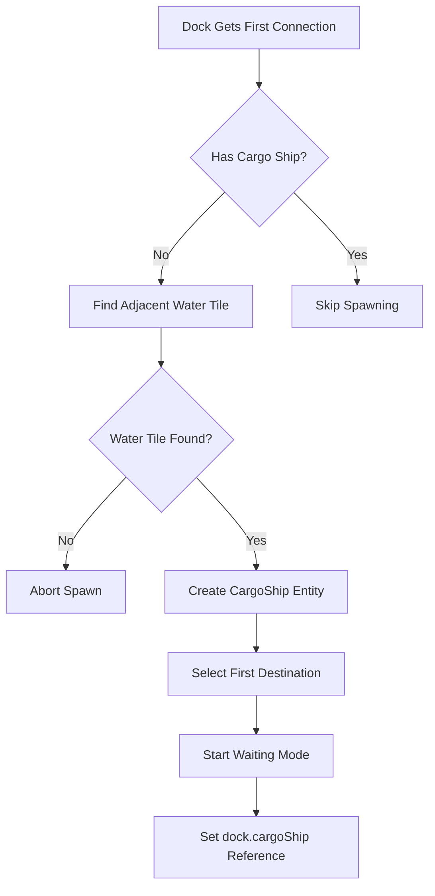
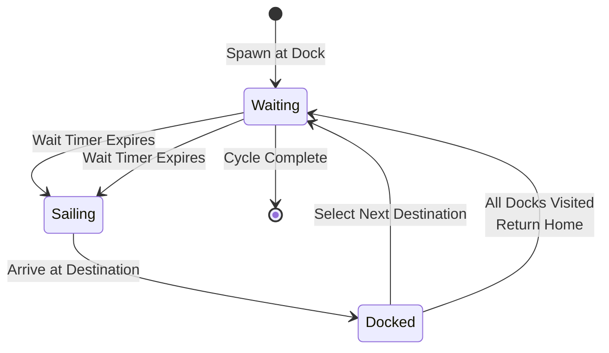
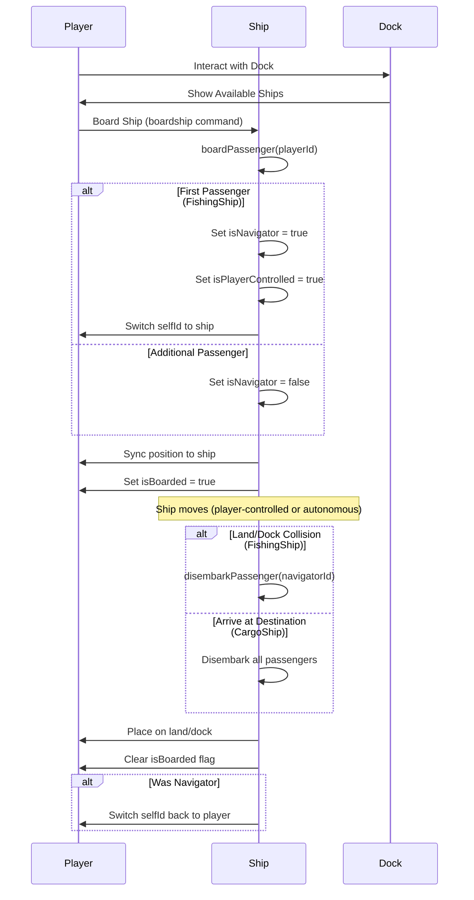
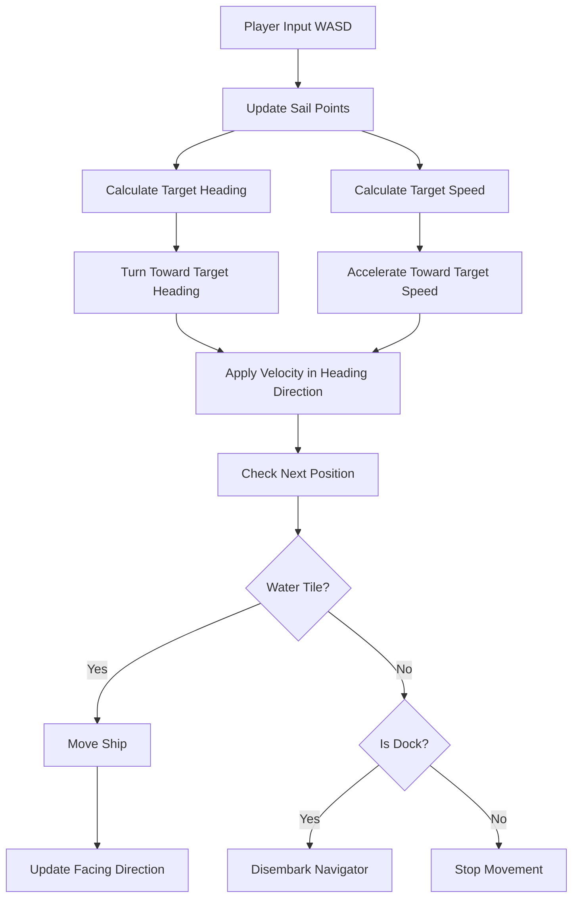
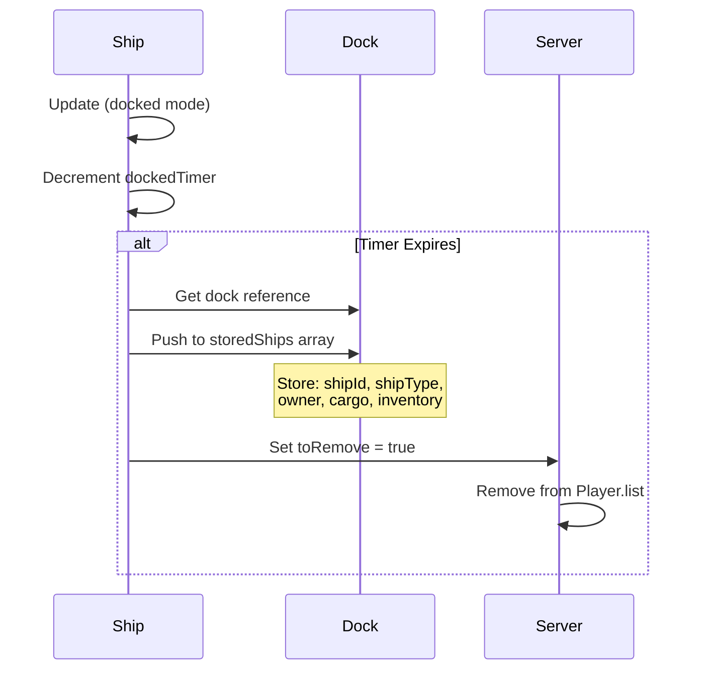
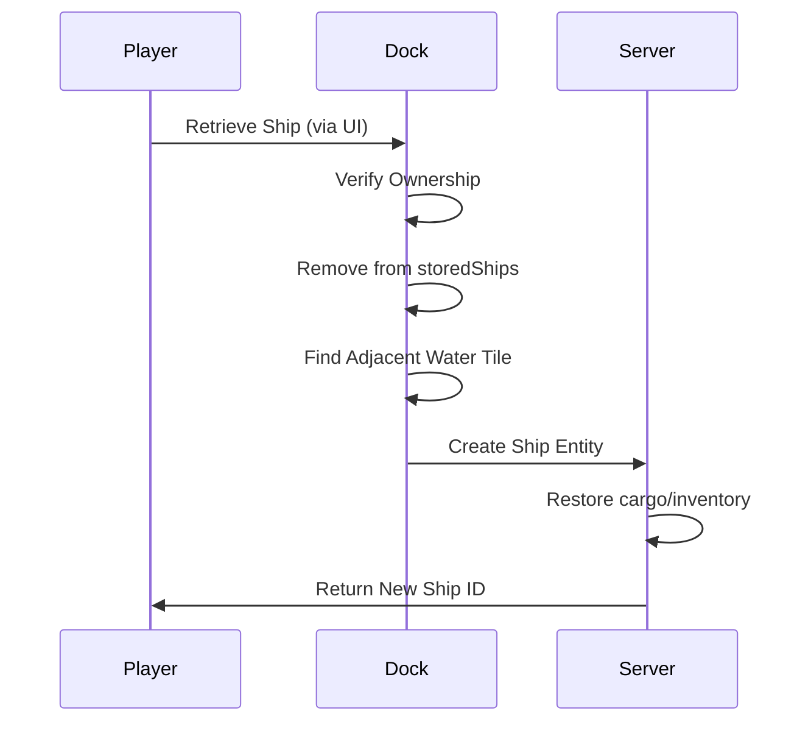
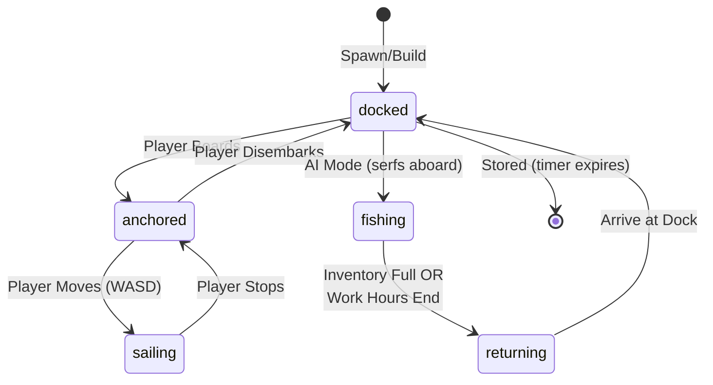

# Ship System Documentation

## Table of Contents
1. [Overview](#overview)
2. [Ship Types](#ship-types)
3. [Dock System](#dock-system)
4. [Navigation Systems](#navigation-systems)
5. [Passenger System](#passenger-system)
6. [Ship Physics & Controls](#ship-physics--controls)
7. [Ship Storage System](#ship-storage-system)
8. [Ship Modes](#ship-modes)
9. [Client-Side Systems](#client-side-systems)
10. [Network Synchronization](#network-synchronization)

---

## Overview

The ship system in Lambic provides two distinct ship types with different purposes and behaviors:

- **FishingShip**: Player-controllable vessels used for fishing and resource gathering
- **CargoShip**: Autonomous transport vessels that ferry passengers between docks

Both ship types share common infrastructure (docks, passenger systems, physics) but differ significantly in control, navigation, and purpose.

---

## Ship Types

### FishingShip

**Location**: `server/js/Entity.js` lines ~7000-7626

Fishing ships are player-owned, player-controllable vessels designed for fishing operations.

#### Key Properties
- **Controllability**: Player-controlled via WASD keys (sail points system)
- **Ownership**: Owned by specific players (`owner` property)
- **Purpose**: Fishing and resource gathering
- **Serf Integration**: Can carry serfs for automated fishing
- **Inventory**: Stores fish (max 20) before returning to dock
- **Sprite Size**: 128px

#### Key Features
- Player can board as navigator (first passenger)
- Physics-based movement with velocity system
- Autonomous fishing mode when serfs are aboard
- Returns to dock when inventory full or work hours end
- Can be stored at docks when docked for extended periods

#### Initialization
```javascript
FishingShip({
  x: spawnCoords[0],
  y: spawnCoords[1],
  z: 0,
  owner: playerId,
  dock: dockId,
  house: houseId,
  kingdom: kingdomId,
  mode: 'docked'
})
```

### CargoShip

**Location**: `server/js/Entity.js` lines ~8000-8439

Cargo ships are autonomous, NPC-controlled vessels that transport passengers between docks.

#### Key Properties
- **Controllability**: NOT player-controllable (autonomous navigation)
- **Ownership**: No owner (public transport)
- **Purpose**: Passenger transport between docks
- **Navigation**: Autonomous pathfinding between dock network nodes
- **Passenger Capacity**: Configurable (`maxPassengers` property)
- **Sprite Size**: 160px

#### Key Features
- Automatically spawned when docks form network connections
- Navigates between docks using A* pathfinding
- Waits at docks before departure (1 minute timer)
- Disembarks all passengers at destination dock
- Cycles through unvisited docks, returns home when all visited

#### Initialization
```javascript
CargoShip({
  x: waterCoords[0],
  y: waterCoords[1],
  z: 0,
  homeDock: dockId,
  currentDock: dockId,
  mode: 'waiting'
})
```

### Comparison Table

| Feature | FishingShip | CargoShip |
|---------|-------------|-----------|
| Player Control | Yes (WASD) | No (autonomous) |
| Ownership | Player-owned | Public transport |
| Navigation | Player-controlled or simple wandering | A* pathfinding |
| Purpose | Fishing | Passenger transport |
| Serf Support | Yes | No |
| Spawn Trigger | Player builds at dock | Dock network connection |
| Storage | Yes (at dock) | No (always active) |
| Anchor Emoji | Shows when docked/anchored | Shows when waiting/docked |

---

## Dock System

**Location**: `server/js/Entity.js` lines 130-257, 6394-6487

Docks are buildings that serve as ship hubs, managing ship storage, spawning, and network connections.

### Dock Properties

```javascript
{
  type: 'dock',
  network: [],           // Array of connected dock IDs
  cargoShip: null,       // Reference to cargo ship (if spawned)
  storedShips: []        // Array of stored ship data
}
```

### Dock Network Associations

Docks form bidirectional network connections when ships travel between them. This network enables cargo ship routing.

#### Association Creation

**Location**: `server/js/Entity.js` lines 144-175

When a ship docks at a new location, `createDockAssociation()` is called:

```javascript
self.createDockAssociation = function(otherDockId) {
  // Add otherDockId to this dock's network
  if(self.network.indexOf(otherDockId) === -1) {
    self.network.push(otherDockId);
  }
  
  // Bidirectional: Add this dock to other dock's network
  if(!otherDock.network) otherDock.network = [];
  if(otherDock.network.indexOf(self.id) === -1) {
    otherDock.network.push(self.id);
  }
  
  // Spawn cargo ships if needed (when dock gets first connection)
  if(self.network.length === 1 && !self.cargoShip) {
    self.spawnCargoShip();
  }
}
```

**Key Points**:
- Associations are bidirectional (both docks reference each other)
- Cargo ships spawn automatically when a dock gets its first connection
- Network grows organically as ships travel between docks

### Cargo Ship Spawning

**Location**: `server/js/Entity.js` lines 178-257

Cargo ships are automatically spawned when:
1. A dock receives its first network connection (`network.length === 1`)
2. The dock doesn't already have a cargo ship (`!self.cargoShip`)

#### Spawn Process



**Spawn Logic**:
1. Find water tile adjacent to dock plot
2. Create `CargoShip` at water coordinates
3. Call `selectNextDestination()` to choose first destination
4. Set ship to `waiting` mode
5. Store reference in `dock.cargoShip`

### Ship Storage System

**Location**: `server/js/Entity.js` lines 6394-6487, 7057-7092

Fishing ships are automatically stored at docks after being docked for 1 hour (3600 frames at 60fps).

#### Storage Trigger

When a fishing ship is in `docked` mode and `dockedTimer` expires:

```javascript
if(self.mode == 'docked' && self.dockedTimer > 0) {
  self.dockedTimer--;
  if(self.dockedTimer <= 0) {
    // Store ship at dock
    dock.storedShips.push({
      shipId: self.id,
      shipType: self.shipType || self.class,
      owner: self.owner,
      cargo: self.stores || {},
      inventory: self.inventory || {}
    });
    self.toRemove = true; // Remove from active play
  }
}
```

#### Stored Ship Data Structure

```javascript
{
  shipId: number,        // Original ship entity ID
  shipType: string,      // 'fishingship' or 'cargoship'
  owner: number,         // Player ID who owns the ship
  cargo: object,         // Ship's cargo/stores
  inventory: object      // Ship's inventory (fish, etc.)
}
```

#### Ship Retrieval

**Location**: `server/js/Entity.js` lines 6394-6487

Players can retrieve stored ships via the dock UI:

```javascript
Building.prototype.retrieveShip = function(playerId, shipIndex) {
  // Verify ownership
  if(shipData.owner != playerId) return null;
  
  // Remove from storage
  self.storedShips.splice(shipIndex, 1);
  
  // Find water tile adjacent to dock
  // Recreate ship entity at spawn location
  // Restore cargo and inventory
  // Return new ship ID
}
```

**Retrieval Process**:
1. Verify player owns the ship
2. Remove ship data from `storedShips` array
3. Find adjacent water tile for spawning
4. Recreate ship entity using stored data
5. Restore cargo and inventory
6. Return new ship entity ID

---

## Navigation Systems

### Fishing Ship Navigation

**Location**: `server/js/Entity.js` lines 7182-7200, 7236-7250

Fishing ships use simple direct movement (no pathfinding) for autonomous operations.

#### Autonomous Wandering

When in `fishing` mode and inventory not full:

```javascript
// Find random water tiles within 5-tile radius
var waterSpots = [];
for(var i = -5; i <= 5; i++) {
  for(var j = -5; j <= 5; j++) {
    var checkC = loc[0] + i;
    var checkR = loc[1] + j;
    if(getTile(0, checkC, checkR) == 0) { // Water
      waterSpots.push([checkC, checkR]);
    }
  }
}
// Pick random water tile and move directly toward it
```

#### Return to Dock

Fishing ships return to dock when:
- Inventory full (`inventory.fish >= maxFish`)
- Work hours ended (tempus VI.p - XI.p)

Return logic uses direct movement toward closest dock tile.

#### Player-Controlled Navigation

When player is navigator, ship uses physics-based movement (see [Ship Physics & Controls](#ship-physics--controls)).

### Cargo Ship Navigation

**Location**: `server/js/Entity.js` lines 8002-8188

Cargo ships use A* pathfinding to navigate between docks in their network.

#### Destination Selection

**Location**: `server/js/Entity.js` lines 8002-8030

```javascript
self.selectNextDestination = function() {
  // Get home dock's network
  var unvisited = homeDock.network.filter(function(dockId) {
    return self.visitedDocks.indexOf(dockId) === -1 && 
           dockId !== self.currentDock;
  });
  
  // If all docks visited, return home
  if(unvisited.length === 0) {
    if(self.currentDock === self.homeDock) return false;
    self.targetDock = self.homeDock;
    return true;
  }
  
  // Pick random unvisited dock
  var randomIndex = Math.floor(Math.random() * unvisited.length);
  self.targetDock = unvisited[randomIndex];
  return true;
}
```

**Algorithm**:
1. Filter network to unvisited docks (excluding current dock)
2. If all visited, set destination to home dock
3. Otherwise, pick random unvisited dock
4. When returning home, clear `visitedDocks` array

#### Pathfinding

**Location**: `server/js/Entity.js` lines 8072-8188

```javascript
self.navigateToTarget = function() {
  // Find closest water tile adjacent to target dock
  // Use A* pathfinding with waterOnly option
  var path = global.tilemapSystem.findPath(
    currentLoc, 
    closestWaterTile, 
    0, 
    {waterOnly: true}
  );
  
  // Follow pathfinding waypoints
  // Move toward each waypoint until reached
  // When path complete, arrive at dock
}
```

**Pathfinding Process**:
1. Find closest water tile adjacent to target dock
2. Generate A* path using `tilemapSystem.findPath()` with `waterOnly: true`
3. Follow waypoints sequentially
4. When path complete, dock is reached

#### Navigation Cycle



**Cycle Steps**:
1. **Waiting**: Ship waits at dock (1 minute timer)
2. **Sailing**: Ship navigates to destination via pathfinding
3. **Docked**: Ship arrives, disembarks passengers, selects next destination
4. **Return Home**: When all docks visited, return to home dock and reset cycle

---

## Passenger System

**Location**: `server/js/Entity.js` lines 7455-7626 (FishingShip), 8294-8377 (CargoShip)

Both ship types support passenger boarding, but with different control models.

### Boarding Process

#### FishingShip Boarding

**Location**: `server/js/Entity.js` lines 7455-7538

```javascript
self.boardPassenger = function(playerId) {
  // Check if already aboard
  var alreadyAboard = self.passengers.some(function(p) { 
    return p.playerId === playerId; 
  });
  if(alreadyAboard) return false;
  
  // First passenger becomes navigator (controller)
  var isNavigator = self.passengers.length === 0;
  
  // Add to passengers list
  self.passengers.push({
    playerId: playerId,
    isNavigator: isNavigator,
    storedData: storedPlayerData
  });
  
  // If navigator, set up ship control
  if(isNavigator) {
    self.controller = playerId;
    self.isPlayerControlled = true;
    // Switch client's selfId to ship ID
  }
  
  // Sync player position to ship
  player.isBoarded = true;
  player.boardedShip = self.id;
  player.shipType = self.shipType;
  player.x = self.x;
  player.y = self.y;
  player.z = 0;
}
```

#### CargoShip Boarding

**Location**: `server/js/Entity.js` lines 8294-8334

Cargo ships board passengers but **never** transfer control (always autonomous):

```javascript
self.boardPassenger = function(playerId) {
  // All passengers are non-navigators on cargo ships
  self.passengers.push({
    playerId: playerId,
    isNavigator: false,  // Always false for cargo ships
    storedData: storedPlayerData
  });
  
  // Mark player as boarded (but ship remains autonomous)
  player.isBoarded = true;
  player.boardedShip = self.id;
  player.shipType = self.shipType;
  // Position synced but no control transfer
}
```

### Navigator vs Passenger Roles

| Role | FishingShip | CargoShip |
|------|-------------|-----------|
| **Navigator** | First boarder, controls ship | Never (always autonomous) |
| **Passenger** | Additional boarders, no control | All boarders are passengers |
| **Control Transfer** | Yes (selfId switches to ship) | No (ship always autonomous) |
| **Position Sync** | Yes (follows ship) | Yes (follows ship) |

### Position Syncing

**Location**: `server/js/Entity.js` lines 7112-7120 (FishingShip), 8282-8291 (CargoShip)

Every frame, all passengers' positions are synced to the ship:

```javascript
// Sync all passengers' positions to ship position
for(var i = 0; i < self.passengers.length; i++) {
  var passenger = self.passengers[i];
  if(Player.list[passenger.playerId]) {
    var player = Player.list[passenger.playerId];
    player.x = self.x;
    player.y = self.y;
    player.z = 0; // Always overworld
  }
}
```

### Disembarking

**Location**: `server/js/Entity.js` lines 7560-7626 (FishingShip), 8336-8377 (CargoShip)

#### FishingShip Disembarking

```javascript
self.disembarkPassenger = function(playerId, landLoc) {
  // Place player on land/dock
  var landCoords = getCenter(landLoc[0], landLoc[1]);
  player.x = landCoords[0];
  player.y = landCoords[1];
  player.z = 0;
  player.isBoarded = false;
  player.boardedShip = null;
  player.shipType = null;
  
  // If navigator, transfer control back
  if(passenger.isNavigator) {
    // Switch selfId back to player
    // Next passenger becomes navigator (if any)
  }
  
  // Remove from passengers list
  self.passengers.splice(passengerIndex, 1);
}
```

#### CargoShip Disembarking

Cargo ships disembark all passengers when arriving at destination dock:

```javascript
// When ship arrives at dock
var passengersToDisembark = self.passengers.slice();
for(var i = 0; i < passengersToDisembark.length; i++) {
  self.disembarkPassenger(
    passengersToDisembark[i].playerId, 
    getLoc(targetDock.x, targetDock.y)
  );
}
```

### Boarding/Disembarking Flow



---

## Ship Physics & Controls

**Location**: `server/js/Entity.js` lines 7013-7452

Fishing ships use a physics-based movement system when player-controlled.

### Physics Properties

```javascript
self.velocity = {x: 0, y: 0};        // Current velocity vector
self.targetHeading = 0;               // Target direction (radians)
self.currentHeading = 0;              // Current direction (radians)
self.acceleration = 0.05;             // Acceleration rate
self.deceleration = 0.03;             // Deceleration rate
self.turnRate = 0.08;                 // Turn rate (radians/frame)
self.maxVelocity = 1.5;               // Maximum speed
```

### Sail Points System

**Location**: `server/js/Entity.js` lines 7022-7028

Players control ships using WASD keys, which allocate "sail points":

```javascript
self.sailPoints = {
  up: 0,    // W - north
  down: 0,  // S - south
  left: 0,  // A - west
  right: 0  // D - east
};
```

**Key Constraints**:
- Total of 2 points can be allocated across all directions
- Points determine target heading and speed
- Example: `{up: 1, right: 1}` = northeast at medium speed
- Example: `{right: 2}` = east at full speed

### Physics Update

**Location**: `server/js/Entity.js` lines 7348-7452

```javascript
self.updateShipPhysics = function() {
  // Calculate target heading from sail points
  var targetSpeed = Math.min(
    (self.sailPoints.up + self.sailPoints.down + 
     self.sailPoints.left + self.sailPoints.right) / 2,
    self.maxVelocity
  );
  
  // Calculate target heading from sail points
  var targetHeading = calculateHeadingFromSailPoints();
  
  // Smoothly turn toward target heading
  var headingDiff = targetHeading - self.currentHeading;
  // Normalize to [-PI, PI]
  if(Math.abs(headingDiff) > self.turnRate) {
    self.currentHeading += Math.sign(headingDiff) * self.turnRate;
  }
  
  // Accelerate/decelerate toward target speed
  var currentSpeed = Math.sqrt(self.velocity.x^2 + self.velocity.y^2);
  currentSpeed += (targetSpeed - currentSpeed) * self.acceleration;
  
  // Apply velocity in current heading direction
  self.velocity.x = Math.cos(self.currentHeading) * currentSpeed;
  self.velocity.y = Math.sin(self.currentHeading) * currentSpeed;
  
  // Apply velocity to position
  self.x += self.velocity.x;
  self.y += self.velocity.y;
}
```

### Collision Detection

**Location**: `server/js/Entity.js` lines 7391-7433

```javascript
// Check if next position is on water
var nextTile = getTile(0, nextLoc[0], nextLoc[1]);
if(nextTile != 0) { // Not water (land or dock)
  // Check if this is a friendly dock
  var buildingId = getBuilding(nextX, nextY);
  if(building && building.type === 'dock' && isFriendly) {
    // Allow docking
    hitDock = building;
  }
  
  // Disembark navigator onto land/dock
  if(self.isPlayerControlled && self.mode === 'sailing') {
    self.disembarkPassenger(navigatorId, nextLoc);
  }
  
  return; // Don't move forward
}
```

**Collision Behavior**:
- Ships cannot move onto land tiles
- Friendly docks allow docking (disembark)
- Unfriendly docks block movement
- Navigator is automatically disembarked on land/dock collision

### Physics Flow



---

## Ship Storage System

**Location**: `server/js/Entity.js` lines 7057-7092, 6394-6487

Fishing ships are automatically stored at docks to reduce server load when not in use.

### Storage Trigger

Ships are stored when:
- Mode is `docked`
- `dockedTimer` expires (1 hour = 3600 frames at 60fps)
- Ship is at a dock building

### Storage Process



### Storage Data Structure

```javascript
dock.storedShips.push({
  shipId: self.id,              // Original entity ID
  shipType: self.shipType,      // 'fishingship'
  owner: self.owner,            // Player ID
  cargo: self.stores || {},     // Ship's cargo
  inventory: self.inventory || {} // Ship's inventory (fish)
});
```

### Retrieval Process

**Location**: `server/js/Entity.js` lines 6394-6487



**Retrieval Steps**:
1. Player selects ship from dock UI
2. Dock verifies ownership (`shipData.owner == playerId`)
3. Remove ship data from `storedShips` array
4. Find water tile adjacent to dock plot
5. Recreate ship entity using stored data
6. Restore cargo and inventory
7. Return new ship entity ID

**Note**: Cargo ships are never stored - they remain active in the world at all times.

---

## Ship Modes

Ships operate in different modes that determine their behavior:

### FishingShip Modes

| Mode | Description | Behavior |
|------|-------------|----------|
| `docked` | At dock, waiting | Ship is stationary at dock, can be boarded |
| `anchored` | Player boarded, not moving | Ship is stationary, player can start moving |
| `sailing` | Moving | Ship is moving via physics or direct movement |
| `fishing` | Actively fishing | Autonomous wandering, catching fish |
| `returning` | Returning to dock | Moving directly toward home dock |

### CargoShip Modes

| Mode | Description | Behavior |
|------|-------------|----------|
| `waiting` | Waiting at dock | Ship waits 1 minute before departure |
| `sailing` | Navigating to destination | Ship uses pathfinding to reach target dock |
| `docked` | Arrived at destination | Ship has arrived, disembarking passengers |

### Mode Transitions

#### FishingShip



#### CargoShip

```mermaid
stateDiagram-v2
    [*] --> waiting: Spawn at Dock
    waiting --> sailing: Wait Timer Expires
    sailing --> docked: Arrive at Destination
    docked --> waiting: Select Next Destination
    Note right of docked: Disembark Passengers<br/>Add to visitedDocks
    Note right of waiting: If all docks visited:<br/>Return home, reset cycle
```

### Mode-Specific Behavior

#### Anchor Emoji Display

Ships display an anchor emoji (⚓) in their name when:
- **FishingShip**: `docked` or `anchored` mode
- **CargoShip**: `waiting` or `docked` mode

The emoji is automatically removed when ships start moving (`sailing` mode).

**Location**: `server/js/Entity.js` lines 8191-8238 (CargoShip), similar logic for FishingShip

---

## Client-Side Systems

### Dock UI

**Location**: `client/js/ui/DockUI.js`

The dock UI displays available ships, owned ships, and cargo ships at a dock.

#### UI Components

1. **Available Ships**: Ships that can be built (requires resources)
2. **Owned Ships**: Player's ships stored at this dock
3. **Cargo Ships**: Autonomous cargo ships waiting at dock

#### Rendering

```javascript
updateDockDisplay(dockData) {
  // Render cargo ships
  renderCargoShips(cargoShips, dockCargoShipsList);
  
  // Render available ships to build
  renderAvailableShips(availableShips, playerResources, dockShipList);
  
  // Render owned ships
  renderOwnedShips(ownedShips, dockOwnedShipsList);
}
```

#### Ship Boarding

Clicking a ship in the UI sends a `boardship` command:

```javascript
socket.send(JSON.stringify({
  msg: 'evalCmd',
  id: selfId,
  cmd: `boardship ${shipId}`,
  world: world
}));
```

### Ship Wake System

**Location**: `client/js/core/ShipWakeSystem.js`

The wake system creates visual wake effects behind moving ships.

#### Wake Tracking

```javascript
class ShipWakeSystem {
  constructor() {
    this.ships = new Set();        // Track ship IDs
    this.fading = {};              // Fading wake tiles
  }
  
  addShip(shipId) {
    this.ships.add(shipId);
  }
  
  update(config) {
    // For each tracked ship:
    // 1. Get current tile position
    // 2. Mark tile as fading (5 second fade)
    // 3. Update alpha for all fading tiles
  }
  
  getBrightness(tileX, tileY) {
    // Return brightness multiplier (0-0.3) for wake effect
  }
}
```

#### Wake Effect

- Ships leave bright wake trails on water tiles
- Wakes fade over 5 seconds
- Brightness multiplier: 0.3 * alpha (fades from 1.0 to 0.0)

### Ship Rendering

Ships are rendered as entities with:
- Sprite based on ship type (FishingShip: 128px, CargoShip: 160px)
- Name displayed above ship (with anchor emoji when applicable)
- Wake effects on water tiles

### Boarding Command Handler

**Location**: `server/js/commands/commands/BoardShipCommand.js`

Handles the `boardship <shipId>` command:

1. **Find Ship**: Check active `Player.list` or stored ships at docks
2. **Verify Ownership**: For fishing ships at dock, verify player owns ship
3. **Board Ship**: Call `ship.boardPassenger(player.id)`
4. **Update State**: Set ship mode if needed

**Key Logic**:
- Cargo ships are always public (no ownership check)
- Fishing ships at dock require ownership verification
- Fishing ships not at dock can be boarded by anyone (abandoned)

---

## Network Synchronization

**Location**: `client/js/core/SocketMessageHandler.js` lines 928-1100

Ship entities require special handling for network synchronization to prevent visual artifacts and ensure proper state updates.

### Position Updates

Ship positions bypass throttling to prevent "jumping" artifacts:

```javascript
// Always update ship positions immediately (don't skip)
var isShip = p.type === 'ship';
if(pack.x != undefined && p.x !== pack.x) { 
  p.x = pack.x; 
  posChanged = true; 
}
// Similar for y and z
```

**Why**: Ships can move quickly, and throttled updates cause ships to appear stationary then suddenly "jump" to correct position.

### Name Updates

Ship names bypass throttling for anchor emoji display:

```javascript
// Always update ship names immediately (don't throttle)
if(pack.name != undefined && p.type === 'ship') {
  p.name = pack.name;
}
```

**Why**: Anchor emoji must update immediately when ship mode changes (docked → sailing).

### ShipType Propagation

ShipType updates bypass throttling for audio context:

```javascript
// Always update shipType immediately (don't throttle)
if(pack.shipType != undefined) {
  p.shipType = pack.shipType;
}
```

**Why**: AudioManager needs immediate `shipType` updates to correctly play ship BGM when player boards.

### Update Pack Structure

Ships include additional properties in update packs:

```javascript
// FishingShip
{
  sailPoints: self.sailPoints,
  shipMode: self.mode,
  // ... standard entity properties
}

// CargoShip
{
  shipType: self.shipType,
  shipMode: self.mode,
  waitTimer: self.waitTimer,
  passengerCount: self.passengers.length,
  maxPassengers: self.maxPassengers,
  // ... standard entity properties
}
```

### Client-Side Audio Context

**Location**: `client/js/audio/AudioManager.js`

When player is boarded, AudioManager checks ship context:

```javascript
getAudioContext() {
  // Use player.shipType if set
  let shipType = player.shipType || null;
  
  // Fallback: Check boardedShip entity's shipType
  if (!shipType && player.boardedShip) {
    const boardedShipEntity = Player.list[player.boardedShip];
    if (boardedShipEntity && boardedShipEntity.shipType) {
      shipType = boardedShipEntity.shipType;
    }
  }
  
  // Ship audio takes priority over day/night transitions
  if(shipType) {
    return ship_bgm; // Play ship music
  }
}
```

**Key Points**:
- Ship audio prevents day/night music from interrupting
- Falls back to boardedShip entity if player.shipType not set
- Ensures consistent ship audio while boarded

---

## Summary

The ship system provides two distinct ship types with shared infrastructure:

- **FishingShip**: Player-controlled, fishing-focused, can be stored
- **CargoShip**: Autonomous, transport-focused, always active

Both types use:
- Dock network system for connections
- Passenger boarding/disembarking
- Position syncing for passengers
- Physics-based movement (FishingShip only)

Key systems:
- **Dock Network**: Bidirectional associations enable cargo ship routing
- **Navigation**: Simple wandering (FishingShip) vs A* pathfinding (CargoShip)
- **Physics**: Velocity-based movement with sail points (FishingShip)
- **Storage**: Automatic storage for fishing ships at docks
- **Client**: Dock UI, wake effects, proper network synchronization

The system is designed to support both player agency (fishing ships) and automated world systems (cargo ships) while sharing common infrastructure.

