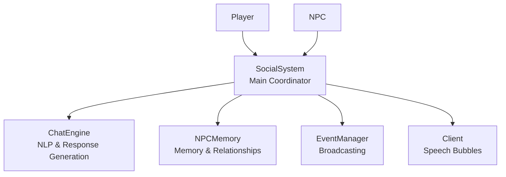
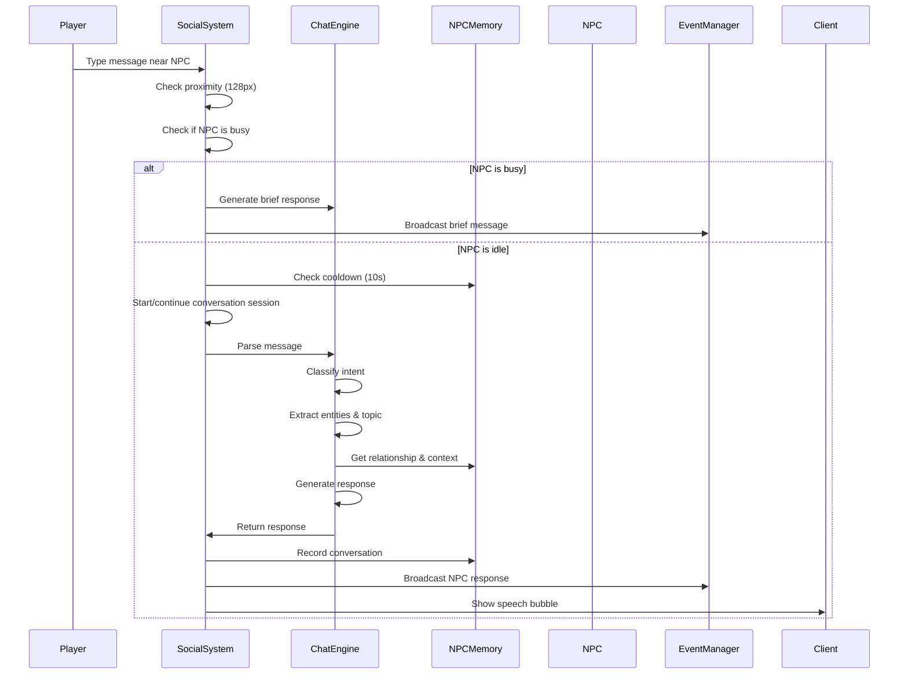
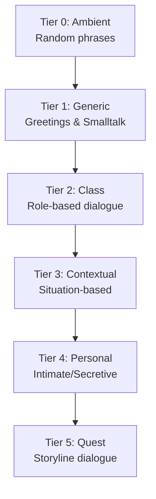

# NPC Social System Documentation

## Overview

The NPC Social System is a comprehensive framework that enables dynamic conversations between players and NPCs, as well as between NPCs themselves. The system uses natural language processing (NLP) pattern matching, memory tracking, and dialogue trees to create immersive social interactions.

## System Architecture

The social system consists of three core components working together:



### Component Responsibilities

- **SocialSystem** (`server/js/core/SocialSystem.js`): Main coordinator that manages conversation sessions, proximity detection, speech bubbles, and integrates with the game loop
- **ChatEngine** (`server/js/core/ChatEngine.js`): Handles intent classification, entity extraction, and response generation using pattern matching
- **NPCMemory** (`server/js/core/NPCMemory.js`): Tracks acquaintances, event memories, conversation history, and relationship progression

### Integration Points

- **Entity.js** (lines 2094-2108): Initializes NPC social profiles on creation and records death events
- **OptimizedGameLoop.js** (lines 144-146): Updates social system every frame (with budget allocation)
- **EventManager**: Broadcasts NPC speech to nearby players
- **Client-side**: `ChatManager.js` displays messages, `SocketMessageHandler.js` handles `npcSpeaking` messages for speech bubbles

## Conversation Mechanics

### Player-to-NPC Conversations

Players initiate conversations by typing messages in the chat. The system automatically detects nearby NPCs and routes messages to them.

#### Conversation Flow



#### Proximity Detection

- **Conversation Radius**: 128 pixels (2 tiles)
- **Z-Level Checking**: Participants must be on the same z-level
- **Distance Monitoring**: Conversations automatically end if participants move more than 128px apart

#### Cooldown System

- **New Conversations**: 10 seconds cooldown between starting new conversations with the same NPC
- **Busy NPCs**: 30 seconds cooldown for brief responses from busy NPCs
- **Active Conversations**: No cooldown during an active conversation session

#### Busy NPC Handling

NPCs that are working, in combat, or performing actions give brief contextual responses instead of full conversations:

- **Chopping**: "*chop* Busy! *chop*"
- **Mining**: "*mining* Not now!"
- **Farming**: "Working the fields!"
- **Building**: "Building here!"
- **Fishing**: "Shhh! Fishing!"
- **Combat**: "*fighting* Not now!"
- **Fleeing**: "*running* Can't talk!"

Busy NPCs do not start conversation sessions - they only give brief acknowledgments.

#### Conversation Session Lifecycle

1. **Start**: When player first talks to NPC (or NPC initiates)
   - Creates session with unique ID: `${id1}-${id2}-${timestamp}`
   - Shows permanent speech bubbles for both participants
   - Records start time and last message time

2. **Continue**: During active conversation
   - Updates `lastMessageTime` on each message
   - No cooldown checks (free conversation flow)
   - Speech bubbles remain visible

3. **End**: When conversation terminates
   - Player says farewell (explicit end)
   - Participants move >128px apart (distance-based)
   - Participants change z-levels
   - One participant dies or is removed

### NPC-to-NPC Conversations

NPCs can spontaneously initiate conversations with nearby characters (players or other NPCs).

#### Spontaneous Conversation Triggers

- **Chance**: 5% per minute for idle NPCs (checked every 30 seconds)
- **Requirements**:
  - NPC must be idle (not working, chopping, mining, farming, building, fishing, in combat, or fleeing)
  - Target must be idle
  - Both must be within 128px of each other
  - Both must be on the same z-level
  - Neither can already be in a conversation
  - NPC must pass cooldown check (30 seconds since last conversation)

#### Relationship-Based Greetings

NPCs generate different greetings based on their relationship with the target:

- **Friend** (10+ interactions): "Good to see you, [name]!", "Ah, [name]! How goes it?"
- **Acquaintance** (3-9 interactions): "Greetings!", "Hail, traveler!"
- **Stranger** (<3 interactions): "Greetings, stranger." (30% chance to actually say something)

#### Event-Driven Conversations

NPCs may comment on recent events:

- **Recent Attack**: "Be careful out there! I was just attacked by [attacker]!"
- **Death Witnessed**: "Did you see that? [victim] was slain! Terrible..."

## Chat Engine (NLP System)

The ChatEngine uses pattern matching to classify player intent and generate appropriate responses.

### Intent Classification

The engine recognizes the following intents using regex patterns:

| Intent | Patterns | Example Input |
|--------|----------|---------------|
| `greeting` | `/^(hello|hi|hey|greetings|hail)/i` | "Hello", "Greetings" |
| `farewell` | `/^(goodbye|bye|farewell|see you)/i` | "Goodbye", "Farewell" |
| `question_howAreYou` | `/(how (are|do) you|how's it going)/i` | "How are you?" |
| `question_seen` | `/(have you seen|know where).+(enemy|wolf|deer)/i` | "Have you seen any wolves?" |
| `question_whatDoYouDo` | `/(what (do|are) you (do|doing)|what's your job)/i` | "What do you do?" |
| `question_location` | `/(where (is|are)|do you know where)/i` | "Where is the mill?" |
| `question_faction` | `/(your (faction|house|kingdom)|who do you serve)/i` | "What faction are you?" |
| `question_trade` | `/(trade|buy|sell).+(wood|stone|iron|gold)/i` | "Do you trade wood?" |
| `statement_complaint` | `/(tired|exhausted|difficult|my back|aches)/i` | "I'm tired" |
| `statement_weather` | `/(nice (day|weather)|beautiful|cold|hot)/i` | "Nice day" |
| `question_general` | `/(what|why|how|when|where|who)/i` | Catch-all for questions |
| `unknown` | (fallback) | Anything not matching above |

### Entity Extraction

The engine extracts entities from messages for context:

- **Enemies**: wolf, wolves, boar, enemy, enemies, bandit, outlaws
- **Animals**: deer, wolf, wolves, boar, falcon, sheep
- **Resources**: wood, stone, iron, gold, silver, grain, diamond
- **Buildings**: mill, mine, lumbermill, farm, tavern, hut, stronghold
- **Classes**: serf, knight, archer, monk, bishop, hunter, rogue, mage

### Topic Extraction

Topics are extracted for conversation memory:

- `weather`: weather, rain, cold, hot, nice day
- `work`: work, job, tired, busy, hauling, chopping, mining
- `faction`: faction, house, kingdom, allegiance, serve, loyalty
- `danger`: danger, enemy, wolf, attack, combat, fight, death
- `trade`: trade, buy, sell, gold, market
- `location`: where, location, place, find
- `general`: (fallback)

### Response Generation

Responses are generated based on:

1. **Intent Type**: Each intent has specific response generators
2. **NPC Class**: Class-specific responses (serf, knight, monk, etc.)
3. **Relationship**: Stranger, acquaintance, or friend
4. **Recent Events**: Recent attacks, deaths witnessed, etc.
5. **Time of Day**: Day vs. night variations
6. **Context**: Current activity, location, etc.

#### Response Examples

**Greeting (Friend)**:
- "Well met, friend!"
- "Good to see thee again!"
- "Ah, mine friend! How farest thou?"

**Greeting (Stranger)**:
- "Hail, stranger."
- "Greetings, traveler."
- "Well met, though I know thee not."

**Status Response (Serf)**:
- "Weary from all this toil."
- "Well enough, though mine back doth ache."
- "Busy as ever."

**Status Response (with Recent Attack)**:
- "Not well! I was attacked by [attacker]!"
- "Shaken... I just witnessed a death. Most terrible business."

## NPC Memory System

The NPCMemory system tracks relationships, events, and conversation history for each NPC.

### Acquaintance Tracking

NPCs remember characters they've interacted with:

```javascript
{
  id: "player123",
  name: "PlayerName",
  class: "knight",
  house: "houseId",
  kingdom: "kingdomName",
  relationship: "friend", // stranger → acquaintance → friend → enemy
  interactionCount: 12,
  firstMet: 1234567890,
  lastInteraction: 1234567890,
  conversationTopics: ["weather", "work", "faction"],
  lastConversationTime: 1234567890
}
```

#### Relationship Progression

- **Stranger**: 0-2 interactions
- **Acquaintance**: 3-9 interactions
- **Friend**: 10+ interactions
- **Enemy**: Set explicitly (via combat or other hostile actions)

#### Memory Limits

- **Max Acquaintances**: 10 per NPC (oldest removed when limit reached)
- **Max Event Memories**: 20 per NPC (FIFO queue)
- **Max Topics per Acquaintance**: 5 (most recent)

### Event Memory System

NPCs remember significant life events:

```javascript
{
  type: "combat_attacked" | "death_witnessed" | "trade" | "joined_faction",
  timestamp: 1234567890,
  description: "Attacked by PlayerName",
  involvedCharacters: ["player123"],
  location: { x: 100, y: 200, z: 0 },
  details: {
    attackerName: "PlayerName",
    attackerClass: "knight"
  }
}
```

#### Event Types

- **`combat_attacked`**: NPC was attacked by someone
- **`death_witnessed`**: NPC witnessed a death nearby (1280px radius)
- **`trade`**: NPC traded with someone
- **`enemy_sighted`**: NPC saw enemies nearby

#### Event Queries

- `getRecentEvent(withinMs)`: Get most recent event within time window
- `getEventsByType(type, limit)`: Get events of specific type
- `getEventsWithCharacter(characterId, limit)`: Get events involving a character
- `wasRecentlyAttackedBy(characterId, withinMs)`: Check if recently attacked
- `witnessedDeathRecently(withinMs)`: Check if witnessed death

### Conversation History

NPCs track topics discussed with each acquaintance:

- Topics are stored per-acquaintance
- Used to avoid excessive repetition (though system allows natural topic revisiting)
- Limited to 5 most recent topics per person

### Conversation Cooldown

- **Global Cooldown**: 30 seconds between NPC-initiated conversations
- **Per-Acquaintance Cooldown**: 5 minutes between conversations with the same person
- **Active Conversation**: No cooldown during active session

## Dialogue Trees

Dialogue trees are organized in a tiered structure defined in `server/js/Dialogue.js`:

### Tier Structure



### Tier 0: Ambient

Phrases said in passing or at random (not currently used in active conversations, but defined for future use):

- **General**: "Another day doth pass...", "*sighs deeply*", "Hmm."
- **Serf**: "Mine back doth ache...", "So much toil to be done."
- **Military**: "Ever vigilant.", "*scanneth the horizon*"
- **Cleric**: "*prayeth quietly*", "Blessed be...", "The Lord watcheth over us."

### Tier 1: Generic

Generic greetings and smalltalk based on circumstances:

- **Greetings**:
  - Day: "Good morrow!", "Greetings to thee!", "Hail!", "Well met!"
  - Night: "Good eventide.", "Dark be the night...", "Greetings, traveler."
  - By relationship: stranger, acquaintance, friend
- **Farewells**: "Fare thee well!", "Safe travels to thee!", "Until we meet anon."
- **Weather**: Day/night/general variations

### Tier 2: Class

Class-specific dialogue based on NPC role:

- **Serf**: Work complaints, status updates
- **Innkeeper**: Tavern management, hospitality
- **Knight**: Duty, combat, honor
- **Archer**: Watch duty, marksmanship
- **Monk**: Spiritual matters, prayer
- **Bishop**: Leadership, faith
- **Hunter**: Hunting, tracking, game

### Tier 3: Contextual

Situation-based responses:

- **Danger**: Warnings about wolves, enemies, recent attacks
- **Death**: Responses to witnessed deaths
- **Location**: Context-aware comments about surroundings

### Tier 4: Personal

Intimate or secretive information (defined but not heavily used yet):

- Secrets, fears, hopes

### Tier 5: Quest

Quest-specific dialogue trees (placeholder for future quest system)

## Speech Bubbles

Speech bubbles provide visual feedback during conversations.

### Bubble Types

1. **Permanent Bubbles**: Shown during active conversation sessions (duration = 0)
   - Remain visible until conversation ends
   - Shown for both participants

2. **Temporary Bubbles**: Shown for brief responses (duration = 3000ms)
   - Auto-hide after 3 seconds
   - Used for busy NPC responses

### Client-Side Implementation

- **Server**: Broadcasts `npcSpeaking` message with `{id, show}` to all clients
- **Client**: `SocketMessageHandler.handleNpcSpeaking()` sets `npc.speechBubble = true/false`
- **Rendering**: Client renderer displays speech bubble emoji above NPC sprite when `speechBubble === true`

## Event Integration

The social system integrates with the EventManager for broadcasting NPC speech.

### Event Creation

When an NPC speaks, the system creates an event:

```javascript
global.eventManager.createEvent({
  category: global.eventManager.categories.SOCIAL,
  subject: npc.id,
  subjectName: npc.name || npc.class,
  action: 'said',
  message: formattedMessage,
  communication: global.eventManager.commModes.AREA,
  log: `[SOCIAL] ${npc.name} said: "${message}" at [${x},${y}] z=${z}`,
  position: { x: npc.x, y: npc.y, z: npc.z }
});
```

### Combat Event Recording

When an NPC is attacked:

```javascript
socialSystem.recordCombatEvent(victimId, attackerId);
```

This:
1. Records the attack in victim's memory
2. Marks attacker as enemy
3. Stores attacker details for future reference

### Death Witness System

When an NPC dies, nearby NPCs (within 1280px) witness it:

```javascript
socialSystem.recordDeathWitnessed(victimId, location, 1280);
```

Witnesses:
- Record the death event in their memory
- May comment on it in future conversations
- Remember the victim's name and class

### Trade Event Recording

When an NPC trades with a player:

```javascript
socialSystem.recordTradeEvent(npcId, traderId);
```

This:
1. Records the trade event
2. Adds trader as acquaintance (if not already)
3. Updates relationship based on interaction count

## Proximity and Cooldown Systems

### Conversation Radius

- **Standard Radius**: 128 pixels (2 tiles at 64px/tile)
- **Witness Radius**: 1280 pixels (20 tiles) for death events
- **Distance Calculation**: Euclidean distance: `√((x1-x2)² + (y1-y2)²)`

### Z-Level Checking

- Participants must be on the same z-level to converse
- Conversations automatically end if participants change z-levels
- Z-levels: -3 (underwater), -2 (cellar), -1 (cave), 0 (overworld), 1 (ground floor), 2 (second floor)

### Distance-Based Termination

Conversations end automatically if:
- Participants move >128px apart
- One participant changes z-level
- One participant dies or is removed

### Cooldown Timers

| Scenario | Cooldown | Purpose |
|----------|----------|---------|
| New conversation (player→NPC) | 10 seconds | Prevent spam |
| Busy NPC brief response | 30 seconds | Reduce interruptions |
| NPC-initiated conversation | 30 seconds | Prevent NPC spam |
| Per-acquaintance conversation | 5 minutes | Natural conversation pacing |
| Active conversation | None | Free flow during session |

## Humanoid NPC Detection

Only certain NPC classes can participate in conversations:

### Conversation-Capable Classes

- **Serfs**: `serf`, `serfm`, `serff`
- **Merchants**: `innkeeper`
- **Military**: `knight`, `archer`, `footsoldier`, `cavalry`, `swordsman`
- **Clerics**: `monk`, `bishop`, `friar`, `druid`, `priest`
- **Rogues**: `hunter`, `rogue`
- **Mages**: `mage`, `warlock`
- **Nobles**: `king`, `general`, `crusader`, `templar`

### Filtering

The system checks `isHumanoidNPC(npc)` before allowing social interactions. Non-humanoid entities (animals, ships, etc.) cannot participate.

## Client-Side Systems

### ChatManager

`client/js/core/ChatManager.js` manages chat display:

- **Auto-hide**: Chat hides after 5 seconds of inactivity
- **Show on focus**: Chat shows when input is focused
- **Scroll management**: Auto-scrolls to bottom on new messages
- **Message display**: Adds formatted HTML messages to chat container

### SocketMessageHandler

`client/js/core/SocketMessageHandler.js` handles social-related messages:

- **`addToChat`**: Displays NPC speech messages
- **`npcSpeaking`**: Updates speech bubble state on NPC entities

### Speech Bubble Rendering

Speech bubbles are rendered client-side:

1. Server sends `npcSpeaking` message with `{id, show: true/false}`
2. Client sets `npc.speechBubble = true/false`
3. Renderer displays speech bubble emoji above NPC when `speechBubble === true`

## Performance Considerations

### Update Frequency

- **Proximity Checks**: Every frame (cheap operation)
- **Spontaneous Conversations**: Every 30 seconds
- **Game Loop Integration**: Social system update allocated 20% of remaining frame budget

### Optimization Strategies

- **Memory Limits**: Capped at 10 acquaintances and 20 events per NPC
- **Cooldown Checks**: Prevent excessive conversation attempts
- **Lazy Initialization**: NPCMemory created only when needed
- **Session Cleanup**: Automatic cleanup when participants leave or die

## Code Examples

### Example Conversation Session

```javascript
// Player types "Hello" near an NPC
// 1. SocialSystem receives message
socialSystem.handlePlayerToNPC(playerId, npcId, "Hello");

// 2. Check proximity (128px)
const distance = Math.sqrt((player.x - npc.x)² + (player.y - npc.y)²);
if (distance > 128) return; // Too far

// 3. Parse message
const parsed = chatEngine.parse("Hello");
// { intent: "greeting", entities: {}, topic: "general", keywords: ["hello"] }

// 4. Get NPC memory
const memory = socialSystem.getMemory(npcId);
const relationship = memory.getAcquaintance(playerId)?.relationship || "stranger";

// 5. Generate response
const response = chatEngine.generateGreeting(npc, memory, playerId, dialogues);
// "Hail, stranger." (if first meeting)

// 6. Start conversation session
const sessionId = socialSystem.startConversation(playerId, npcId);

// 7. Broadcast response
eventManager.createEvent({
  category: "SOCIAL",
  subject: npcId,
  action: "said",
  message: "<span style='color:#88ccff;'><b>NPCName:</b></span> Hail, stranger.",
  communication: "AREA",
  position: { x: npc.x, y: npc.y, z: npc.z }
});

// 8. Record conversation
memory.recordConversation(playerId, "greeting");
memory.startConversation();
```

### Example Memory State

```javascript
// NPC Memory after several interactions
{
  npcId: "npc123",
  acquaintances: Map {
    "player456" => {
      id: "player456",
      name: "PlayerName",
      class: "knight",
      relationship: "friend", // 12 interactions
      interactionCount: 12,
      firstMet: 1234567890,
      lastInteraction: 1234567899,
      conversationTopics: ["weather", "work", "faction", "danger"],
      lastConversationTime: 1234567899
    }
  },
  eventMemories: [
    {
      type: "combat_attacked",
      timestamp: 1234567895,
      description: "Attacked by EnemyName",
      involvedCharacters: ["enemy789"],
      details: { attackerName: "EnemyName", attackerClass: "rogue" }
    },
    {
      type: "death_witnessed",
      timestamp: 1234567890,
      description: "Witnessed death of VictimName",
      involvedCharacters: ["victim321"],
      details: { victimName: "VictimName", victimClass: "serf" }
    }
  ],
  lastConversationTime: 1234567899,
  conversationCooldown: 30000
}
```

### Example Dialogue Selection

```javascript
// NPC is a serf, player is a friend, asking "How are you?"
const npc = { class: "serf", name: "SerfName" };
const memory = getMemory(npcId);
const relationship = memory.getAcquaintance(playerId)?.relationship; // "friend"
const recentEvent = memory.getRecentEvent(300000); // Check last 5 minutes

// Response generation:
if (recentEvent?.type === "combat_attacked") {
  return "Not well! I was attacked by " + recentEvent.details.attackerName + "!";
}

// Class-based response (serf)
const responses = [
  "Weary from all this toil.",
  "Well enough, though mine back doth ache.",
  "Busy as ever."
];
return randomChoice(responses); // "Weary from all this toil."
```

## System Statistics

The social system provides statistics via `getStats()`:

```javascript
{
  totalNPCs: 45,                    // NPCs with memory profiles
  activeConversations: 3,           // Current conversation sessions
  activeSpeechBubbles: 6,            // NPCs showing speech bubbles
  totalAcquaintances: 127,           // Total acquaintance relationships
  totalEvents: 89                   // Total event memories across all NPCs
}
```

## Future Enhancements

Potential areas for expansion:

1. **Quest Integration**: Tier 5 dialogue trees for quest-specific conversations
2. **Reputation System**: More granular relationship tracking beyond stranger/acquaintance/friend
3. **Faction Relations**: NPCs remember player's faction and adjust responses
4. **Topic Memory**: More sophisticated topic tracking to enable deeper conversations
5. **Multi-Party Conversations**: Support for 3+ participants
6. **Emotion System**: NPCs remember emotional context of interactions
7. **Rumor System**: NPCs share information they've heard from others

