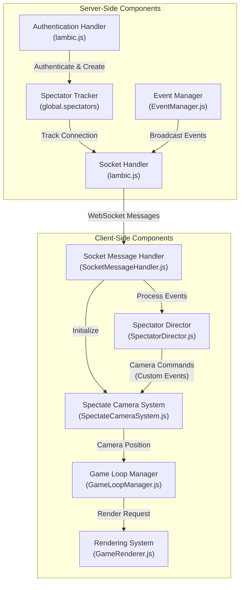
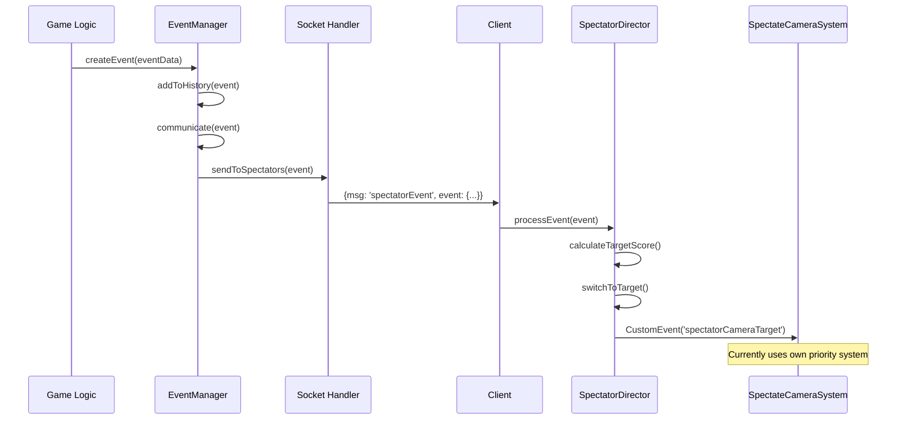

# Spectator System Documentation

## Table of Contents

1. [Introduction](#introduction)
2. [Architecture Overview](#architecture-overview)
3. [Server-Side System](#server-side-system)
4. [Client-Side Camera System](#client-side-camera-system)
5. [Director System](#director-system)
6. [Event Communication](#event-communication)
7. [Integration Points](#integration-points)
8. [Technical Details](#technical-details)

---

## Introduction

### What is Spectator Mode?

Spectator mode is a special viewing mode that allows authenticated users to observe the game world without participating as a player. Spectators have a unique camera system that automatically follows interesting events and characters, providing an automated "director" experience similar to sports broadcasting.

### Purpose and Use Cases

- **Content Creation**: Streamers and content creators can use spectator mode to capture interesting gameplay moments
- **Moderation**: Administrators can monitor server activity without interfering with gameplay
- **Tournament Viewing**: Spectators can watch competitive events with an intelligent camera that follows the action
- **Learning**: New players can observe experienced players to learn game mechanics
- **Server Monitoring**: Track server activity, player behavior, and game events in real-time

### Key Characteristics

- **No Player Entity**: Spectators are NOT Player entities - they exist only as Camera entities tracked separately in `Camera.list`
- **Read-Only Access**: Spectators cannot interact with the game world (no building, combat, or item manipulation)
- **Intelligent Camera**: Automatic camera system that prioritizes interesting events (combat, deaths, building completions)
- **Event-Driven**: Receives structured game events for intelligent camera control
- **Isolated Chat**: Spectators have their own chat channel separate from regular players

---

## Architecture Overview

The spectator system consists of several interconnected components working together to provide a seamless viewing experience.

### System Components



### Data Flow

1. **Authentication**: Client sends `spectate` message → Server validates → Creates spectator entry
2. **Initialization**: Server sends world data, entities, and initialization packets → Client sets up camera system
3. **Event Broadcasting**: Game events occur → EventManager sends to spectators → Director processes events
4. **Camera Control**: Director evaluates targets → Camera system follows selected targets → Rendering system displays view
5. **Updates**: Game loop continuously updates camera position → Renders world from camera perspective

### Component Relationships

- **Server → Client**: One-way data flow for game state and events
- **EventManager → SpectatorDirector**: Event-driven camera control
- **SpectatorDirector → SpectateCameraSystem**: Potential integration (currently uses custom events)
- **SpectateCameraSystem → GameLoop**: Camera position updates
- **GameLoop → Renderer**: Rendering requests with camera position

---

## Server-Side System

### Authentication Flow

The server handles spectator authentication in [`lambic.js`](lambic.js) (lines 6750-6823).

#### Authentication Process

```javascript
// Client sends: { msg: 'spectate', name: 'SpectatorName', password: '...' }
if (data.msg === 'spectate') {
  isValidPassword(data, function(res) {
    if (res) {
      // Authentication successful
      // Create spectator entry
      // Send initialization data
    } else {
      // Authentication failed
      socket.write(JSON.stringify({ msg: 'spectateResponse', success: false }));
    }
  });
}
```

#### Spectator Creation

Upon successful authentication:

1. **Time Data**: Server sends current `tempus` (time of day) and `nightfall` status
2. **Spectator Tracking**: Creates entry in `global.spectators`:
   ```javascript
   global.spectators = global.spectators || {};
   global.spectators[socket.id] = {
     name: data.name,
     id: socket.id,
     type: 'spectator'
   };
   ```
3. **World Data**: Sends complete world array, `tileSize`, `mapSize`, and `tempus`
4. **Faction Data**: Sends `House.list` and `Kingdom.list`
5. **Entity Initialization**: Sends init pack with all entities (players, arrows, items, lights, buildings)
6. **Welcome Message**: Displays formatted welcome message with controls

**Important**: Spectators receive `selfId: null` in the init packet, indicating they have no player character.

### Spectator Tracking

Spectators are tracked in two places:
1. `global.spectators` object for authentication and chat (keyed by socket ID)
2. `Camera.list` for spatial filtering (keyed by camera ID)

```javascript
global.spectators[socket.id] = {
  name: string,      // Spectator's display name
  id: string,        // Socket ID (same as key)
  type: 'spectator'  // Entity type identifier
}
```

**Key Design Decision**: Spectators are NOT Player entities but use Camera entities for spatial filtering. This separation allows:
- No collision with game logic
- Simplified tracking via Camera entities
- Spatial filtering works consistently across all camera modes
- Cleaner code organization with unified viewer system

### Event Broadcasting

The [`EventManager`](server/js/core/EventManager.js) handles broadcasting events to spectators via the `sendToSpectators()` method (lines 295-325).

#### Event Broadcasting Process

```javascript
sendToSpectators(event) {
  if (!global.spectators || !global.SOCKET_LIST) return;
  
  for (const id in global.spectators) {
    const socket = global.SOCKET_LIST[id];
    if (socket) {
      // Send chat message (if available)
      if (event.message) {
        socket.write(JSON.stringify({
          msg: 'addToChat',
          message: event.message
        }));
      }
      
      // Send structured event data
      socket.write(JSON.stringify({
        msg: 'spectatorEvent',
        event: {
          category: event.category,
          subject: event.subject,
          subjectName: event.subjectName,
          action: event.action,
          target: event.target,
          targetName: event.targetName,
          position: event.position,
          timestamp: event.timestamp
        }
      }));
    }
  }
}
```

#### Dual Message Format

Events are sent in two formats:
1. **Chat Message**: Human-readable HTML message for display in chat
2. **Structured Event**: Machine-readable event data for the Director system

This dual approach allows both human viewing and automated camera control.

### Spectator Chat System

Spectators have an isolated chat channel separate from regular players.

#### Chat Message Handling

```javascript
// Client sends: { msg: 'spectatorChat', message: '...' }
if (data.msg === 'spectatorChat') {
  const spectator = global.spectators && global.spectators[socket.id];
  if (spectator) {
    // Broadcast to all spectators only
    const spectatorMessage = `<b>[SPECTATING] ${spectator.name}:</b> ${data.message}`;
    for (var i in global.spectators) {
      var spectatorSocket = SOCKET_LIST[i];
      if (spectatorSocket) {
        spectatorSocket.write(JSON.stringify({
          msg: 'spectatorChatMessage',
          message: spectatorMessage
        }));
      }
    }
  }
}
```

**Features**:
- Messages prefixed with `[SPECTATING]` tag
- Only visible to other spectators
- Styled with green color (`#4CAF50`) on client

### Cleanup on Disconnect

When a spectator disconnects, the server cleans up their entry:

```javascript
// In disconnect handler (lines 8944-8961)
if (global.spectators && global.spectators[socket.id]) {
  delete global.spectators[socket.id];
}
```

This prevents memory leaks and ensures accurate spectator counts.

---

## Client-Side Camera System

The [`SpectateCameraSystem`](client/js/core/SpectateCameraSystem.js) manages the intelligent camera that automatically follows interesting targets.

### Priority System

The camera uses a three-tier priority system to select targets:

#### Priority Tiers

1. **COMBAT** (Highest Priority)
   - Characters with `combat === true` or `action === 'combat'`
   - Always switches to combat targets when available
   - Represents active fighting

2. **ECONOMIC** (Medium Priority)
   - Characters with `working === true` or `fleeing === true` or `action === 'flee'`
   - Represents economic activity (gathering, building, fleeing)
   - Switches from "other" to "economic" when available

3. **OTHER** (Lowest Priority)
   - All other valid characters
   - Default fallback when no higher priority targets exist

#### Excluded Entities

The system excludes:
- Spectators (`character.type === 'spectator'`)
- Falcons (`character.class === 'Falcon'`)

### Target Selection Algorithm

The `selectBestTarget()` method implements the selection logic:

```javascript
selectBestTarget(PlayerList) {
  const combatTargets = [];
  const economicTargets = [];
  const otherTargets = [];
  
  // Categorize all characters by priority
  for (const id in PlayerList) {
    const character = PlayerList[id];
    const priority = this.evaluateCharacterPriority(character);
    
    if (priority === 'combat') {
      combatTargets.push(id);
    } else if (priority === 'economic') {
      economicTargets.push(id);
    } else if (priority === 'other') {
      otherTargets.push(id);
    }
  }
  
  // Return best available target by priority tier
  if (combatTargets.length > 0) {
    const randomIndex = Math.floor(Math.random() * combatTargets.length);
    return { id: combatTargets[randomIndex], priority: 'combat' };
  } else if (economicTargets.length > 0) {
    const randomIndex = Math.floor(Math.random() * economicTargets.length);
    return { id: economicTargets[randomIndex], priority: 'economic' };
  } else if (otherTargets.length > 0) {
    const randomIndex = Math.floor(Math.random() * otherTargets.length);
    return { id: otherTargets[randomIndex], priority: 'other' };
  }
  
  return { id: null, priority: null };
}
```

**Selection Strategy**: Within each priority tier, targets are selected randomly to provide variety.

### Camera Movement Mechanics

The camera uses smooth following with dynamic speed adjustment based on distance.

#### Dead Zone

The camera uses a **15-pixel dead zone** - when the target is within 15 pixels, the camera stops moving to prevent jittery micro-movements.

```javascript
if (dist < 15) {
  this.isPanning = false;
  this.isTransitioning = false;
  return; // Camera is locked on target
}
```

#### Speed Calculation

Camera speed varies based on distance and transition state:

**During Transition** (switching to new target):
- Distance > 300: Uses `baseSpeed` (calculated from initial distance)
- Distance 100-300: Gradual slowdown (`baseSpeed * slowdownFactor`)
- Distance < 100: Slow approach (`baseSpeed * 0.2`)

**Normal Following**:
- Distance > 100: `Math.min(dist * 0.18, 12)` (max 12 pixels/frame)
- Distance 40-100: `dist * 0.14`
- Distance < 40: `dist * 0.1` (very slow for fine positioning)

#### Base Speed Calculation

When switching to a new target, base speed is calculated from initial distance:

```javascript
if (this.initialDistance < 800) {
  this.baseSpeed = 30 + (this.initialDistance / 800) * 20; // 30-50
} else if (this.initialDistance < 2000) {
  this.baseSpeed = 50 + ((this.initialDistance - 800) / 1200) * 40; // 50-90
} else {
  this.baseSpeed = 90 + ((this.initialDistance - 2000) / 3000) * 110; // 90-200
  this.baseSpeed = Math.min(this.baseSpeed, 200); // Max speed 200
}
```

This ensures fast transitions for distant targets while maintaining smooth movement.

### Target Switching Logic

The camera system checks for new targets every **1 second** (`targetCheckInterval = 1000ms`).

#### Switching Conditions

1. **Current Target Lost**: If current target no longer exists, immediately switch to best available
2. **Higher Priority Available**: 
   - Always switch from non-combat to combat targets
   - Switch from "other" to "economic" if minimum transition duration has passed
3. **Minimum Lock Duration**: Camera stays on a target for at least **8 seconds** (`lockDuration = 8000ms`) before considering switches within the same priority tier

#### Transition Handling

When switching targets:
- Sets `isTransitioning = true`
- Records `transitionStartTime`
- Calculates `baseSpeed` based on initial distance
- Minimum transition duration: **2 seconds** (`minTransitionDuration = 2000ms`)

This prevents rapid target switching and provides smooth camera movements.

### Camera Position Updates

The `update()` method is called every frame by the game loop:

```javascript
update(PlayerList) {
  if (!this.isActive) return;
  
  const now = Date.now();
  
  // Check for new targets periodically (every 1 second)
  if (now - this.lastTargetCheckTime >= this.targetCheckInterval) {
    this.lastTargetCheckTime = now;
    
    const bestTarget = this.selectBestTarget(PlayerList);
    
    // Evaluate if we should switch targets
    // ... (switching logic)
  }
  
  // Update camera position to follow current target
  this.updateCamera(PlayerList);
}
```

The camera position (`cameraX`, `cameraY`, `cameraZ`) is updated each frame to smoothly follow the current target.

---

## Director System

The [`SpectatorDirector`](client/js/SpectatorDirector.js) provides event-driven camera control, analyzing game events to intelligently select interesting targets.

### Architecture

The Director operates independently from the camera system's priority-based selection, processing structured events to make camera decisions.

**Current Status**: The Director dispatches `spectatorCameraTarget` custom events, but the camera system currently uses its own priority-based selection. The Director system is designed for future integration.

### Event Processing

The Director processes events by category:

#### Event Categories

1. **Combat Events** (`processCombatEvent`)
   - Tracks combat participants
   - Records damage dealt and attack count
   - Updates last activity timestamp
   - Priority: `COMBAT_DAMAGE = 10`

2. **Death Events** (`processDeathEvent`)
   - Highest priority events
   - Immediately switches camera to death location
   - Cleans up combat tracking for dead player
   - Priority: `DEATH = 100`

3. **Building Events** (`processBuildingEvent`)
   - Tracks building completions
   - Records completion count and activity
   - Priority: `BUILDING_COMPLETION = 20`

4. **Economic Events** (`processEconomicEvent`)
   - Only tracks significant activity (quantity >= 100)
   - Tracks milestones and total quantity
   - Priority: `ECONOMIC_MILESTONE = 5`

5. **Environment Events** (`processEnvironmentEvent`)
   - Low priority contextual events
   - Priority: `ENVIRONMENT = 1`

### Target Scoring Algorithm

The Director uses a sophisticated scoring system to evaluate target interest:

```javascript
calculateTargetScore(targetId, basePriority) {
  let score = basePriority;
  
  // Recency bonus (events in last 30 seconds)
  const recentEvents = this.recentEvents.filter(e => 
    e.subject === targetId && (now - e.timestamp) < 30000
  );
  score += recentEvents.length * 2;
  
  // Combat activity bonuses
  if (this.combatParticipants.has(targetId)) {
    const combat = this.combatParticipants.get(targetId);
    score += combat.damage * 0.1;
    score += combat.attacks * 2;
    
    // Recent activity bonus (last 10 seconds)
    if (timeSinceActivity < 10000) {
      score += 20;
    }
  }
  
  // Building activity bonuses
  if (this.buildingActivity.has(targetId)) {
    const building = this.buildingActivity.get(targetId);
    score += building.completions * 10;
    
    // Recent activity bonus (last 30 seconds)
    if (timeSinceActivity < 30000) {
      score += 15;
    }
  }
  
  // Economic activity bonuses
  if (this.economicActivity.has(targetId)) {
    const economic = this.economicActivity.get(targetId);
    score += economic.milestones * 5;
    
    // Recent activity bonus (last 60 seconds)
    if (timeSinceActivity < 60000) {
      score += 5;
    }
  }
  
  return score;
}
```

#### Scoring Factors

1. **Base Priority**: Event type priority (Death=100, Building=20, Combat=10, Economic=5, Environment=1)
2. **Recency Bonus**: +2 per recent event (within 30 seconds)
3. **Combat Activity**: 
   - +0.1 per damage point
   - +2 per attack
   - +20 if active in last 10 seconds
4. **Building Activity**: 
   - +10 per completion
   - +15 if active in last 30 seconds
5. **Economic Activity**: 
   - +5 per milestone
   - +5 if active in last 60 seconds

### Target Switching Logic

The Director switches targets when:

1. **Significant Score Difference**: New target score > current target score × 1.5
2. **Minimum Lock Duration**: Must stay on target for at least **5 seconds** (`minLockDuration = 5000ms`)
3. **Not Transitioning**: Won't switch during active transition
4. **Death Events**: Always switch immediately (highest priority)

### Camera Command Generation

When the Director decides to switch targets, it dispatches a custom event:

```javascript
sendCameraCommand(targetId, position) {
  if (typeof window !== 'undefined' && window.dispatchEvent) {
    const event = new CustomEvent('spectatorCameraTarget', {
      detail: {
        targetId: targetId,
        position: position,
        reason: this.currentTarget ? this.currentTarget.reason : 'unknown'
      }
    });
    window.dispatchEvent(event);
  }
}
```

**Note**: The camera system would need to listen for this event to integrate with the Director. Currently, the camera system uses its own priority-based selection.

### Activity Tracking

The Director maintains activity maps:

- **`combatParticipants`**: Map of player IDs to combat data
- **`buildingActivity`**: Map of building IDs to building data
- **`economicActivity`**: Map of player IDs to economic data
- **`recentEvents`**: Ring buffer of last 50 events

### Cleanup

The Director automatically cleans up old activity data:

- **Max Age**: 5 minutes (`maxAge = 300000ms`)
- **Recent Events**: Limited to 50 events (`maxRecentEvents = 50`)
- Runs cleanup during `evaluateTargetSwitch()`

This prevents memory leaks and ensures the Director focuses on recent, relevant activity.

---

## Event Communication

The spectator system relies on structured event communication to provide intelligent camera control.

### Event Structure

Events sent to spectators follow this structure:

```javascript
{
  msg: 'spectatorEvent',
  event: {
    category: string,        // 'Combat', 'Death', 'Building', 'Economic', 'Environment'
    subject: string,          // Entity ID that performed the action
    subjectName: string,      // Display name of subject
    action: string,           // Description of action
    target: string,           // Target entity ID (if applicable)
    targetName: string,       // Display name of target (if applicable)
    position: {               // World position
      x: number,
      y: number,
      z: number
    },
    timestamp: number          // Event timestamp (milliseconds)
  }
}
```

### Event Categories

#### Combat Events

- **Trigger**: Player attacks, deals damage
- **Data**: Attacker ID, target ID, damage amount, position
- **Communication**: `SPECTATOR` mode
- **Example**: `combatAttack(attacker, target, damage, position)`

#### Death Events

- **Trigger**: Player or entity dies
- **Data**: Victim ID, killer ID (if applicable), position
- **Communication**: `[AREA, SPECTATOR]` modes
- **Example**: `death(victim, killer, position)`

#### Building Events

- **Trigger**: Building construction completes
- **Data**: Building ID, owner ID, position
- **Communication**: `PLAYER` (if owner) or `SPECTATOR` (if no owner)
- **Example**: `buildingCompleted(building, owner, position)`

#### Economic Events

- **Trigger**: Resource gathering, significant economic activity
- **Data**: Player ID, resource type, quantity, position
- **Communication**: `NONE` (logged but not broadcast)
- **Example**: `resourceGathered(gatherer, resourceType, quantity, position)`

#### Environment Events

- **Trigger**: Day/night transitions, weather changes
- **Data**: State information
- **Communication**: `GLOBAL` (all players and spectators)
- **Example**: `dayNightTransition(newState, isNight)`

### Communication Modes

The EventManager supports multiple communication modes:

- **`NONE`**: Event logged but not communicated
- **`PLAYER`**: Sent to specific player
- **`HOUSE`**: Sent to all house members
- **`AREA`**: Sent to players within 768-pixel radius
- **`GLOBAL`**: Sent to all connected players
- **`SPECTATOR`**: Sent to all spectators (with structured event data)

Events can specify multiple modes using an array: `[AREA, SPECTATOR]`

### Event Flow



---

## Integration Points

### Game Loop Integration

The spectator camera is integrated into the game loop via [`GameLoopManager`](client/js/core/GameLoopManager.js) (lines 284-301).

#### Update Cycle

```javascript
// SPECTATE MODE - Unified rendering
if (spectateCameraSystem.isActive) {
  // Update spectate camera (target selection and movement)
  spectateCameraSystem.update(Player.list);
  
  const currentZ = getCurrentZ();
  
  // Update viewport BEFORE rendering
  const cameraPos = spectateCameraSystem.getCameraPosition();
  if (config.viewport && config.viewport.update) {
    config.viewport.update(cameraPos.x, cameraPos.y, config.currentZoom, tileSize, mapSize);
  }
  
  // Render map after viewport is updated
  renderMap();
  
  // Use unified rendering function
  renderUnified('spectate', currentZ, nightfall);
}
```

**Update Order**:
1. Camera system updates (target selection, position calculation)
2. Viewport updates with camera position
3. Map rendering
4. Unified entity rendering with 'spectate' mode

### Rendering Pipeline

The rendering system uses a unified rendering path for all camera modes, including spectator mode.

#### Rendering Mode

Spectator mode uses `renderUnified('spectate', currentZ, nightfall)` which:
- Renders all entities visible from camera position
- Uses `innaWoods = true` (can see through heavy forest)
- Follows same lighting and weather effects as normal rendering
- Hides spectator entities (if any exist)

#### Camera Position Access

The camera position is accessed via `getCameraPosition()`:

```javascript
getCameraPosition() {
  if (spectateCameraSystem.isActive) {
    return spectateCameraSystem.getCameraPosition();
  }
  // ... other camera modes
}
```

This provides a unified interface for all rendering systems to access camera position.

### Input Handling

Spectator mode has limited input handling via [`InputHandler`](client/js/core/InputHandler.js).

#### Allowed Inputs

- **ESC**: Exit spectator mode
- **Enter**: Open chat input
- **All other inputs**: Blocked

```javascript
// Block all gameplay controls in spectate mode except ESC and Enter
if (spectateCameraSystem && spectateCameraSystem.isActive) {
  if (event.keyCode === 27) { // ESC - Exit spectate mode
    spectateCameraSystem.stop();
    // ... exit logic
  }
  // All other inputs are blocked
  return;
}
```

This ensures spectators cannot interfere with gameplay.

### Socket Message Handling

The [`SocketMessageHandler`](client/js/core/SocketMessageHandler.js) handles spectator-specific messages.

#### Message Handlers

1. **`handleSpectateResponse(data)`** (lines 252-321)
   - Processes successful authentication
   - Loads world data
   - Stops login camera
   - Stops audio (BGM, ambience)
   - Activates spectator camera
   - Shows chat interface

2. **`handleSpectatorEvent(data)`** (lines 410-415)
   - Processes structured game events
   - Forwards to SpectatorDirector
   ```javascript
   handleSpectatorEvent: function(data) {
     if(window.spectatorDirector){
       window.spectatorDirector.processEvent(data.event);
     }
   }
   ```

3. **`handleSpectatorChatMessage(data)`** (lines 395-408)
   - Displays spectator chat messages
   - Uses distinct green styling (`#4CAF50`)
   - Resets chat hide timer

### Initialization Sequence

When a spectator connects, the initialization sequence is:

1. **Authentication**: Client sends `spectate` message → Server validates
2. **Response**: Server sends `spectateResponse` with world data
3. **Handler**: `handleSpectateResponse()` processes response
4. **Camera Activation**: `spectateCameraSystem.isActive = true`
5. **Init Packet**: Server sends `init` message with all entities
6. **Director Start**: `SpectatorDirector.start()` called
7. **Camera Start**: `spectateCameraSystem.start()` called
8. **Game Loop**: Camera system begins updating each frame

---

## Technical Details

### Configuration Values

#### SpectateCameraSystem

| Property | Value | Description |
|----------|-------|--------------|
| `lockDuration` | 8000ms | Minimum time camera stays on a target |
| `targetCheckInterval` | 1000ms | How often to check for new targets |
| `minTransitionDuration` | 2000ms | Minimum transition time between targets |
| `deadZone` | 15px | Distance threshold for camera lock |
| `maxBaseSpeed` | 200px/frame | Maximum camera movement speed |
| `innaWoods` | true | Can see through heavy forest |

#### SpectatorDirector

| Property | Value | Description |
|----------|-------|--------------|
| `minLockDuration` | 5000ms | Minimum time on target before switching |
| `transitionDuration` | 2000ms | Smooth transition duration |
| `maxRecentEvents` | 50 | Maximum events in history buffer |
| `priorities.DEATH` | 100 | Death event priority |
| `priorities.BUILDING_COMPLETION` | 20 | Building completion priority |
| `priorities.COMBAT_DAMAGE` | 10 | Combat damage priority |
| `priorities.ECONOMIC_MILESTONE` | 5 | Economic milestone priority |
| `priorities.ENVIRONMENT` | 1 | Environment event priority |
| `maxAge` | 300000ms (5 min) | Maximum age for activity tracking |

### Performance Considerations

#### Update Frequency

- **Camera Updates**: Every frame (~60 FPS)
- **Target Checks**: Every 1 second (1000ms interval)
- **Event Processing**: Immediate (as events arrive)
- **Activity Cleanup**: Every target evaluation cycle

#### Memory Management

- **Activity Maps**: Automatically cleaned up after 5 minutes
- **Recent Events**: Limited to 50 events (ring buffer)
- **Spectator Tracking**: Cleaned up on disconnect
- **No Entity Creation**: Spectators don't create Player entities (memory efficient)

#### Network Bandwidth

- **Initial Load**: World array, all entity init packs (one-time)
- **Updates**: Only entity update packs (position, state changes)
- **Events**: Structured event data (small JSON payloads)
- **Chat**: Text messages only

### Known Limitations

1. **Director Integration**: The SpectatorDirector dispatches custom events, but the camera system currently uses its own priority-based selection. Full integration would require the camera system to listen for `spectatorCameraTarget` events.

2. **Target Selection**: Within each priority tier, targets are selected randomly. This could be improved with more sophisticated selection (e.g., closest target, most active target).

3. **Transition Smoothness**: Long-distance transitions may appear fast due to high base speed. Consider adding easing functions for smoother transitions.

4. **Event Latency**: Events are processed immediately but camera switching respects minimum lock duration. This can cause slight delays in camera response to high-priority events.

5. **No Manual Control**: Spectators cannot manually control the camera. All camera movement is automated.

6. **Z-Level Awareness**: Camera follows target's Z-level but doesn't handle Z-level transitions smoothly (e.g., entering/exiting caves).

### Future Enhancements

Potential improvements to the spectator system:

1. **Director Integration**: Connect SpectatorDirector camera commands to SpectateCameraSystem
2. **Manual Override**: Allow spectators to temporarily take manual camera control
3. **Multiple Camera Modes**: Free camera, follow mode, cinematic mode
4. **Replay System**: Record and replay interesting moments
5. **Camera Presets**: Predefined camera positions for important locations
6. **Smooth Z-Level Transitions**: Better handling of vertical movement
7. **Predictive Camera**: Anticipate interesting events before they happen
8. **Multi-Target View**: Split-screen or picture-in-picture for multiple interesting events

---

## Summary

The spectator system provides a comprehensive viewing experience with:

- **Server-Side**: Authentication, tracking, event broadcasting, isolated chat
- **Client-Side**: Intelligent camera system with priority-based target selection
- **Director System**: Event-driven camera control (ready for integration)
- **Event Communication**: Structured events for intelligent camera decisions
- **Seamless Integration**: Works with existing game loop and rendering systems

The system is designed to be extensible, with the Director system providing a foundation for more sophisticated camera control in the future.

